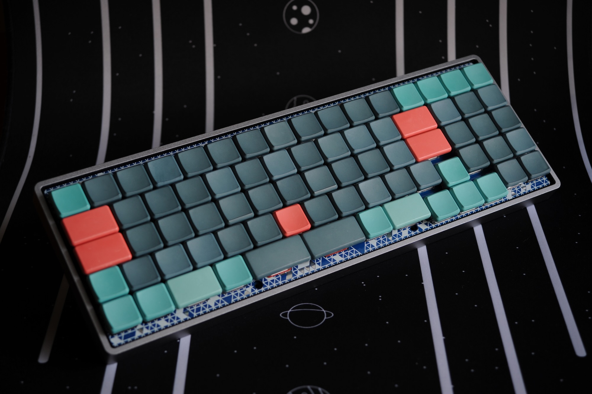
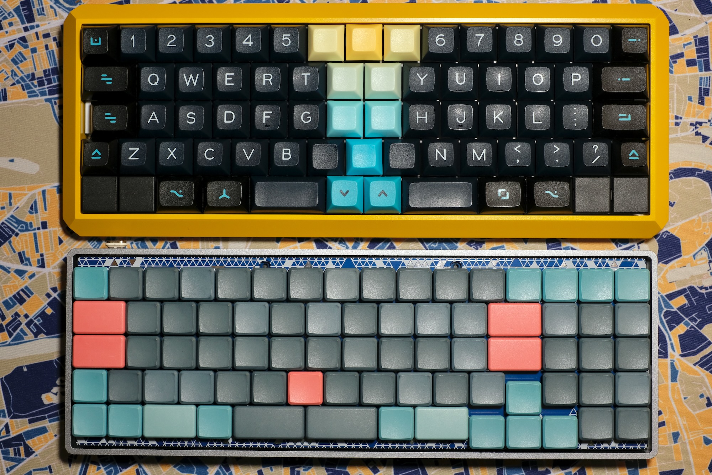
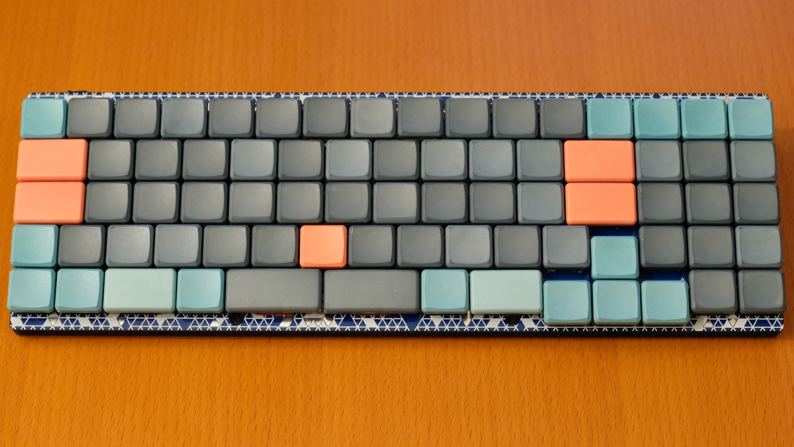
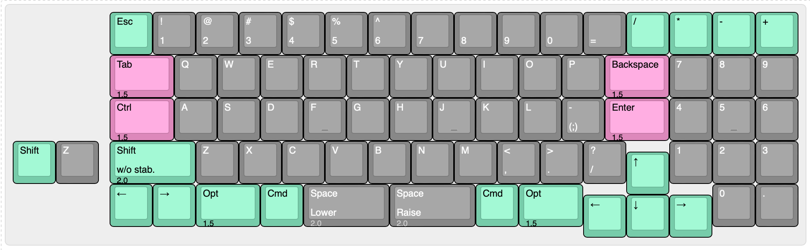
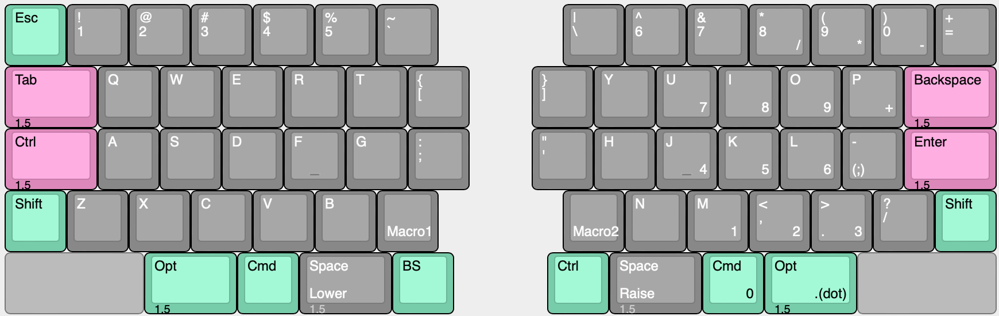
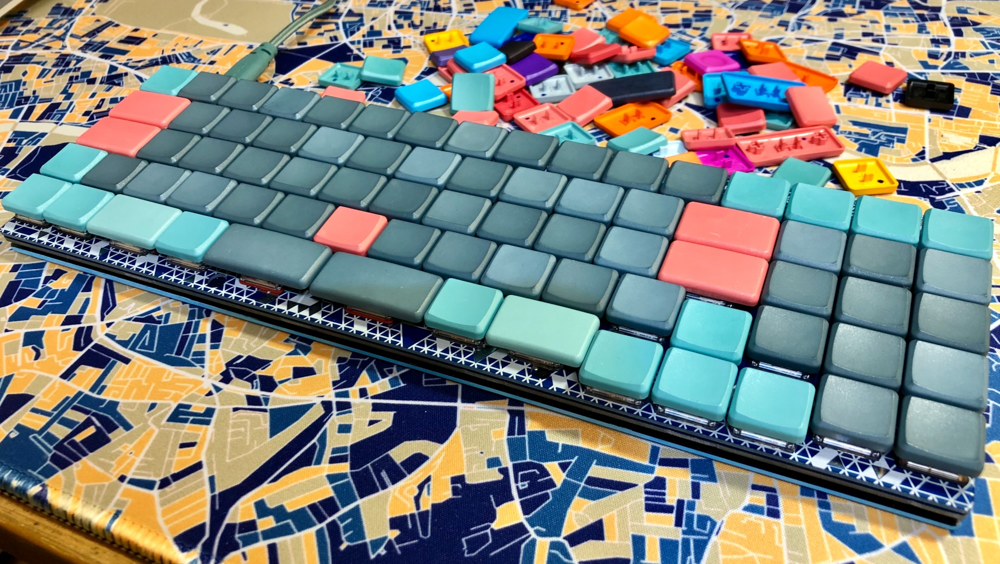
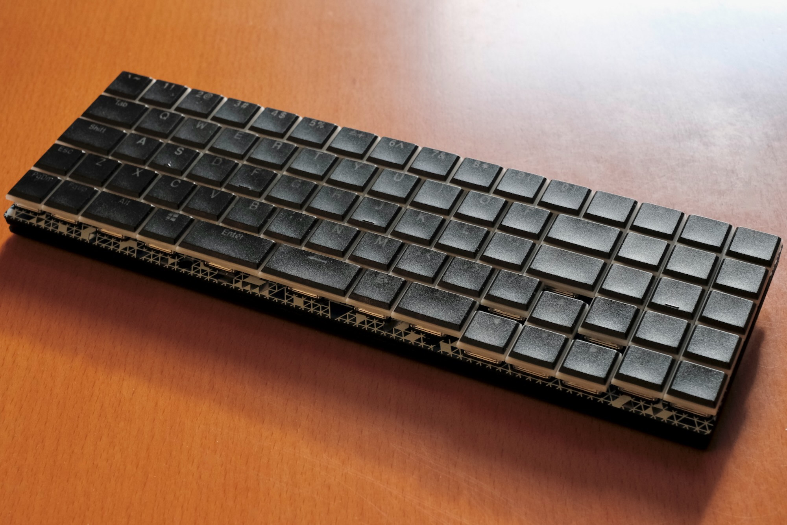

# Nora（ノラ）



Nora（ノラ）は、Choc v1 ロープロファイルスイッチを使用する、狭ピッチの一体型キーボードです。  
MBK、またはそれ以下のサイズのキーキャップに合わせて設計されており、GH60型やPoker型に互換性のあるロープロファイルケースや、専用のボトムプレートと組み合わせて使用できます。

Noraには、レイアウトの違いで”1.8k”と”Fearless Wings”というふたつのバリエーションがあります。  
どちらも2行目と3行目にずれのない[Jones](https://github.com/jpskenn/Jones)のレイアウトを継承しており、”1.8k”はテンキーと飛び出したカーソルキーをもち、”Fearless Wings”は左右に大きく離れたアルファ部をもつのが特徴です。

狭いキーピッチによって、TやYなどのホームポジションから遠いキーや、一番上の行の数字や記号キーにも、指がとどきやすくなっています。  
また、打鍵時に指を大きく伸ばしたり手首の位置を変えたりする動作が減ることで、指・手首・肘のポジションを一定の位置に保ったまま打鍵を続けられます。

名前の由来は、”狭ピッチのJonesキーボード”からの連想で…

``` text
狭ピッチのJones → ナロー・ジョーンズ → ノラ・ジョーンズ → ノラ

Narrow Jones --> Norah Jones --> Norah --> Nora
```

という具合の言葉遊びで、Nora（ノラ）に決まりました。

---

Nora is a narrow pitch keyboard with Choc v1 low profile switches, designed for MBK or smaller keycaps.
It can be used with GH60 and Poker compatible low profile cases or original bottom plate.

It has two layout variations, "1.8k" and "Fearless Wings".  
Both inherit [Jones](https://github.com/jpskenn/Jones)' symmetrical layout with gapless R1-R2 rows.  
The "1.8k" has numeric pad and projecting cursor .  
The "Fearless Wings" has widely separated alpha keys.

Narrow pitch makes fingers easy to reach keys far from home position, "T" and "Y", R1 numerics and symbols.  
It also reduces stretching fingers and reduces changing the position of wrist.  
You can continue tying without breaking the position of finger, wrist and elbow.

## 対象とするユーザー

このNoraキーボードは、  
*一般的なキーボードのキー配列に不満があり、より良いタイピングポジションを求めている方*  
を対象に作られています。

特に、  
*ホームポジションから遠いキーにも指をとどきやすくしたい方*  
や、  
*手・手首・肘の位置を一定に保ったまま打鍵したい方*  
におすすめします。

## コンセプト

このキーボードの開発コンセプトや実現したい要件は次のとおりです。

- 「Chocスイッチの狭ピッチを60%ケースに入れたら、1列増えて65%キーボードができちゃうのでは？」という思いつき。
- 一般的なキーピッチの19.05mmで打鍵がつらいのを、狭ピッチで楽にしたい。
- 狭ピッチは、浅いストロークの方が打鍵しやすい。→Chocスイッチを使おう。
- MBKキーキャップって格好良いじゃんか → 使いたい。
- Jonesの横方向（行方向）のずれかたや、左右対称のアルファ部に満足している。
- キー数は60%くらいで、数字行がついているものが使いたい。
- GH60型のケースに対応させ、ケース設計をメイン作業に含めない。
- これくらいの狭ピッチなら、通常のキーボードと何ら変わらず打鍵できることを伝えたい。

## 特徴

### 狭ピッチ

一般的なキーボードの、たて19.05mm×よこ19.05mmピッチよりも1-2mmほど狭い、たて17mm×よこ約17.86mmピッチでキーを配置しています。  

横方向のキーピッチは、MBK、またはそれ以下のサイズのキーキャップの使用を前提とした設計で、Choc用キーキャップの標準的なキーピッチ（たて17mm×よこ18mm）よりも横方向をさらに狭くしています。  
そのため、Kailh製のロープロファイルキーキャップ（例：[Kailhロープロ刻印キーキャップ](https://shop.yushakobo.jp/collections/keycaps/products/pg1350cap-doubleshot)）では、隣同士のキーが干渉するかもしれません。


キーピッチの比較  
上：一般的なキーピッチの60%キーボード。  
下：狭ピッチのNora。65%のキーが60%キーボードのサイズにおさまっている。

### Jonesゆずりのキーレイアウト

キーレイアウトはJonesのレイアウトを元に設計しており、2行目と3行目にずれのない左右対称のアルファ部や、右手のホームポジションに近づけたModキーなどにその特徴があらわれています。


左右対称のアルファ部と、近づけたModキー

詳しくは次の項目を参照してください。

- [Jones#独自のずれ幅をもつ左右対象のアルファ部](https://github.com/jpskenn/Jones#独自のずれ幅をもつ左右対象のアルファ部)
- [Jones#右手のホームポジションに近づけたmodキー](https://github.com/jpskenn/Jones#右手のホームポジションに近づけたmodキー)

### レイアウトのバリエーション

狭ピッチの一体型キーボードというコンセプトを元に、ふたつのレイアウトバリエーションが存在します。

#### Nora, 1.8k



アルファ部の右側にテンキーを配置し、少し下へ飛びだしたカーソルキーが特徴のレイアウトです。  

#### Nora, Fearless Wings



左右に大きく離れたアルファ部が特徴のレイアウトです。

打鍵時の肘・腕・手首・指先の位置を最適化し、快適な運指と、肩や腕への負担軽減を目指しています。  
また、手のひらにキーが当たる不快感を無くすため、最下行の左右の端にはキーを配置していません。

## 機能

### QMKファームウェアによる動作

MCUにATmega32u4を採用し、[QMKファームウェア](https://github.com/qmk/qmk_firmware)によって動作します。

### RemapやVIAなどのキーマップ書き換えツールに対応（今後、登録予定）

[Remap](https://remap-keys.app)や[VIA](https://caniusevia.com)などのキーマップ書き換えツールに対応しており、ファームウェアを書き換えることなく、キーの割り当てを変更することができます。  

ハードウェアの動作確認が終わり次第、Remapへ登録する予定です。  

<!--
Remapにはキーボード定義を登録済みですので、サイトへアクセスしてキーボードを接続すれば、すぐにキーの割り当てを変更することができます。  
VIAを使用する場合は、以下のキーボード定義ファイルを読み込ませてください。  
キーボード定義ファイル：[nora_via_v01.json](./VIA/nora_via_v01.json)
-->

### RemapやVIAで、より多くのレイヤーを使用可能

外部EEPROMの搭載により、RemapやVIAでより多くのレイヤーを使用することができます。

出荷時に書き込まれている初期ファームウェアでは、7レイヤーまで使用可能です。  
ファームウェアに変更を加えれば、さらに多くのレイヤーを使用できます。  

### ケース

GH60型やPoker型に互換性のある、ロープロファイルケースに対応しています。  
ハイプロファイルのケースにも取り付けできますが、キー天面がケースのフレームよりも低くなるため実用には向きません。

また、専用のボトムプレート”Jones / Nora用ボトムプレートキット”を使用すれば、ケースレスのサンドイッチマウントとして使用できます。  
ケースを使用する場合に比べてキーボードの高さを低く抑えることができ、手首の負担軽減などに有効です。

### レイヤーインジケータ／イルミネーションLED（オプション）

レイヤーの状態を表示するインジケータや、イルミネーションとして使用できるLEDを、キースイッチの下へ取り付けできます。

”1.8k”は1行目と5行目に合計31個、”Fearless Wings”はすべてのキーに合計71個のLEDを取り付けできる予定です。

### Raspberry Pi PICOによる動作（実験的機能）

Raspberry Pi PICOによる動作を実験的機能として提供します。  
キーマトリクス、LED、I2Cに配線をつないであるので、DIYで楽しんでください。

[PRK Firmware](https://github.com/picoruby/prk_firmware)を使用して、キー入力とLEDの点灯を確認済みです。

詳しくは、ビルドガイドをごらんください。

## ビルドガイド

- [Nora, 1.8k v.0.1 ビルドガイド](./docs/BuildGuide_v.0.1_JA.md)
- [Nora, Fearless Wings DN0030 ビルドガイド](./docs/BuildGuide_DN0030_JA.md)

## ビルド例

| ビルド例 | 詳細 |
| --- | :-- |
| []((./assets/Readme/DSC_7457.jpeg)) | Nora, 1.8k（試作）<br>case: KBDfans 60% Aluminum Low Profile, Gray<br>keycaps: MBK Colors & Self Dye |
| []((./assets/Readme/IMG_3798.jpeg)) | Nora, 1.8k（試作）<br>case: Jones' Bottom plate<br>keycaps: MBK Colors & Self Dye |
| []((./assets/Readme/_DSF1357.jpeg)) | Nora, 1.8k（試作）<br>case: Jones' Bottom plate<br>keycaps: Kailh low profile |

## 製作歴

- Fearless Wings DN0030

    DN0020を元にレイアウトを変更。  
    全キーへLEDを配置。  
    Jonesとの共用ボトムプレートを、PICOの取り付けに対応する切り欠きをつけて更新。

- 1.8k DN0020

    1.8k v.0.1の試作結果を反映。  
    全キーをKailhソケットに変更。  
    現在のところ基板設計のみ。未製造。

- 1.8k v.0.1, 2021年12月3日

    試作1号機、完成。

- 1.8k v.0, 2021年11月上旬

    60%ケースにChocスイッチを配置して、65%キーボードにするアイデアを思いつく。
