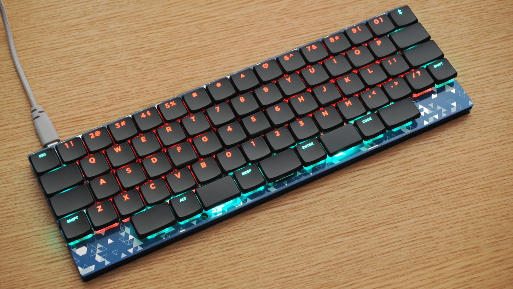
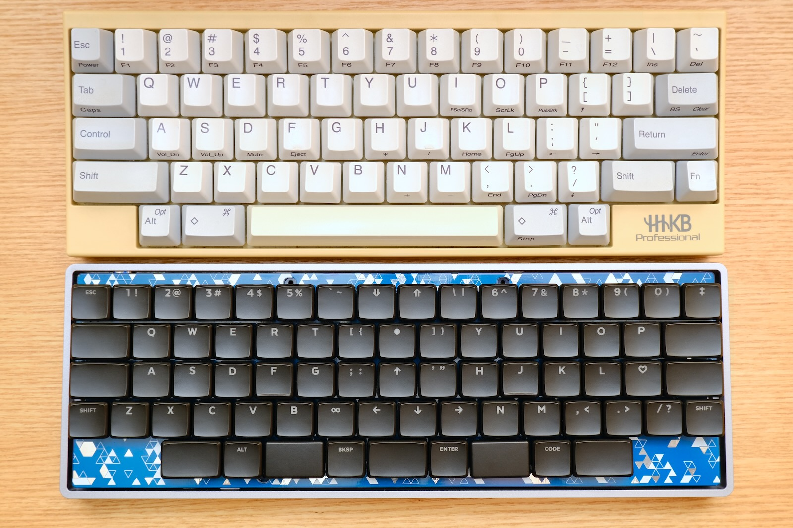
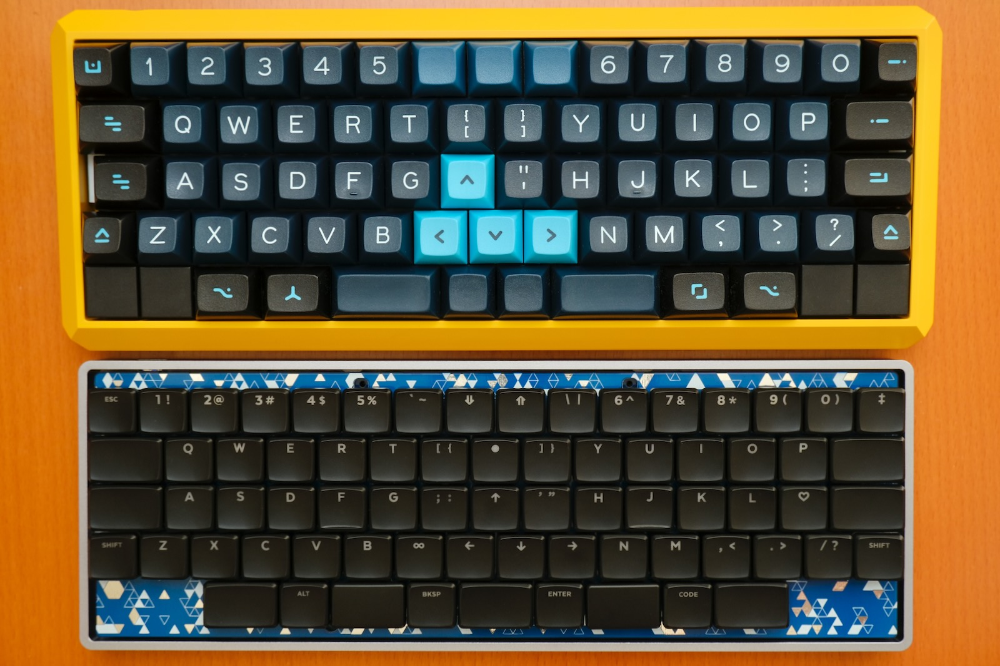
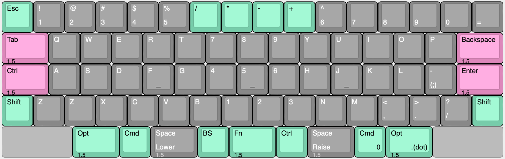
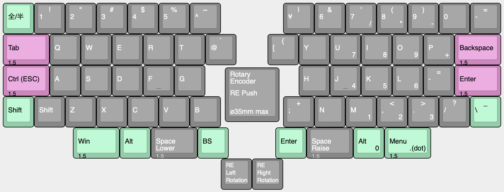
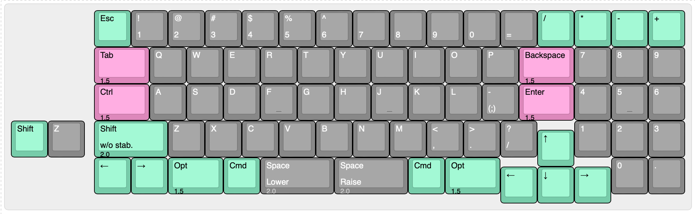
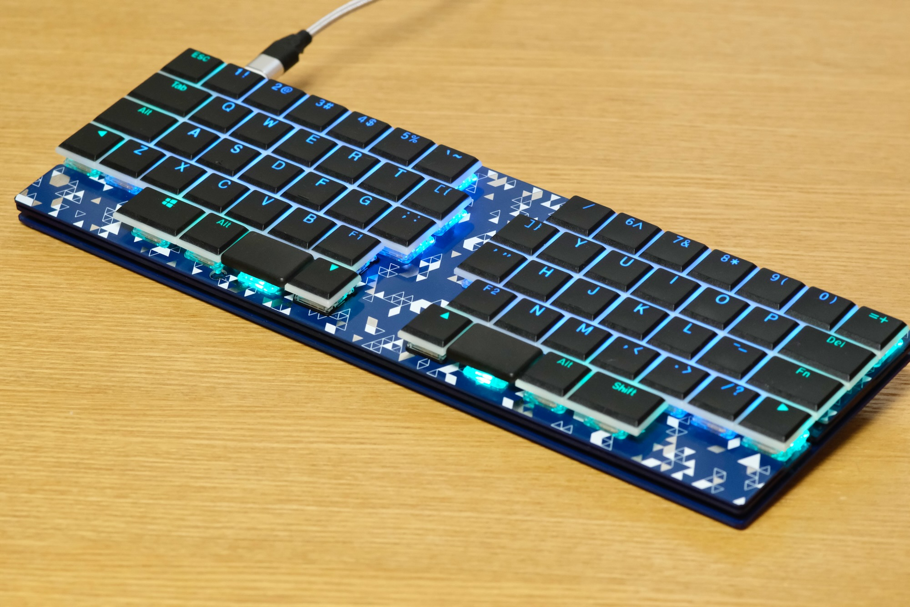
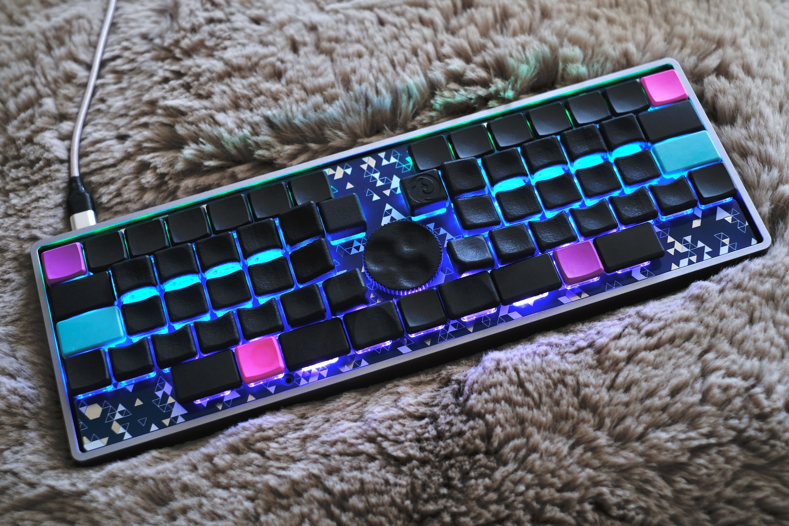

# Nora（ノラ）



Nora（ノラ）は、Choc v1 ロープロファイルスイッチを使用する、狭ピッチの一体型キーボードです。  
[Jones（ジョーンズ）](https://github.com/jpskenn/Jones)と同様の、2行目と3行目にずれのない左右対称の配列が特徴です。  
専用のボトムプレートや、GH60型，Poker型のロープロファイルケースと組み合わせて使用できます。

名前の由来は、”狭ピッチのJonesキーボード”からの連想で…

``` text
狭ピッチのJones → ナロー・ジョーンズ → ノラ・ジョーンズ → ノラ

Narrow Jones --> Norah Jones --> Norah --> Nora
```

という具合の言葉遊びで、Nora（ノラ）に決まりました。

Nora is a narrow pitch keyboard with Choc v1 low profile switches.  
It has symmetrical gapless R2-R3 row, like [Jones](https://github.com/jpskenn/Jones).  
Original bottom plate and GH60/Poker compatible low profile cases are supported.

---

<!-- @import "[TOC]" {cmd="toc" depthFrom=2 depthTo=2 orderedList=false} -->

<!-- code_chunk_output -->

- [対象とするユーザー](#対象とするユーザー)
- [コンセプト](#コンセプト)
- [特徴](#特徴)
- [機能](#機能)
- [ビルドガイド](#ビルドガイド)
- [ビルド例](#ビルド例)
- [製作歴](#製作歴)

<!-- /code_chunk_output -->

---

## 対象とするユーザー

このNoraキーボードは、
*”一般的なキーボードのキー配列に不満があり、より良いタイピングポジションを求めている方”*
を対象に作られています。

特に、
*”一般的なキーボードと違いすぎないキーボードを求めている方”*
におすすめします。

## コンセプト

- 「Chocスイッチの狭ピッチを60%ケースに入れたら、1列増えて65%キーボードができちゃうのでは？」という思いつき。
- 一般的なキーピッチの19.05mmで打鍵がつらいのを、狭ピッチで楽にしたい。
- 「狭ピッチは浅いストロークの方が打鍵しやすい」という経験から、Chocスイッチを採用。
- MBKキーキャップって格好良いじゃんか。
- Jonesの横方向（行方向）のずれかたや、左右対称のアルファ部に満足している。
- キー数は60%くらいで、数字行がついているものが使いたい。
- GH60型のケースに対応させ、ケース設計をメイン作業に含めない。
- これくらいの狭ピッチなら、通常のキーボードと何ら変わらず打鍵できることを伝えたい。

## 特徴

### 狭ピッチ

Kailh Chocスイッチとそれに対応するキーキャップを使用することで、一般的なキーボードよりもキーピッチが狭くなっています。

60%キーボードのサイズに16列を配置するため、Choc用キーキャップのキーピッチ（たて17mm×よこ18mm）よりも横方向を少し狭くして（たて17mm×よこ約17.86mm）しています。  
横方向のキーピッチは、MBKまたはそれ以下のサイズのChoc用キーキャップの使用を前提とした設計です。

  
キーピッチの比較  
上：一般的なキーピッチの60%キーボード、HHKB Professional。5行15列。  
下：狭ピッチ設計のNora。5行**16列**（1列多い）。

### 左右対称のキーレイアウト

キーレイアウトはJonesのレイアウトを元に設計しており、2行目と3行目にずれのない左右対称のキーレイアウトです。  

  
Jones（上）とNora（下）。  
どちらも2行目と3行目にずれがなく、左右対称。

詳しくは次の項目を参照してください。

- [Jones#独自のずれ幅をもつ左右対象のアルファ部](https://github.com/jpskenn/Jones#独自のずれ幅をもつ左右対象のアルファ部)

### レイアウトのスタイル、バリエーション

狭ピッチの一体型キーボードというコンセプトを元に、"Nora, Fearless Wings"と"Nora, 1.8k"という、ふたつのスタイルが存在します。

#### Nora, Fearless Wings

左右に大きく離れたアルファ部が特徴のレイアウトスタイルです。  
アルファ部を左右へ大きく離すことで打鍵時の肘・腕・手首・指先の位置を最適化し、快適な運指と、肩や腕への負担軽減を目指しています。  
手首をあまり持ち上げないスタイルでも快適に打鍵できるように、最下行の左右の端にはキーを配置せず、手のひらにキーが当たる不快感を無くしています。

キー配置とロータリーエンコーダの有無により、3つのレイアウトバリエーションがあります。

- Fullレイアウト

    左右に離れたアルファ部の間を、すべて埋めたレイアウトです。  
    65〜70%キーボードに相当する71個のキーは、多くのキーを必要とする方に適しています。  
    中央部に記号キーやカーソルを配置したり、テンキーやマクロキーを配置したりできます。

    

- FWレイアウト

    Fullレイアウトから中央部の7キーを取り除き、左右のアルファ部に隙間のあるレイアウトです。  
    60%キーボードに相当する64キーをもち、必要十分なキー数を確保しています。  
    ホームポジションから手を移動させず、レイヤー内のキーを打鍵するのが快適な方に適しています。  
    ミニマルな構成やデザインを好む方にもおすすめです。

    

- REレイアウト

    FWレイアウトの中央にロータリーエンコーダを配置したレイアウトです。  
    4行目の中央をFWレイアウトから2キー減らし、直径35ｍｍまでのノブに対応しています。

    

#### Nora, 1.8k



アルファ部の右側にテンキーを配置し、少し下へ飛びだしたカーソルキーが特徴のレイアウトスタイルです。  
キー数が多く、記号やカーソルなどを物理的に配置することができます。

日常的に使用する上での快適さ（※）を満たせないため、1.8kは開発を停止しています。  
※狭ピッチで左右の手が中央へ近づくため、肩や腕、親指まわりが窮屈に感じてしまいます。  

## 機能

### QMKファームウェアによる動作

MCUにATmega32u4を採用し、[QMKファームウェア](https://github.com/qmk/qmk_firmware)によって動作します。

### RemapやVIAなどのキーマップ書き換えツールに対応

[Remap](https://remap-keys.app)や[VIA](https://caniusevia.com)などのキーマップ書き換えツールに対応しており、ファームウェアを書き換えることなく、キーの割り当てを変更することができます。  

### EEPROM搭載により、多くのレイヤーを使用可能

外部EEPROMを搭載したことで、RemapやVIA使用時にも多くのレイヤーを使用することができます。

出荷時に書き込まれている初期ファームウェアでは、10レイヤーまで使用可能です。  
ファームウェアに変更を加えれば、さらに多くのレイヤーを使用できます。  

### ケース

キット同梱のボトムプレートと組み合わせれば、ケースレスで使用できます。  
ケースを使用する場合に比べてキーボードの高さを低く抑えることができ、手首の負担軽減などに有効です。

また、GH60型やPoker型に互換性のある、ロープロファイルケースと組み合わせて使用することもできます。  
→[ビルド例](#ビルド例)  

### キーバックライトLED

レイヤーの状態を表示するインジケータや、イルミネーションとして使用できるキーバックライトLEDを、すべてのキーへ取り付けできます。

### Raspberry Pi PICOによる動作（実験的機能）

実験的機能として、Raspberry Pi PICOで動作させることができます。  
キーマトリクス、LED、I2Cに配線をつないであるので、DIYで楽しんでください。

[PRK Firmware](https://github.com/picoruby/prk_firmware)を使用して、キー入力とLEDの点灯を確認済みです。

## ビルドガイド

- 最新版
  - [Nora, Fearless Wings v.1(DN0032) ビルドガイド](./docs/BuildGuide_DN0032_JA.md)

- 過去版
  - [Nora, Fearless Wings DN0031 ビルドガイド](./docs/BuildGuide_DN0031_JA.md)
  - [Nora, Fearless Wings DN0030 ビルドガイド](./docs/BuildGuide_DN0030_JA.md)
  - [Nora, 1.8k v.0.1 ビルドガイド](./docs/BuildGuide_v.0.1_JA.md)

</details>

## ビルド例

| ビルド例 | 詳細 |
| --- | :-- |
| [](./assets/Readme/DSC_7630.jpeg) | v.1(DN0032)<br>layout: Full<br>keycaps: MBK Legend‡ Glow<br>case: Bottom plate |
| [](./assets/Readme/_DSF1643.jpeg) | DN0031<br>layout: FW<br>keycaps: Kailh low profile + MBK<br>case: Bottom plate |
| [](./assets/Readme/_DSF1571.jpeg) | DN0031<br>layout: RE<br>keycaps: Gravity Keycaps + MBK<br>case: KBDfans 60% Aluminum Low Profile, Gray |
| [](./assets/Readme/DSC_7457.jpeg) | DN0020<br>layout: 1.8k<br>keycaps: MBK Colors & Self Dye<br>case: KBDfans 60% Aluminum Low Profile, Gray |
| [](./assets/Readme/_DSF1357.jpeg) | DN0010<br>layout: 1.8k<br>keycaps: Kailh low profile<br>case: Bottom plate |

## 製作歴

- Fearless Wings v.1(DN0032), 2022年3月中旬

    組み立てやすさを向上。  
    ロータリーエンコーダのノブサイズ拡大のため、REレイアウトの最下行中央のキーを削除。  
    細部を調整。  
    DN0031組み立てアンケートの内容を反映。

- Fearless Wings DN0031, 2022年1月下旬

    スペースキーより内側のキーに親指が届きやすいように、最下行を外側へ0.25u移動。  
    ロータリーエンコーダ付きのレイアウトを追加。  
    組み立てやすさを向上。
    少数頒布。

- Fearless Wings DN0030, 2022年1月上旬

    DN0020を元にレイアウトを変更。  
    全キーへLEDを配置。  
    Jonesとの共用ボトムプレートを、PICOの取り付けに対応する切り欠きをつけて更新。

- 1.8k DN0020, 2021年12月中旬

    1.8k v.0.1の試作結果を反映。  
    全キーをKailhソケットに変更。  
    現在のところ基板設計のみ。未製造。

- 1.8k v.0.1, 2021年12月上旬

    試作1号機、完成。

- 1.8k v.0, 2021年11月上旬

    60%ケースにChocスイッチを配置して、65%キーボードにするアイデアを思いつく。
