# Nora, Fearless Wings (DN0030) ビルドガイド

購入していただいた方、リポジトリから製造していただいた方、その他の皆様、Noraに興味を持っていただきありがとうございます。

このドキュメントは、Nora, Fearless Wings (DN0030)を組み立てるためのビルドガイドです。  
Noraのコンセプトや特徴、ビルド例などについては、[README](https://github.com/jpskenn/Nora/README.md)をご覧ください。

ビルドガイド全体に目を通して作業手順を把握しておくとミスの防止につながりますので、ぜひ、一度お読みになってから組み立て作業を始めてください。

作業手順をしっかりと確認しながら組み立てたい方は、

<details>
<summary>《詳しい説明》</summary>

ここに追加の説明を表示します。
</details>

と書かれたところをクリックすると、追加の説明が表示されます。

---

## 目次

<!-- @import "[TOC]" {cmd="toc" depthFrom=2 depthTo=3 orderedList=false} -->

<!-- code_chunk_output -->

- [目次](#目次)
- [Nora, Fearless Wings (DN0030)の特徴, 機能](#nora-fearless-wings-dn0030の特徴-機能)
- [注意事項、制限など](#注意事項-制限など)
- [部品リスト](#部品リスト)
  - [キット内容](#キット内容)
  - [別途用意が必要な部品](#別途用意が必要な部品)
  - [オプション部品](#オプション部品)
- [組み立てに必要な工具](#組み立てに必要な工具)
- [組み立て前の確認](#組み立て前の確認)
  - [同梱物の確認](#同梱物の確認)
  - [接続の確認](#接続の確認)
  - [ソケット用パッドの確認](#ソケット用パッドの確認)
- [組み立て手順](#組み立て手順)
  - [（オプション）LEDを取り付ける](#オプションledを取り付ける)
  - [Kailh Choc用ソケットを取り付ける](#kailh-choc用ソケットを取り付ける)
  - [スイッチプレートにスペーサーシートを貼り付ける](#スイッチプレートにスペーサーシートを貼り付ける)
  - [スイッチとスイッチプレートを基板へ取り付ける](#スイッチとスイッチプレートを基板へ取り付ける)
  - [スイッチの動作確認をおこなう](#スイッチの動作確認をおこなう)
  - [基板をケース、またはボトムプレートへ取り付ける](#基板をケース-またはボトムプレートへ取り付ける)
  - [スイッチの最終動作確認をおこなう](#スイッチの最終動作確認をおこなう)
  - [仕上げ](#仕上げ)
- [参考](#参考)
  - [打鍵感向上：ケース内部の制振と静音化](#打鍵感向上ケース内部の制振と静音化)
  - [トラブル対応：正常に入力できないスイッチの原因調査](#トラブル対応正常に入力できないスイッチの原因調査)
  - [トラブル対応：LEDの取り付け不良調査](#トラブル対応ledの取り付け不良調査)
  - [資料：USBコネクタ接続図](#資料usbコネクタ接続図)
  - [資料：ファームウェアの書き込み方法](#資料ファームウェアの書き込み方法)
  - [資料：初期ファームウェアの機能と設定値](#資料初期ファームウェアの機能と設定値)
  - [資料：Noraキーボードのファームウェア](#資料noraキーボードのファームウェア)
  - [資料：EEPROMを消去して、初期状態に戻す方法](#資料eepromを消去して-初期状態に戻す方法)
  - [資料：Nora, Fearless Wings (DN0030)関連ファイル](#資料nora-fearless-wings-dn0030関連ファイル)
  - [資料：Raspberry Pi PICOによる動作（実験的機能）](#資料raspberry-pi-picoによる動作実験的機能)

<!-- /code_chunk_output -->

---

## Nora, Fearless Wings (DN0030)の特徴, 機能

- 狭ピッチ
- Jonesゆずりのキーレイアウト
- 左右に大きく離れたアルファ部
- Choc v1スイッチと、MBK、またはそれ以下のサイズのキーキャップに合わせた専用設計
- RemapやVIAなどのキーマップ書き換えツールに対応したファームウェアを書き込み済み
- 外部EEPROM（8KB）を搭載し、十分な数のレイヤーを使用可能
- GH60型やPoker型に互換性のあるロープロファイルケースに対応  
  専用ボトムプレートと組み合わせて、ケースレスで高さを抑えて使用することも可能。
- オプションとして、以下のハードウェア機能を使用可能
  - レイヤーインジケータ／イルミネーションLED
  - Raspberry Pi PICOによる動作（実験的機能）
- 細かな部品を実装済み

## 注意事項、制限など

- キーキャップ

  MBK、またはそれ以下のサイズのキーキャップに合わせて設計されています。  
  Kailh製のロープロファイルキーキャップ（[遊舎工房：Kailhロープロ刻印キーキャップ](https://shop.yushakobo.jp/collections/keycaps/products/pg1350cap-doubleshot)）は隣同士のキーが干渉する可能性があるため、ご自身の責任で使用してください。  
  （こちらで試した限りでは全てのキーが干渉せずに使用できましたが、ギリギリすぎるため保証できかねます。）

- スイッチの加工

  GH60型, Poker型ケースを使用する場合、ケース中央のネジ穴に重なるスイッチは、スイッチの足の加工（切断）が必要です。

- ケースへの取り付け

  GH60型, Poker型のネジ穴位置に対応するように設計していますが、もしかしたら取り付けできないケースがあるかもしれません。  
  ここに記載していないケースへの取り付けの成功／失敗の報告を、随時募集しています。

  取り付け確認済みのケースは次の通りです。  
  - [KBDfans 60% ALUMINUM LOW PROFILE CASE](https://kbdfans.com/collections/60-layout-case/products/customized-gh60-aluminum-case)
  - [Jones / Nora用ボトムプレート](https://booth.pm/ja/items/〓リンク更新)

  ハイプロファイルタイプのケースはキー天面がフレームよりも低くなり実用に向かないため、取り付け対象外とします。  
  参考：[TOFUケースへの装着例](https://twitter.com/jpskenn/status/1466729696713142277)

## 部品リスト

このキットを組み立てるためには、”キット内容”に加え、”別途用意が必要な部品”が必要です。  
好みに合わせて、必要な数をお買い求めください。

”オプション部品”は、使いたい機能などに応じて用意してください。  

部品の購入先は、Self-Made Keyboards in Japanの[ショップリスト](https://scrapbox.io/self-made-kbds-ja/ショップリスト)などを参考にしてください。

### キット内容

| 部品名 | 個数 | 備考 |
| ----- | :-----: | ----- |
| ご案内リーフレット | 1 | |
| 基板 | 1 | [おもて側<br>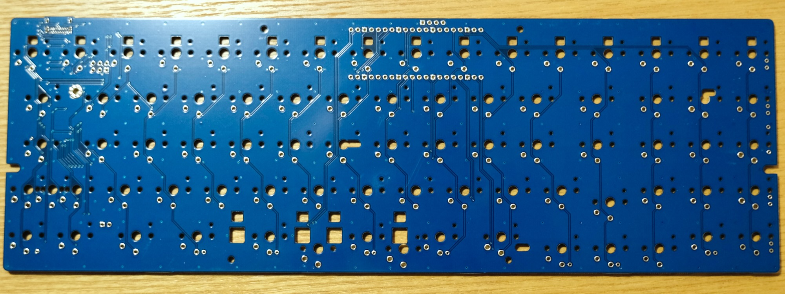](../assets/BuildGuide_v.0.1/_DSF1269.jpeg)<br>[裏側<br>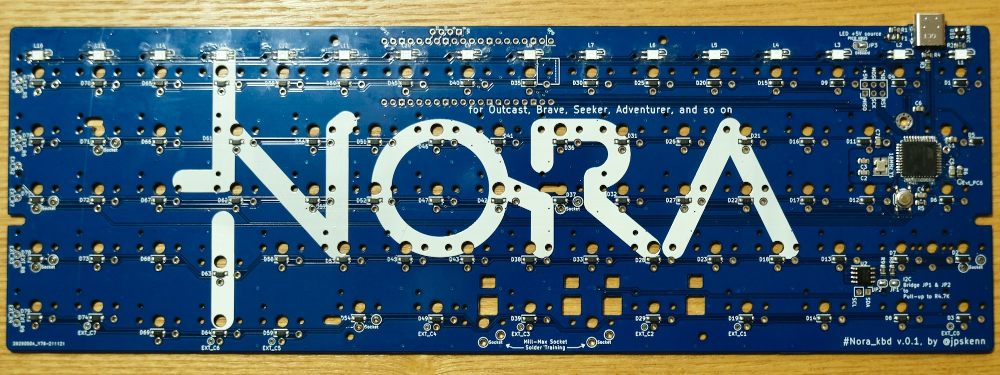](../assets/BuildGuide_v.0.1/_DSF1271.jpeg) |
| スイッチプレート | 1 | [おもて側<br>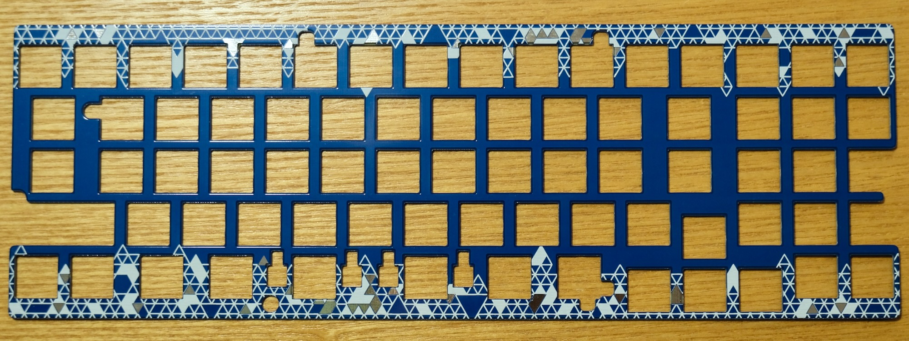](../assets/BuildGuide_v.0.1/_DSF1267.jpeg)<br>[裏側<br>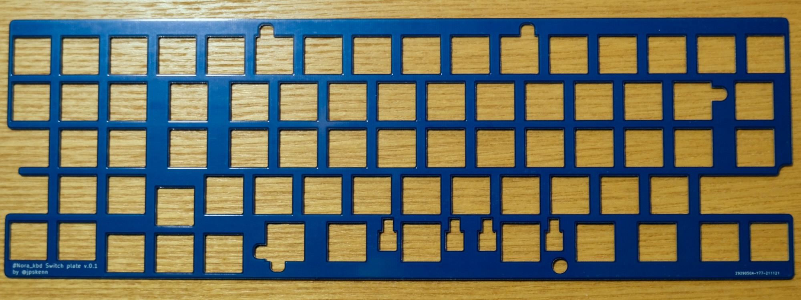](../assets/BuildGuide_v.0.1/_DSF1268.jpeg) |
| スペーサーシート（シール付き）, T1mm * 550mm | 1 ||
| 低頭ネジ, M2 4mm | 5 | [](../assets/BuildGuide_v.0.4/_DSF0432_1.jpeg) |
| Jones / Nora用ボトムプレート | 1 | [おもて側<br>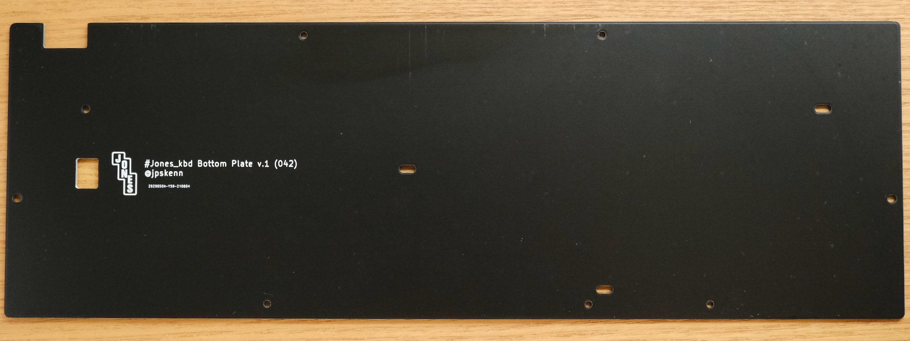](../assets/BuildGuide_v.0.1/_DSF0644.jpeg)<br>[裏側<br>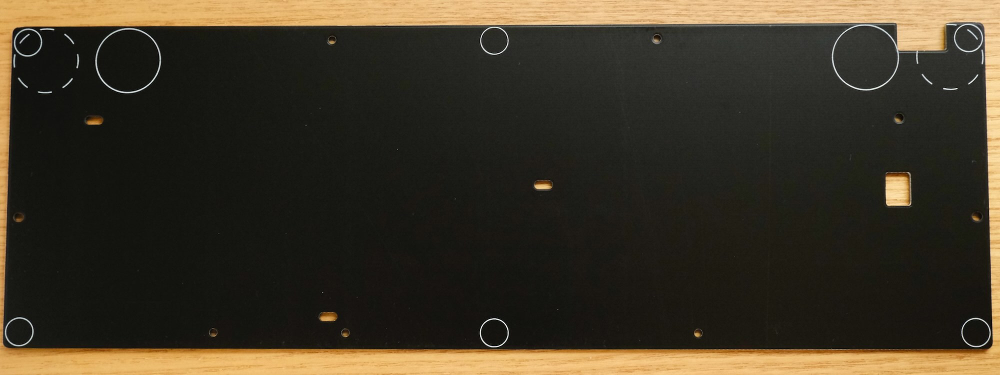](../assets/BuildGuide_v.0.1/_DSF0654.jpeg)<br>基本＋プレートキットのみ同梱 |
| スペーサー, M2 3mm | 8 | [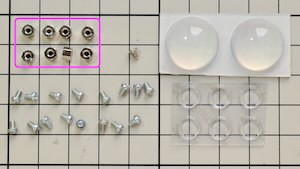](../assets/BuildGuide_v.0.1/_DSF0435_0.jpeg) <br>基本＋プレートキットのみ同梱|
| ネジ, M2 3mm, 低頭 | 16 | [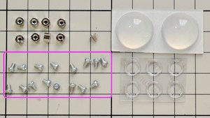](../assets/BuildGuide_v.0.1/_DSF0435_1.jpeg) <br>基本＋プレートキットのみ同梱|
| ゴム足 大 | 2 | [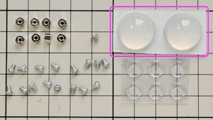](../assets/BuildGuide_v.0.1/_DSF0435_3.jpeg) |
| ゴム足 小 | 6 | [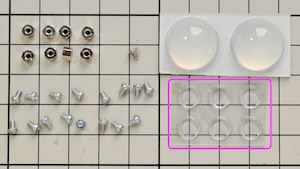](../assets/BuildGuide_v.0.1/_DSF0435_4.jpeg) |

〓写真入れ替え〓
※出荷時期によってメーカーや品番などが変わることがあります

### 別途用意が必要な部品

| 部品名 | 個数 | 備考 |
| ----- | :-----: | ----- |
| GH60型, Poker型ロープロファイルケース<br>または<br>Jones / Nora用ボトムプレートキット | 1 | 基本＋プレートキット購入時は不要 |
| ソケット, Kailh Chocロープロファイル用 | 71 | |
| スイッチ, Kailh Choc v1 | 71 | v1のみ対応 |
| キーキャップ, Choc用<br>MBKまたはそれ以下のサイズのもの | 71 | 1u 63個, 1.5u 8個 |
| USBケーブル （Type-C） | 1 | |

### オプション部品

| 部品名 | 個数 | 備考 |
| ----- | :-----: | ----- |
| LED<br>SK6812MINI-E | 最大71 | 全71個<br>1行目と5行目だけの、25個にすることも可能（要ファームウェア変更） |
| Raspberry Pi PICO | 1 | 実験的機能をDIYで楽しむ場合 |

## 組み立てに必要な工具

- 先の細いドライバー（M2ネジに対応するもの）
- ピンセット
- はんだ付け関連用品
- はさみ
- ニッパー

フラックスやハンダ吸い取り線を用意しておくと、ちょっとした修正などがやりやすくなります。
[遊舎工房の工具セット](https://yushakobo.jp/shop/a9900to/)を参考に用意してください。

なお、無くても組み立てはできますが、何か不具合があった場合の原因調査ではテスターがあると便利です。

## 組み立て前の確認

組み立てを開始する前に、同梱物と基板についての基本的な確認をおこないます。  

**何か問題があった場合は作業を中止し、リーフレットに記載された連絡先へ問い合わせてください。**  
**組み立ての開始後は、初期不良として対応できかねる場合があります。**

### 同梱物の確認

リーフレットに記載された部品が、不足なく入っていることを確認します。

### 接続の確認

基板をUSBケーブルでMacやPCに接続して、キーボードとして認識されることを確認します。

```text
充電用ではないUSBケーブルを使用してください。
他の機器を接続して使用した実績のあるケーブルを使うと、無用のトラブルを防げます。
```

下記のOS別の確認方法を参考に、確認してください。

<details>
<summary>確認方法：《Mac, macOS Monterey 12.0.1》</summary>

1. 基板とMacをUSBケーブルで接続します。

    接続した際に`キーボード設定アシスタント`が表示された場合は、`終了`ボタンを押して閉じます。  
    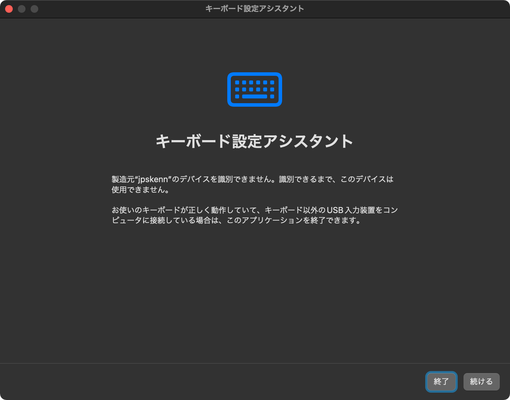  

    なお、キーボード設定アシスタントは、次の操作でいつでも呼び出すことができます。  
    `システム環境設定`から、`キーボード` → `キーボード`タブ → `キーボードの種類を変更…`ボタンを押す。

1. システム情報を表示します。

    メニューバーの``マークから、`このMacについて`を選び、表示された画面で`システムレポート…`をクリックします。  

1. USBデバイスを表示します。

    `システム情報`画面で、左側の`ハードウェア`から`USB`を選択します。

1. `Nora`が接続されていることを確認します。

    右側上部の`USB装置ツリー`で、`Nora`を探します。  
    どこかに`Nora`と表示されていれば、正しく接続されています。  

    `USB装置ツリー`の下の方が見切れている場合があるため、スクロールして探してください。

    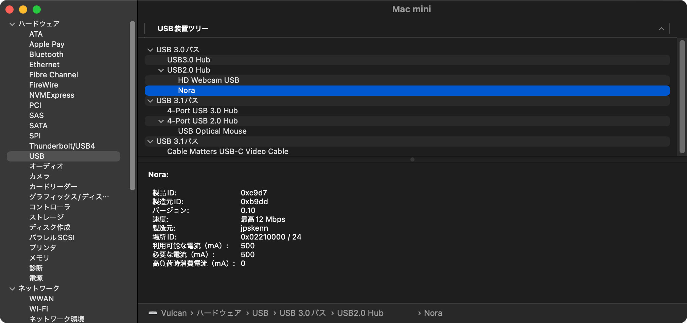
    システム情報の表示

</details>

<details>
<summary>確認方法：《Windows, 10 Pro 1909(18363.1082)》</summary>

1. 基板とPCをUSBケーブルで接続します。

1. `デバイス`を表示します。

    `スタートボタン`から`設定`を開いて`デバイス`を選択します。

1. `Nora`が接続されていることを確認します。

    `マウス、キーボード、ペン`の項目に`Nora`が表示されていれば、正しく認識されています。
    〓SS撮り直し  
    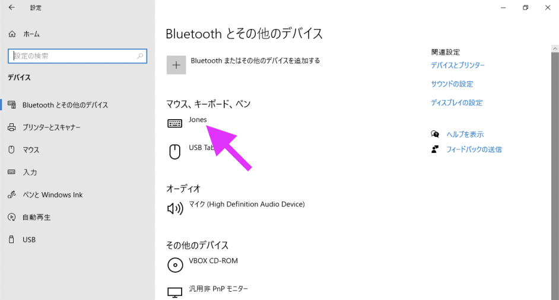  
    デバイスの表示

</details>

### ソケット用パッドの確認

Kailh Chocソケット用のパッド（ソケットをはんだ付けする基板上の四角い銀色の部分）が、電気的に正しく反応することを確認します。

<details>
<summary>《詳しい説明》</summary>

ここでは、キーマップ書き換えツール[Remap](https://remap-keys.app/)のテスト機能を使って確認をおこないます。

キーの入力状態を確認することで、パッドの確認と合わせて、基板上の部品や配線が正常であることも確認できます。

1. 基板の裏側が上になるように置きます。

1. PCやMacとUSBケーブルで接続します。

1. Google Chromeブラウザで、[Remap](https://remap-keys.app/)のページを開きます。

    Chromeブラウザは、Web HID対応のバージョン89以降を使用します。
    〓Edgeどうなん？

1. `START REMAP FOR YOUR KEYBOARD`をクリックして始めます。

    

1. `+ KEYBOARD`をクリックして、キーボードをRemapに接続する画面を表示します。

    〓画像

1. デバイスへの接続要求画面で`Nora`を選択し、`接続`をクリックしてキーボードをRemapに接続します。

    〓画像

1. 右側のアイコンから`…`をクリックし、`Test Matrix mode`を選択します。

    〓画像

1. ピンセットなどの電気を通すものを使い、基板裏側のソケット用パッドをショートさせます。

      
    ピンセットを使ってショートさせる様子〓画像更新

1. Remapの画面で、ショートさせた箇所に対応するキーの色が変わることを確認します。

    *基板が裏側になっているので、画面ではキーの位置が反対になります。*

    〓画像

    パッドをショートしても反応がない場合は、基板に実装された部品が外れたり、配線がダメージを受けている可能性があります。  
    この確認作業をすべてのパッドでおこなった後、リーフレットに記載された連絡先へ問い合わせてください。

1. 同様の作業を繰り返し、全てのキーの色が変わることを確認します。

1. 確認が終わったら、USBケーブルを抜きます。

</details>

## 組み立て手順

以下の手順に沿って組み立てます。  
`（オプション）`と書かれた項目は、不要であれば作業をとばしてもかまいせん。  
`（該当者のみ）`と書かれた項目は、条件に該当する場合のみ作業をおこないます。

怪我などに気をつけて作業してください。  

### （オプション）LEDを取り付ける

*LEDを使用しない場合、この手順は不要です。*

基板裏側の`JP3:Device VDD source`を`Onboard`にジャンパします。  
基板裏側の`JP4:LED install`を、LEDの取り付け箇所に応じてジャンパします。  
基板裏側からLEDを取り付けます。  
  **注意：行ごとに、LEDを取り付ける方向が異なります。**

<details>
<summary>《詳しい説明》</summary>

#### LEDの電源をジャンパする

基板裏側の`JP3:Device VDD source`を`Onboard`にジャンパ（隣同士のパッド（基板上の小さな四角の銀色部分）にはんだをつけてつなげること）して、USBコネクタから取り出した+5VがLEDに供給されるようにします。  

1. 基板を裏側が上になるように置きます。

1. はんだごてを用意します。  
  こて先の温度は320℃程度にします。  

1. 3個並んだパッドのうち、中央と`Onboard`の2個にまたがるようにこて先をあてます。  
  そのまま、3秒ほど温めます。

1. こて先にはんだを押し付けて、少したっぷり目に溶かします。

1. こて先で基板をなでるように、横へスッとずらしてパッドから離します。  
  2個のパッドが、はんだでつながっていれば完了です。  

なかなか上手くジャンパできないのですが、何度かトライすればそのうちできます。  
こて先でパッドをグリグリいじるとパッドが剥がれて大変なことになるため、「はんだをつけて横へスッ」の動きを守って作業します。

〓写真　パッドをOnboardにジャンパした例

#### LEDの取り付け個数をジャンパする

基板裏側の`JP4:LED install`をLEDの取り付け箇所に応じてジャンパします。

LEDの取り付け箇所に対応するジャンパ位置は次の通りです。

| LEDの取り付け箇所（個数） | ジャンパ位置 |
| :-- | :-- |
| 1行目のみ（最大16個） | ジャンパ不要 |
| 1行目と5行目（最大25個） | `Simple` |
| 全キー（最大71個） | `Full` |

1. ”LEDの電源をジャンパする”と同様の手順で、ジャンパをおこないます

#### LEDを取り付ける

基板裏側の`L1`から`L71`へLEDを取り付けます。

1. 基板を裏側が上になるように置きます。

1. LEDを1個用意して、LEDの発光部分（透明な窓がある部分）が下側になるように持ちます。

1. LEDから出ている4本の端子のうち、角が斜めになっている1本が基板に描かれた印に合うようにして、基板の穴にはめこみます。  
    **注意：行ごとに、LEDを取り付ける方向が異なります。**  
    〓写真　はめこんだようす  

    4本の端子が基板から浮いている場合は、LEDのプラ部分を軽く押し込んで密着させます。  
    〓写真　浮いてるNG、ぴったりOK

1. はんだごてを用意します。  
  LEDは高温ではんだ付けすると壊れやすいため、こて先温度を少し低めの220-270℃に設定します。

1. 1、2、3、4、5と数える間に次の手順をおこないます。  

    - 1、2：  
      4本の端子のどれかひとつにこて先をあてて押さえ、端子とパッドを温めます。  

    - 3、4：  
      はんだを端子（またはパッド）に当てて溶かし、端子とパッドにはんだを行き渡らせて、はんだを離します。  
      こて先はグリグリ動かしません。はんだ溶けて、自然に濡れ広がっていくような具合です。  

    - 5：  
      こて先を離します。
      はんだが、端子とパッド全体に行き渡っていれば良い仕上がりです。  

1. LEDが傾いてしまった場合は、ピンセットでLEDをつまみ、はんだ付けした端子をこて先で温めながら傾きを修正します。  
  端子とパッドがずれたりしていなければ、少しくらい傾いていてもLEDの光り具合に大差はありません。

1. 最初にはんだ付けした端子とLED本体を挟んだ反対側の端子2本を、1本ずつ、同様の手順ではんだ付けします。

1. 残った1本の端子をはんだ付けします。  
  これで、LED1個の取り付けが完了です。

1. 作業を繰り返し、必要な数のLEDを取り付けます。

〓写真更新

取り付けたLED

#### LEDの動作確認

〓最初のLEDパターンをテスト用のやつにしておく。その手順でビルドガイド書く

LEDの点灯状態を見て、正しく取り付けられているか確認します。

1. PCやMacにUSBケーブルで接続します。

1. すべてのLEDが、`赤 → 青 → 緑 → 赤…`という具合に繰り返して点灯することを確認します。

  点灯しないLEDがあったり、色がおかしかったりする場合は、[トラブル対応：LEDの取り付け不良調査](#トラブル対応LEDの取り付け不良調査)を参考にして調査します。

</details>

〓写真　LED取り付け完了（テスト時に光ってるやつ）

### Kailh Choc用ソケットを取り付ける

基板裏側へKailh Choc用ソケットを取り付けます。  
**注意：ソケットを取り付ける方向に決まっています。基板に描かれた枠をよく見て、正しい方向に取り付けます。**

<details>
<summary>《詳しい説明》</summary>

#### ソケット用パッドの片方へ予備はんだする

1個のソケットに対応する2箇所のパッドのうち、どちらか*片方だけ*に予備はんだ（部品の取り付け前にはんだをつけておく）します。

1. 基板を裏側が上になるように置きます。

1. はんだごてを用意します。  
  こて先の温度は320℃程度にします。

1. 1、2、3、4、5と数える間に次の手順をおこないます。

    - 1、2：  
      予備はんだするパッドにこて先をあてて、温めます。

    - 3：  
      こて先にはんだをあてて溶かします。

    - 4：  
      溶けたはんだがパッド全体に広がったら、はんだを離します。

    - 5：  
      こて先をパッドから離します。

〓写真　予備はんだ

#### ソケットの仮置き

ソケットを基板に描かれた枠に合わせ、プラスチックの突起が穴にはまるように仮置きします。  
ソケットを取り付ける方向に決まりがあるので、正しい方向になっているかよく確認します。

〓写真　ソケット方向

1. 基板を裏側が上になるように置きます。

1. ソケットを1個用意し、方向を確認します。

1. 予備はんだしておいた箇所へ、穴に合わせてソケットを置きます。  
  この段階では、ソケットの片方の端子が予備はんだの上に乗り、基板から少し浮いて傾いた状態になります。

```aside
基板の製造ロットによっては、穴が小さい（狭い）ことがあります。
その場合は、プラスチックの突起を穴に合わせて、ソケットを指で押し込むようにしてはめ込みます。
```

#### 予備はんだした端子をはんだ付けする

予備はんだしてある方の端子を、はんだ付けします。

1. はんだごてを用意します。  
  こて先の温度は320℃程度にします。

1. 利き手にはんだごて、もう一方の手にピンセットを持ちます。

1. ピンセットでソケット中央のプラ部分を抑えて動かないようにして、端子の隙間にこて先を差し込みます。

    〓写真　こて先差し込み

1. 1、2、3、4、5、6と数える間に次の手順をおこないます。

    - 1、2：  
      予備はんだが溶け始めます。  
      ピンセットで軽く追い込むと、ソケットのプラスチックの突起が基板の穴にはまり、浮いていた端子が基板に接します。  

    - 3：  
      こて先をあてたまま、加熱を続けます。  

    - 4：  
      こて先を離します。  

    - 5：  
      ピンセットでソケットを抑え続けます。  

    - 6：  
      はんだが冷えて固まるのを待ってから、ピンセットを離します。

1. ソケットが枠沿ってまっすぐに取り付けられ、傾いていないことを確認します。
  傾いている場合は端子部分を再度加熱し、こて先とピンセットで傾きを修正します。

#### 残りの端子のはんだ付け

残りのもう一方の端子をはんだ付けします。

1. はんだごてを用意します。  
  こて先の温度は320℃程度にします。

1. 残りの端子の隙間にこて先を差し込みます。

1. 1、2、3、4、5、6と数える間に次の手順をおこないます。

    - 1、2：  
      こて先を差し込んだまま、端子とパッドを加熱します。  

    - 3：  
      パッドと端子の隙間あたりへ、はんだを押し付けて溶かします。  

    - 4：  
      はんだを溶かしながら、端子とパッドの隙間へ流し込みます。  

    - 5：  
      溶けたはんだがパッド全体に広がる程度まで流し込んだら、はんだを離します。  

    - 6：  
      ソケットを動かしてしまわないよう、静かにこて先を離します。

1. はんだ付けした状態を確認します。  
    はんだがパッド全体に広がり、端子の間にポコっと盛り上がって固まっているのが良好な状態です。  

    広がりが足りない場合は、再加熱して、はんだを足して塗り広げます。

1. ソケットが枠に沿ってまっすぐに取り付けられていることを確認します。  
    また、ソケットが基板から浮いていないことも確認します。  

    傾いたり浮いたりしている場合は、端子部分を再加熱し、こて先とピンセットで修正します。

〓写真　浮いたソケット

#### すべてのソケットの取り付け

1. 作業を繰り返して、すべてのソケットを取り付けます。

1. 取り付けが終わったら、**はんだ付けし忘れた箇所がないか、十分確認します**。

</details>

〓写真　ソケット取り付け、できあがり

### スイッチプレートにスペーサーシートを貼り付ける

基板とスイッチプレートの隙間を埋めるスペーサーシートを、スイッチプレートの裏側へ貼り付けます。  

<details>
<summary>《詳しい説明》</summary>

1. スイッチプレートを、裏側が上になるように置きます。

1. スイッチプレート裏側の貼り付け位置へ、スペーサーシートを貼り付けます。

    シートをはさみなどで切り離し、以下の優先順に貼り付けます。  

    1. 幅が広い箇所（シート幅そのままの10mm）
    1. 幅が中くらいの箇所（シートを縦半分に切った5mm幅）
    1. 幅が狭い箇所のうち、貼り付けサイズが長い箇所（シートを縦1/3に切った約3mm幅）
    1. その他、残りの箇所  
      その他の箇所は、すべて貼り付けできなくでも問題ありません。  
      貼り付け箇所を、ひとつ飛ばし（2個に1個、飛び飛び）にして、バランスよく貼り付けます。

    Raspberry Pi PICOを使用する場合は、コンスルーの足がシートに当たってしまうため、中央上部には貼り付けません。

</details>

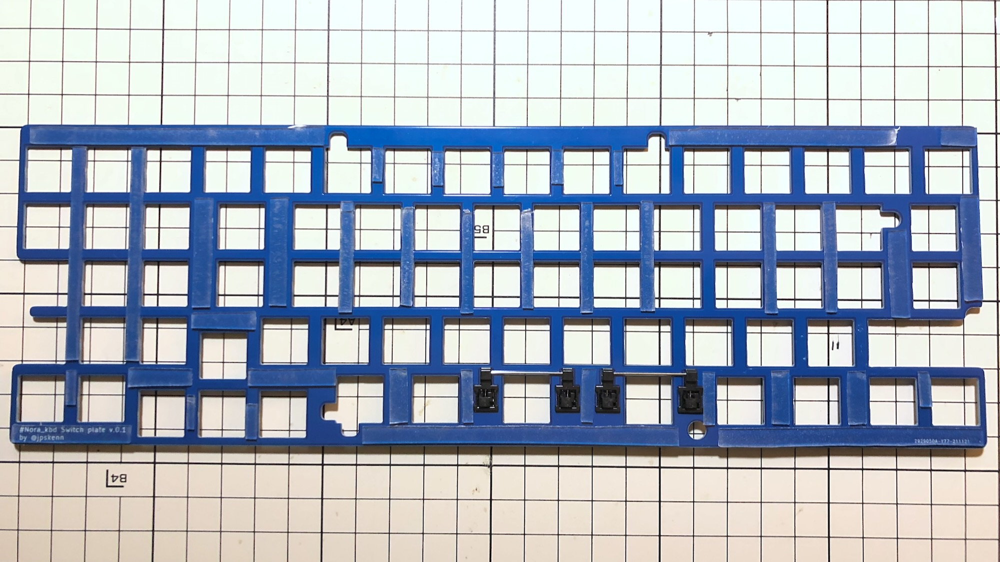
〓写真更新　スイッチプレートにスペーサーシートを貼り付けた状態  
（ほぼ透明のシートを使用したため、多少見づらくなっています）

### スイッチとスイッチプレートを基板へ取り付ける

スイッチを、スイッチプレートをはさむようにして基板に取り付けます。  
ケースネジに重なるスイッチ（※）は、この手順では取り付けません。  
※基板にネジのアイコンが描かれています。

<details>
<summary>《詳しい説明》</summary>

#### スイッチプレートを仮固定する

スイッチプレートのおもて側から6個のスイッチをはめ込み、スイッチの端子を基板のソケットへはめ込んで仮固定します。

1. スイッチを6個用意します。  
  端子が折れたものは使用できません。曲がっているものは、まっすぐにしておきます。

1. スイッチプレートをおもて側が上になるように置きます。

1. プレートのおもて側から、6箇所（1・3・5行目の左右の端）に、スイッチをパチンとはめ込みます。  
    スイッチをソケットの方向に合わせるため、スイッチの端子が手前側になるようにします。

    〓写真更新
    スイッチプレートに取り付けたスイッチ

1. スイッチがプレートの枠から浮いておらず、ぴったり密着してはまっていることを確認します。  
    浮いている場合は、スイッチを押し込んで密着させます。

    〓写真　スイッチとプレートの密着OK NG

1. 基板をおもて側が上になるようにして、プレートの隣に置きます。

1. スイッチ6個を取り付けたプレートを、スイッチ端子と基板のソケットの位置が合うようにして、基板に乗せて重ねます。  

1. プレートと基板がずれないように持ち上げ、基板の裏側を支えながら、どれかひとつのスイッチを押し込み、しっかりとソケットへ差し込みます。  

    〓写真　スイッチを押し込む様子

1. スイッチがしっかりと差し込まれ、基板にほぼくっついた状態になっていることを確認します。  
    5ピンのスイッチを取り付ける場合は、スイッチ固定用のプラスチックピン2本が根元まで刺さりきっていない場合があるので、よく確認しておきます。

    〓写真　スイッチの押し込まれ具合

1. 同じようにして、6個のスイッチすべてをソケットへ差し込みます。

〓写真更新
基板に取り付けられたスイッチとスイッチプレート

#### 残りのスイッチを取り付ける

ケースネジに重なるスイッチを除いて、残りのスイッチをすべて取り付けます。

1. スイッチを用意します。  
    端子が折れたものは使用できません。曲がっているものは、まっすぐにしておきます。

1. プレートにスイッチをはめ込みつつ、そのまま基板のソケットへスイッチ端子を差し込んで、スイッチを取り付けます。

1. ケースネジに重なるスイッチ（基板にネジのアイコンが描かれた箇所）を除き、残りのスイッチをすべて取り付けます。

    〓写真　ネジアイコン

</details>

〓写真更新  
基板に取り付けられたスイッチプレート

### スイッチの動作確認をおこなう

組み立て前におこなった[ソケット用パッドの確認](#ソケット用パッドの確認)と同様の手順で、ソケットに取り付けたスイッチが正しく動作するか確認します。  
この手順では、取り付けたスイッチを押して確認します。

正常に入力できないスイッチがあった場合は、[トラブル対応：正常に入力できないスイッチの原因調査](#トラブル対応正常に入力できないスイッチの原因調査)の手順に沿って調査します。

### 基板をケース、またはボトムプレートへ取り付ける

スイッチとプレートが組み合わされた基板を、ケース、またはボトムプレートへ取り付けます。

打鍵感向上に興味のある方は、次の項目をお読みになると何かヒントがあるかもしれません。

- [打鍵感向上：ケース内部の制振と静音化](打鍵感向上：ケース内部の制振と静音化)

#### （該当者のみ）基板をボトムプレートへ取り付ける

*ボトムプレートキットを使用する場合のみ、この手順をおこないます。*

ネジとスペーサーを使い、ボトムプレートに基板を取り付けます。

<details>
<summary>《詳しい説明》</summary>

1. ボトムプレート裏面から、以下の写真に示す○印をつけた8箇所に、ネジ（M2 3mm 低頭）を使い、スペーサー（M2 3mm）をねじ止めします。  

    ◎印をつけた右上と中央下の2箇所は、スイッチとの干渉を避けるため、スペーサーを右側へ寄せてねじ止めします。  

    〓写真更新
      
    スペーサー取り付け箇所

1. ボトムプレートをおもて側が上になるように置きます。

1. 基板を、ボトムプレートに取り付けたスペーサーの位置に合わせて乗せます。  
  基板裏側の部品がスペーサーにぶつからないように注意します。

1. 基板おもて側から、ネジ（M2 3mm 低頭）を使い、基板とスペーサーをねじ止めします。  

      
    基板とボトムプレートをねじ止めした状態

1. まだ取り付けていないスイッチを、すべて取り付けます。

1. ボトムプレート底面に、滑り止めのゴム足を貼り付けます。

    - キーボードに傾斜をつける場合  
      奥の左・右の2箇所：ゴム足 大  
      手前の左・中・右の3箇所：ゴム足 小

    - キーボードをフラットにする場合  
      手前と奥の左・中・右の6箇所：ゴム足 小

</details>

  
ボトムプレート取り付け完了

#### （該当者のみ）GH60型, Poker型ケースへ取り付ける

*GH60型, Poker型ケースを使用する場合のみ、この手順をおこないます。*

ケースに基板をねじ止めして取り付けます。

<details>
<summary>《詳しい説明》</summary>

1. ケースにネジ留め式の足がある場合は、最初に取り付けておきます。

1. ケースを安定したところへ置き、スイッチとスイッチプレートが組み合わされた基板を手に持ちます。

1. 基板を水平から30度くらいの角度に持ち、奥側から斜めにケース内へ入れていきます。  
  斜めに差し込んでいくと、USBコネクタがケースの穴にスッとはまります。

1. USBコネクタがはまった状態で基板の手前側を静かに下ろして水平にします。  
    力をかけることなく、基板全体がストンとケースに入ります。  
    力を入れてグリグリとこじったりググググッと押し込むようなことはせず、角度を合わせて差し込んで、水平にするだけです。

    〓写真更新  
    30度で差し込む

1. ケース付属のネジで、左上と右上の2箇所を仮固定します。

1. キット同梱のネジ（M2 4mm 低頭）で、左端、右端、中央、中央下の4箇所を仮固定します。

1. ケースに対して、基板の位置が上下左右の真ん中になるように調整します。

1. ネジが軽く止まる程度まで締めて基板を固定します。

1. ケース中央のネジ穴に重なるスイッチを、足を加工して取り付けます。  
    3ピンのスイッチは、加工不要で、そのまま取り付けできます。  
    5ピンのスイッチを使用する場合は、左右2本のプラスチックピンのうちネジ穴に干渉する方の足を、根本からニッパーなどで切断します。

    〓写真　5ピンの片足をカット

    おそらく回避できるはずですが、もしスイッチの中央の足が干渉する場合は、中央の足も切断します。

    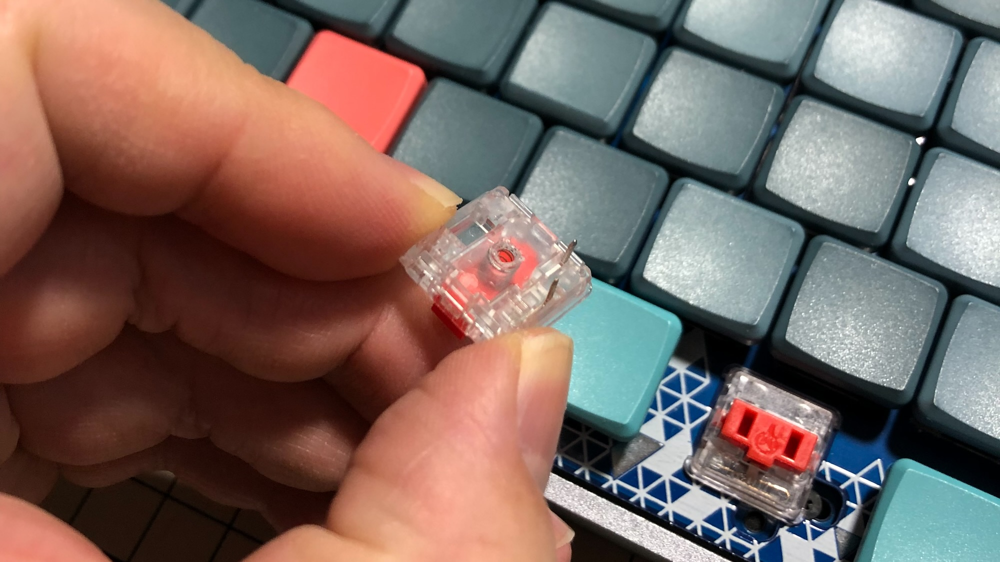  
    中央の足をカットしたスイッチ

1. 残りのスイッチを、すべて取り付けます。

1. ケース底面に、滑り止めのゴム足を貼り付けます。

</details>

〓写真　ケース取り付け完了

### スイッチの最終動作確認をおこなう

組み立て前におこなった[ソケット用パッドの確認](#ソケット用パッドの確認)と同様の手順で、ソケットに取り付けたスイッチが正しく動作するか最終確認します。  
この手順では、取り付けたスイッチを押して確認します。

### 仕上げ

1. キーキャップを取り付けます。

1. Remapでキーマップを変更したり、ファームウェアをカスタマイズして、自分好みに仕上げます。

1. 完成です。

〓写真更新  
製作例

写真を撮影し、`#Nora_kbd` のタグをつけてツイートすると設計者が喜んだりします。  
[Twitter: #Nora_kbd](https://twitter.com/search?q=(%23nora_kbd)&src=typed_query&f=live)

---

## 参考

打鍵感向上や機能追加についてのDIY情報や、トラブル調査方法などの参考資料です。  
必要に応じてお読みください。

### 打鍵感向上：ケース内部の制振と静音化

ケースやボトムプレートに工夫を施すことで、打鍵感を向上させる方法について説明します。

<details>
<summary>《詳しい説明》</summary>

- ケースの振動防止

    ケース内部におもりを入れておくと、ケースの共振が抑えられ、打鍵感の向上や、打鍵音の変化が期待できます。  
    おもりには、10円玉、真鍮板、自動車タイヤ用のホイールバランスウェイト、鉛シートなどを使用します。  
    また、スポンジ状の両面テープなどを使っておもりを貼り付けると、より高い防振効果を得ることができます。

    基板裏側の部品におもりの金属部分がふれてショートしないよう、スポンジシートを間に挟んだり、カプトンテープなどで保護します。

- 基板の振動防止

    基板とケース間をウレタンスポンジやシリコンシートなどで埋めると、基板の振動を抑えることができます。  
    また、ケース内部の空間を埋めることで、基板の振動音やスイッチの動作音がケース内で響くのを減らすことができます。

    ボトムプレートを使用する場合も、基板とボトムプレートの間に対策を施すことで、同様の効果が期待できます。

    スポンジなどを詰めすぎると、ネジや基板裏側の部品に力がかかるため、ほどよい程度に調節します。

これらの工夫をおこなう様子はこちら  
→[ケースが響いてうるさいのをなんとかしていく](https://twitter.com/jpskenn/status/1467010813773119490)

</details>

### トラブル対応：正常に入力できないスイッチの原因調査

正常に入力できないスイッチの原因調査と対応方法について説明します。  

<details>
<summary>《詳しい説明》</summary>

テスターをお持ちの方は、疑わしい箇所をテスターで調べるのが手っ取り早い方法ですので、積極的に使用してください。

〓リンクをDN0030タグとかに
電子工作に詳しい方であれば、[NoraのKiCadプロジェクト](https://github.com/jpskenn/Nora/tree/master/PCB)を参考にテスター等を用いて調査を進め、ジャンパ線などで配線を修復してください。

#### スイッチの取り付け不良

もっとも多い原因は、スイッチの取り付け不良です。  

スイッチを取り外し、端子が曲がったり折れたりしていないか確認します。  
端子の曲がりを修復するか、新しいスイッチに交換して、もう一度キー入力を確認します。

#### ソケットの取り付け不良

次に多いのが、ソケットの取り付け不良です。  

ソケットのはんだ忘れや、はんだが適切に行われていないことが原因のため、ソケットのはんだ状態を確認します。  
溶けたはんだがパッド全体に広がっていること、はんだがソケットの端子の間にポコっと盛り上がって固まっていることも確認します。  

念のため、再度はんだ付けし直して、もう一度キー入力を確認します。

#### 原因箇所の特定

スイッチとソケットの取り付け不良を調査しても改善しなかった場合、原因箇所の特定をおこないます。

組み立て前におこなった[ソケット用パッドの確認](#ソケット用パッドの確認)と同様の手順で、基板のパッド部分をピンセットでショートさせ、キー入力できるか確認します。  
パッドをショートしてキー入力できた場合は、パッド自体は正常ですので、スイッチとソケットを再度調査します。

#### キー入力が確認できない場合

この場合は、ソケット用パッドや基板の配線、その他の基板に取り付けられた部品が、組み立て中にダメージを受けたことが原因と考えられます。

これ以降の調査と修復の難易度が高くなりますが、ソケット用パッドが剥がれてソケットが取り付けられないというような物理的に破壊された状態を除けば、修復できる可能性は残されています。  
（パッドが剥がれたとしても、ネジ穴に重なるスイッチでなければ、スイッチを固定してソケットを端子に差し込んで、ソケットから基板へ配線すればなんとかなります。）

電子工作に詳しい方であれば、[NoraのKiCadプロジェクト](https://github.com/jpskenn/Nora/tree/master/PCB)を参考にテスター等を用いて調査を進め、ジャンパ線などで配線を修復してください。

自分ではどうにもできない場合など、何らかのアドバイスを必要とされる方は、キット同梱のリーフレットに記載された連絡先へ問い合わせてください。  
状況に応じて、できる限りのサポートをいたします。  

</details>

### トラブル対応：LEDの取り付け不良調査

LEDが点灯しない場合など、LEDの取り付け不良を調査する方法について説明します。

<details>
<summary>《詳しい説明》</summary>

調査の前提として、LEDの点灯には、

```text
点灯しないLEDより後ろは、すべて点灯しない。
```

というルールがあります。

例えば、
`L1` `L2`が点灯し、`L3`が点灯しないとき、
`4`より後ろは、正しく取り付けられていたとしても、点灯しません。

このルールをふまえ、点灯しない最初のLEDから順番に調査を進めていきます。

#### LEDがひとつも点灯しない場合

LEDがひとつも点灯しない場合は、LEDに電源が供給されていないことが原因のひとつと考えられます。

ジャンパ`JP3: Device VDD source`が、正しい位置にジャンパされていることを確認します。  
使用するMCUに合わせてジャンパする位置の組み合わせが異なりますが、手順通りに組み立てる場合、通常は`Onboard`へジャンパします。

ジャンパ位置は合っているが、ジャンパのはんだ作業に不安がある場合は、念のため、ジャンパをやりなおしておきます。

正しい位置にジャンパしていても点灯しない場合は、LED点灯状態に応じた確認をおこないます。

MCUとジャンパの組み合わせは次の通り。

| MCU | ジャンパ位置 | 備考 |
| :--: | :--: | :-- |
| ATmega32u4 | `Onboard` | 通常の組み合わせ |
| Raspberry Pi PICO | `PICO VBUS` | |

#### 2行目以降のLEDが点灯しない場合

2行目以降のLEDが点灯しない場合は、LEDの信号伝達経路が正しく指定されていないことが原因のひとつと考えられます。

全キーにLEDを取り付けた場合は、ジャンパ`JP4: LED install`が、`Full`にジャンパされていることを確認します。  
また、R1とR5だけにLEDを取り付けた場合は、`Simple`にジャンパされていることを確認します。

正しい位置にジャンパしていても点灯しない場合は、LED点灯状態に応じた確認をおこないます。

#### LEDの光り方がおかしい場合

LEDがちらついたり、色がおかしい場合は、LEDのはんだ不良が疑われます。

光り方がおかしいLEDのはんだ付けをやり直します。

フラックスがある場合は、LEDの端子に塗布しておくと、はんだがダマになりにくくなります。  
はんだ吸い取り線がある場合は、一旦はんだを除去しておきます。  
どちらもない場合は、はんだを足しながら、はんだ付けをやり直します。

#### LEDが点灯しない場合

正しくジャンパしていてもLEDが点灯しない場合は、LEDの取り付けまたはLED自体に原因があると考えられます。  
LEDの点灯に関するルールにしたがい、**光らないLEDの、番号が若いものから順番に**以下の対処を行います。

1. 光らないLEDのはんだ不良を修復する

    「光らないLEDが正しくはんだ付けされていない」と仮定した対処です。  
    光らないLEDのはんだ付けをやり直します。

1. 光らないLEDの*ひとつ前*のLEDのはんだ不良を修復する

    「光らないLEDは正常に取り付けられているが、*ひとつ前*のLEDのはんだ不良が原因で配線がつながっていない」と仮定した対処です。  
    光らないLEDの*ひとつ前*のLEDのはんだ付けをやり直します。

1. 光らないLEDを新しいものに交換する

    「光らないLEDが壊れてしまっている」と仮定した対処です。  
    これまでの対処をおこなっても点灯しない場合は、光らないLED自体が壊れていると判断して、新しいものに交換します。

    以下のような方法で、LEDを取り外すことができます。

    - 少しずつ持ち上げる方法
      強く持ち上げるとパッドが剥がれてひどいことになるので、力をかけずに少しずつ持ち上げます。

        1. こて先の温度を320℃程度にします。
        1. はんだ吸い取り線で、できる限りのハンダを除去しておきます。
        1. 片側2本の端子を同時に加熱しながら、ピンセットでLEDを少しだけ持ち上げます。
        1. 反対側の2本の端子も、同様にして、少しだけ持ち上げます。
        1. これを交互に繰り返し、じわりじわりと取り外していきます。

    - 熱々にして持ち上げる方法
      溶けたはんだで火傷しないように注意します。

        1. こて先の温度を320℃程度にします。
        1. LEDの端子部分を温め、はんだをたーーーーーーっぷりと溶かし、端子部分につけておきます。  
        （あずき〜大豆くらいの大きさの溶けたはんだ）
        1. 反対側の端子にも、同じようにはんだをたっぷりとつけます。
        1. LEDのプラ部分をピンセットつまみます。
        1. LEDの両側のはんだを交互に2秒ずつ温めるのを繰り返し、両側のはんだが溶けた状態にします。
        1. その状態でLEDを引き上げて、基板から取り外します。

</details>

### 資料：USBコネクタ接続図

USBコネクタ（型番：USB4085-GF-A）の配線は次の通りです。


USBコネクタ接続図

### 資料：ファームウェアの書き込み方法

[QMK Toolbox](https://github.com/qmk/qmk_toolbox/releases)を使用してビルド済み（＝作成済み）のファームウェアを書き込む方法について説明します。

QMKファームウェアのドキュメント[ファームウェアを書き込む](https://docs.qmk.fm/#/ja/newbs_flashing?id=ファームウェアを書き込む)も、あわせてご覧ください。

<details>
<summary>《詳しい説明》</summary>

1. [資料：Noraキーボードのファームウェア](〓リンク)に記載のダウンロード先から、ビルド済みのファームウェアをダウンロードします。

1. [QMK Toolbox](https://github.com/qmk/qmk_toolbox/releases)をダウンロードし、起動します。

1. QMK Toolboxに、ダウンロードしておいたファームウェアをロードします。

1. `Nora`キーボードをDFU (Bootloader)モードにします。
    1. USBケーブルが接続されている場合は、ケーブルを抜きます。
    1. キーボードの**左上**のキーを押したまま、USBケーブルを差し込みます。

1. QMK Toolboxの画面に、以下のメッセージが表示されます。  
    （もし表示されない場合は、USBケーブルを接続した状態で、基板裏側のリセットボタンを押します）

    ```text
    *** Atmel DFU device connected: ATMEL ATm32U4DFU (03EB:2FF4:0000)
    ```

1. QMK Toolboxの`Flash`ボタンを押すとファームウェアの書き込みが始まります。  
    5秒程度で書き込みが終わり、QMK Toolboxの画面に以下のような書き込み完了メッセージが表示されます。（サイズ表記などの、細かい部分は実際とは異なります）

    ```text
    *** Attempting to flash, please don't remove device
    >>> dfu-programmer atmega32u4 erase --force
        Erasing flash...  Success
        Checking memory from 0x0 to 0x6FFF...  Empty.
    >>> dfu-programmer atmega32u4 flash --force /Users/jpskenn/qmk_firmware/nora_v01_via.hex
        0%                            100%  Programming 0x5E80 bytes...
        [>>>>>>>>>>>>>>>>>>>>>>>>>>>>>>>>]  Success
        0%                            100%  Reading 0x7000 bytes...
        [>>>>>>>>>>>>>>>>>>>>>>>>>>>>>>>>]  Success
        Validating...  Success
        0x5E80 bytes written into 0x7000 bytes memory (84.38%).
    >>> dfu-programmer atmega32u4 reset
    *** Atmel DFU device disconnected: ATMEL ATm32U4DFU (03EB:2FF4:0000)
    ```

    書き込み完了メッセージが表示されたら、QMK Toolboxを終了してもかまいません。  

    これとは違うメッセージ（書き込み失敗など）が表示された場合は、スクリーンショットを撮ったり、メッセージをコピーしておくと、何らかのサポートを受ける場合にスムースに話が進みます。

1. 書き込みが終わってから10秒ほど待つと、キーボードが起動し、キー入力できるようになります。  
  ファームウェアを書き込んだ後、初回起動時に外部EEPROMの消去をおこなっています。  
  この消去処理に10秒ほどかかっています。

1. リセットボタンを使ってDFUモードにする操作をおこなった場合は、[資料：EEPROMを消去して、初期状態に戻す方法](#資料eepromを消去して-初期状態に戻す方法)を実施します。

以上でファームウェアの書き込み作業は完了です。

</details>

### 資料：初期ファームウェアの機能と設定値

出荷時に書き込まれている初期ファームウェアの機能と設定値を説明します。

<details>
<summary>《詳しい説明》</summary>

- キーマップ書き換えツール
  RemapやVIAに対応。

- レイヤー

    7個のレイヤー。  
    レイヤー構成とLEDインジケータの色は次の通りです。

    〓変更

    | No. | レイヤー名 | 機能 | LEDインジケータ色<br>手前, 奥 |
    | :-: | :-- | :-- | :-: |
    | 0 | ベースレイヤー #1 | 日本語配列 | 白, 白 |
    | 1 | ベースレイヤー #2 | テンキー | 青, 青 |
    | 2 | ベースレイヤー #3 | （未設定） | 黄, 黄 |
    | 3 | Lower | 記号, ボリューム, ファンクションキー | －, 緑 |
    | 4 | Raise | カーソル移動, 数字, ファンクションキー | －, 水 |
    | 5 | Adjust | 各種設定, スクロールロックなど | －, 赤 |

- イルミネーションLED  

    〓何がデフォ？
    全キー71個のLEDによる、RGB Matrix Lightingに対応。  
    初期状態のエフェクトは〓  
    エフェクトのモードは`RGB_MOD`, `RGB_RMOD`で変更でき、EEPROMにモードが保存されます。

- レイヤーインジケータLED  

    左上2個（1行目の左から2個）のLEDをレイヤーインジケータLEDとして使用し、レイヤーの状態を表示します。

</details>

### 資料：Noraキーボードのファームウェア

ビルド済みファームウェアと、ソースファイルを用意しています。

#### ビルド済みのファームウェア

- [Nora v1 ファームウェア, VIA対応デフォルト](https://gist.github.com/jpskenn/3fcebf6a7c17f1a8433a8d954e05206f)

R1,R5のみLED

#### ファームウェアのソース

私がQMKからフォークしたリポジトリ  
[https://github.com/jpskenn/qmk_firmware](https://github.com/jpskenn/qmk_firmware)  
を使用してください。  

[develop_nora](https://github.com/jpskenn/qmk_firmware/tree/develop_Nora)ブランチの、`keyboards/nora/v01`に関連ファイルが格納されています。

### 資料：EEPROMを消去して、初期状態に戻す方法

キーマップやLEDの表示モードなどのEEPROMに記録されているデータを消去し、初期状態に戻すことができます。  

また、古いデータが残って動作がおかしくなるのを防止するため、リセットボタンを使用してファームウェアを書き込んだ際にもこの操作をおこないます。

<details>
<summary>《詳しい説明》</summary>

1. USBケーブルを接続している場合は、ケーブルを抜きます。

1. キーボードの左上のキーを押したまま、USBケーブルを差し込みます。

1. ケーブルを差し込んで、1、2と数えてから、USBケーブルを抜きます。

1. USBケーブルを差し込みます。

1. 10秒ほど待つとキーボードが起動します。

以上でEEPROMが消去され、初期状態に戻ります。

</details>

### 資料：Nora, Fearless Wings (DN0030)関連ファイル

〓リンク更新
関連ファイルは、  
[コミット：718199fba41e841ba6e2f60da43260c8e984e9b2](https://github.com/jpskenn/Nora/tree/718199fba41e841ba6e2f60da43260c8e984e9b2)の内容を、  
[Nora v01_PCBタグ](https://github.com/jpskenn/Nora/releases/tag/v01_PCB)にまとめてあります。

〓via json

### 資料：Raspberry Pi PICOによる動作（実験的機能）

DIYの実験的機能として、Raspberry Pi PICO（以下、PICOと呼びます）を使用して、キーボードを動作させることができます。

<details>
<summary>《詳しい説明》</summary>

#### PICOを使用して、できること

- キーマトリクスの駆動
- LEDの点灯

#### PICOを使用して、できるかもしれないこと

以下は、動作未確認の項目です。

- EEPROMや、その他のI2C接続された機器との通信
- 未割り当てのGPIOピンの使用

#### 使用時の注意

- GH60型，Poker型ケースには、（たぶん）取り付けできません。  
  取り付けられたとしても、ケーブルの取り回しを工夫する必要があります。

- 基板のジャンパを変更して使用します。  
  [PICO使用時の設定](#PICO使用時の設定)を参照。

#### 接続図

PICOの接続図は以下の通り。

〓写真　回路図

#### 取り付け

〓このへん違う

コンスルーを使用する場合、20ピンで、高さ2mm以上のものが使用できます。

基板とスイッチプレートの感覚が1mmしかないため、コンスルーが奥まで刺さり切らない場合があります。  

ボトムプレートに取り付ける場合は、プレート中央部を切り離します。  
L字型のコネクタをもつUSBケーブルを使用すると、すっきりとおさまります。

#### PICO使用時の設定

必要に応じて基板裏側のジャンパを設定してください。

- `JP3:Device +5 source`：LEDの電源供給元

    | ジャンパ設定 | LEDの電源供給元 | 備考 |
    | :-: | :-- | :-- |
    | PICO VBUS | PICOのVBUS ||
    | Onboard | 基板に接続したUSBのVCC | オンボードのMCU、ATmega32u4使用時のデフォルト設定|
    | オープン | 接続なし ||

- `JP1`,`JP2`：I2Cプルアップ抵抗（4.7KΩ）への接続

    | ジャンパ設定 | I2Cプルアップ抵抗への接続 | 備考 |
    | :-: | :-- | :-- |
    | ブリッジ | プルアップ抵抗へ接続 | オンボードのMCU、ATmega32u4使用時のデフォルト設定|
    | オープン | 接続なし ||

#### ファームウェア

- [PRK Firmware](https://github.com/picoruby/prk_firmware)

  以下の基本的な動作を確認済みです。

  - 全キーの入力
  - LED点灯

  動作確認に使用したファームウェアはこちら：[keymap.rb](../Firmware/prk_nora/)
