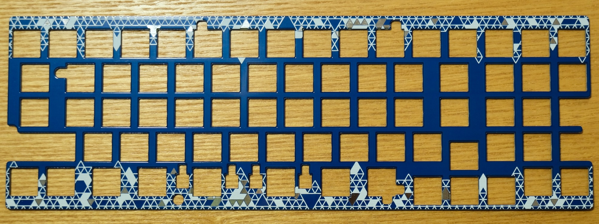
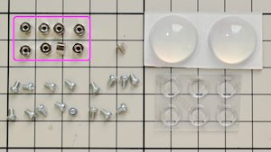
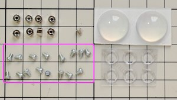
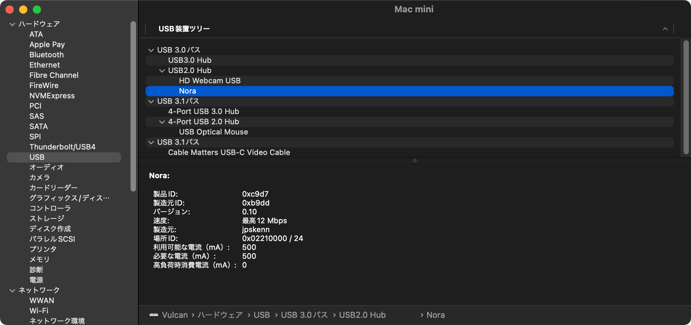

# ”Nora, Fearless Wings (DN0031) 試作版”ビルドガイド

購入していただいた方、リポジトリから製造していただいた方、その他の皆様、Noraに興味を持っていただきありがとうございます。

このドキュメントは、”Nora, Fearless Wings (DN0031) 試作版”を組み立てるためのビルドガイドです。  
以下に示す、ふたつレイアウトの組み立て方法について説明します。  
参考： [Nora, Kyboard Layout Editor](http://www.keyboard-layout-editor.com/#/gists/568990362f215776aa93e3b90064f241)

- `FWレイアウト`

  ロータリーエンコーダを配置せず、中央部分に隙間のあるレイアウト
  
    
  Keycaps: Kailhロープロファイルキーキャップ  
  Case: 専用ボトムプレート

- `REレイアウト`

  中央にロータリーエンコーダを配置したレイアウト
  
    
  Keycaps: Gravity Keycaps + MBK  
  Case: KBDfans 60% ALUMINUM LOW PROFILE CASE, Gray  
  Rotary Encoder: ALPS EC12E2440301（貫通軸タイプ）  
  Knob: Daily Craft Keyboard ロープロ FLAT 33mm

Noraのコンセプトや特徴、ビルド例などについては、[README](https://github.com/jpskenn/Nora/blob/main/README.md)をご覧ください。

ビルドガイド全体に目を通して作業手順を把握しておくとミスの防止につながりますので、ぜひ、一度お読みになってから組み立て作業を始めてください。

作業手順をしっかりと確認しながら組み立てたい方は、

<details>
<summary>《詳しい説明》</summary>

ここに追加の説明を表示します。
</details>

と書かれたところをクリックすると、追加の説明が表示されます。

---

## 目次

<!-- @import "[TOC]" {cmd="toc" depthFrom=2 depthTo=3 orderedList=false} -->

<!-- code_chunk_output -->

- [目次](#目次)
- [Nora, Fearless Wings (DN0031)の特徴, 機能](#nora-fearless-wings-dn0031の特徴-機能)
- [注意事項、制限など](#注意事項-制限など)
- [部品リスト](#部品リスト)
  - [キット内容](#キット内容)
  - [別途用意が必要な部品](#別途用意が必要な部品)
  - [オプション部品](#オプション部品)
- [組み立てに必要な工具](#組み立てに必要な工具)
- [組み立て前の確認](#組み立て前の確認)
  - [同梱物の確認](#同梱物の確認)
  - [接続の確認](#接続の確認)
  - [ソケット用パッドの確認](#ソケット用パッドの確認)
- [組み立て手順](#組み立て手順)
  - [（該当者のみ）`REレイアウト`用ファームウェアへの書き換え](#該当者のみreレイアウト用ファームウェアへの書き換え)
  - [（オプション）基板、スイッチプレート、ボトムプレートの側面を塗る](#オプション基板-スイッチプレート-ボトムプレートの側面を塗る)
  - [（オプション）LEDを取り付ける](#オプションledを取り付ける)
  - [Kailh Choc用ソケットを取り付ける](#kailh-choc用ソケットを取り付ける)
  - [（該当者のみ）ロータリーエンコーダを取り付ける](#該当者のみロータリーエンコーダを取り付ける)
  - [スイッチプレートにスペーサーシートを貼り付ける](#スイッチプレートにスペーサーシートを貼り付ける)
  - [スイッチとスイッチプレートを基板へ取り付ける](#スイッチとスイッチプレートを基板へ取り付ける)
  - [スイッチの動作確認をおこなう](#スイッチの動作確認をおこなう)
  - [基板をケース、またはボトムプレートへ取り付ける](#基板をケース-またはボトムプレートへ取り付ける)
  - [スイッチの最終動作確認をおこなう](#スイッチの最終動作確認をおこなう)
  - [仕上げ](#仕上げ)
- [参考](#参考)
  - [打鍵感向上：ケース内部の制振と静音化](#打鍵感向上ケース内部の制振と静音化)
  - [トラブル対応：正常に入力できないスイッチの原因調査](#トラブル対応正常に入力できないスイッチの原因調査)
  - [トラブル対応：LEDの取り付け不良調査](#トラブル対応ledの取り付け不良調査)
  - [資料：ファームウェアの書き込み方法](#資料ファームウェアの書き込み方法)
  - [資料：初期ファームウェアの機能と設定値](#資料初期ファームウェアの機能と設定値)
  - [資料：EEPROMを消去して、初期状態に戻す方法](#資料eepromを消去して-初期状態に戻す方法)
  - [資料：Nora, Fearless Wings (DN0031)関連ファイル](#資料nora-fearless-wings-dn0031関連ファイル)
  - [資料：Raspberry Pi PICOによる動作（実験的機能）](#資料raspberry-pi-picoによる動作実験的機能)
- [サービスマニュアル](#サービスマニュアル)
  - [パーツリスト](#パーツリスト)
  - [基板セットアップ](#基板セットアップ)

<!-- /code_chunk_output -->

---

## Nora, Fearless Wings (DN0031)の特徴, 機能

- 狭ピッチ
- Jonesゆずりのキーレイアウト
- 左右に離れたアルファ部
- Choc v1スイッチと、MBK以下のサイズのキーキャップに合わせた専用設計
- RemapやVIAなどのキーマップ書き換えツールに対応
- 外部EEPROM（8KB）を搭載し、十分な数のレイヤーを使用できる
- 専用ボトムプレート以外にも、GH60型，Poker型のロープロファイルケースに取り付けできる
- ファームウェア書き込み済み  
  試作版では、`REレイアウト`を使用する場合はファームウェアの書き換えが必要です。
- 細かな部品を実装済み
- オプションとして、以下のハードウェア機能を使用可能
  - レイヤーインジケータ／イルミネーションLED（全キー）
  - Raspberry Pi PICOによる動作（実験的機能）

## 注意事項、制限など

- キーキャップ

  MBK以下のサイズのキーキャップに合わせて設計されており、Choc用のキーピッチよりも横方向がほんの少し狭くなっています。

  取り付け確認済みのキーキャップは次の通りです。

  - MBK
  - Gravity Keycaps
  - Kailh製のロープロファイルキーキャップ（※注意）  

    ※注意  
    Kailh製のロープロファイルキーキャップは、MBKなどに比べてキーの寸法が少し大きいため、隣同士のキーが当たる場合があります。  
    ソケットを傾かないように取り付けたり、キーキャップの成形バリを取り除いたり、干渉する箇所を削る必要があるかもしれません。  

- スイッチの取り付け

  最下行の親指部分、左右のスペースキーとして使用するスイッチは、上下逆向きに取り付けます。  
  キーキャップは特に問題なく取り付けることができます。  
  透過タイプのキーキャップを使用する場合は、LEDも上下逆向きに取り付けるため、光がほとんど透過しません。

  スイッチの手前側が眩しく感じられる場合は、スイッチのLED穴側面にマスキングテープなどを貼るなどして減光してください。

- スイッチの加工

  `FWレイアウト`をGH60型，Poker型ケースへ取り付ける場合は、ケース中央のネジ穴に重なるスイッチの足を加工（切断）して取り付けます。

- ソケットの取り付け

  1行目と4行目の左端のソケット2個は、ソケットの端子部分が基板から約0.5mm飛び出した状態で取り付けます。

  

  GH60型，Poker型のロープロファイルケースへの取り付けなども含め、実用上の問題がないことを確認していますが、怪我などしないようご留意ください。

- GH60型，Poker型のロープロファイルケースへの取り付け

  ケースの構造によっては、取り付けが難しかったり取り付けできない場合があるかもしれません。  
  ここに記載していないケースへの取り付けの成功／失敗の報告を、随時募集しています。

  取り付け確認済みのケースは次の通りです。  
  - [KBDfans 60% ALUMINUM LOW PROFILE CASE](https://kbdfans.com/collections/60-layout-case/products/customized-gh60-aluminum-case)

  ”TOFU”や”60%プラスチックケース”などのハイプロファイルタイプのケースにも取り付けできますが、キーキャップの天面がケースのフレームよりも低くなるため、実用に向きません。  
  よって、取り付けの対象外としています。  
  参考：[TOFUケースへの装着例](https://twitter.com/jpskenn/status/1466729696713142277)

## 試作版，試作版キットに関する注意事項

- ファームウェア

  試作版の提供形態（`FWレイアウト`と`REレイアアウト`の両方のスイッチプレートを同梱し、どちらでも製作できるキット内容）の都合上、`REレイアウト`を使用する場合はファームウェアを書き換える必要があります。  
  正式版では、`FWレイアウト`と`REレイアアウト`をそれぞれ別のキットとして提供する予定で、その際はファームウェアの書き換えは不要となります。

  ビルド済みのファームウェアを用意していますので、[QMK Toolbox](https://github.com/qmk/qmk_toolbox)などを使用して、書き換えてください。  
  詳しくは、組み立て手順の[（該当者のみ）`REレイアウト`用ファームウェアへの書き換え](#該当者のみreレイアウト用ファームウェアへの書き換え)をご覧ください。

## 部品リスト

このキットを組み立てるためには、”キット内容”に加え、”別途用意が必要な部品”が必要です。  
好みに合わせて、必要な数をお買い求めください。

”オプション部品”は、使いたい機能などに応じて用意してください。  

部品の購入先は、Self-Made Keyboards in Japanの[ショップリスト](https://scrapbox.io/self-made-kbds-ja/ショップリスト)などを参考にしてください。

### キット内容

〓写真入れ替え〓

| 部品名 | 個数 | 備考 |
| ----- | :-----: | ----- |
| ご案内リーフレット | 1 | |
| 基板 | 1 | [おもて側<br>](../assets/BuildGuide_v.0.1/_DSF1269.jpeg)<br>[裏側<br>](../assets/BuildGuide_v.0.1/_DSF1271.jpeg) |
| スイッチプレート<br>`FWレイアウト`、または`REレイアウト`のいずれか | 1 | `FWレイアウト`<br>[おもて側<br>](../assets/BuildGuide_v.0.1/_DSF1267.jpeg)<br>[裏側<br>](../assets/BuildGuide_v.0.1/_DSF1268.jpeg)<br>`REレイアウト`<br>[おもて側<br>](../assets/BuildGuide_v.0.1/_DSF1267.jpeg)<br>[裏側<br>](../assets/BuildGuide_v.0.1/_DSF1268.jpeg) |
| ボトムプレート | 1 | [おもて側<br>](../assets/BuildGuide_v.0.1/_DSF0644.jpeg)<br>[裏側<br>](../assets/BuildGuide_v.0.1/_DSF0654.jpeg) |
| スペーサーシート<br> シール付き, 1mm厚, 500mm * 10mm | 1 | |
| スペーサー, M2 3mm | 8 | [](../assets/BuildGuide_v.0.1/_DSF0435_0.jpeg) |
| ネジ, M2 3mm, 低頭 | 16 | [](../assets/BuildGuide_v.0.1/_DSF0435_1.jpeg) |
| ネジ, M2 4mm, 低頭 | 5 | [](../assets/BuildGuide_DN0031/_DSF0432_1.jpeg) |
| ゴム足 小 | 6 | [](../assets/BuildGuide_v.0.1/_DSF0435_4.jpeg) |

※出荷時期によってメーカーや品番などが変わることがあります

### 別途用意が必要な部品

| 部品名 | 個数 | 備考 |
| ----- | :-----: | ----- |
| ソケット<br>Kailh Chocロープロファイル用 | 63〜64 | `FWレイアウト`：64個<br>`REレイアウト`：63個 |
| スイッチ<br>Kailh Choc v1 | 63〜64 | `FWレイアウト`：64個<br>`REレイアウト`：63個 |
| キーキャップ<br>Choc用<br>MBK以下のサイズのもの | 63〜64 | `FWレイアウト`：64個<br>1u × 56個<br>1.5u × 8個<br>`REレイアウト`：63個<br>1u × 54個<br>1.5u × 8個<br>1u, 1.25u, 1.5uのうち、いずれか1個 |
| ロータリーエンコーダ<br>ALPS EC11, EC12または同等品 | 1 | `REレイアウト`を組み立てる場合のみ必要 |
| ロータリーエンコーダ用ノブ<br>（つまみ） | 1 | `REレイアウト`を組み立てる場合のみ必要<br>ロータリーエンコーダの軸の形状に合ったもの。<br>最大径33mm（使用するキーキャップのサイズによる） |
| USBケーブル （Type-C） | 1 | |

### オプション部品

| 部品名 | 個数 | 備考 |
| ----- | :-----: | ----- |
| LED<br>SK6812MINI-E | 64〜65 | LEDを取り付ける場合<br>`FWレイアウト`：64個<br>`REレイアウト`：65個 |
| GH60型，Poker型ロープロファイルケース | 1 | ケースへ取り付ける場合 |
| Raspberry Pi PICO | 1 | 実験的機能をDIYで楽しむ場合 |
| ゴム足 | 必要数 | ボトムプレート裏側へ貼り付け、角度を変えたりする場合<br>例：[大きなゴム足](https://www.yodobashi.com/product/100000001001980663/) |

## 組み立てに必要な工具

- 先の細いドライバー（M2ネジに対応するもの）
- ピンセット
- はんだ付け関連用品
- はさみ
- ニッパー

フラックスやハンダ吸い取り線を用意しておくと、ちょっとした修正などがやりやすくなります。
[遊舎工房の工具セット](https://yushakobo.jp/shop/a9900to/)を参考に用意してください。

なお、無くても組み立てはできますが、何か不具合があった場合の原因調査ではテスターがあると便利です。

## 組み立て前の確認

組み立てを開始する前に、同梱物と基板についての基本的な確認をおこないます。  

**何か問題があった場合は作業を中止し、リーフレットに記載された連絡先へ問い合わせてください。**  
**組み立ての開始後は、初期不良として対応できかねる場合があります。**

### 同梱物の確認

リーフレットに記載された部品が、不足なく入っていることを確認します。

### 接続の確認

基板をUSBケーブルでMacやPCに接続して、キーボードとして認識されることを確認します。

充電用ではないUSBケーブルを使用します。
他の機器を接続して使用した実績のあるケーブルを使うと、無用のトラブルを防げます。

下記のOS別の確認方法を参考に、確認してください。

<details>
<summary>確認方法：《Mac, macOS Monterey 12.0.1》</summary>

1. 基板とMacをUSBケーブルで接続します。

    接続した際に`キーボード設定アシスタント`が表示された場合は、`終了`ボタンを押して閉じます。

      

    なお、キーボード設定アシスタントは、次の操作でいつでも呼び出すことができます。  
    `システム環境設定`から、`キーボード` → `キーボード`タブ → `キーボードの種類を変更…`ボタンを押す。

1. システム情報を表示します。

    メニューバーの``マークから、`このMacについて`を選び、表示された画面で`システムレポート…`をクリックします。  

1. USBデバイスを表示します。

    `システム情報`画面で、左側の`ハードウェア`から`USB`を選択します。

1. `Nora`が接続されていることを確認します。

    右側上部の`USB装置ツリー`で、`Nora`を探します。  
    どこかに`Nora`と表示されていれば、正しく接続されています。  

    `USB装置ツリー`の下の方が見切れている場合があるため、スクロールして探してください。

      
    システム情報の表示

</details>

<details>
<summary>確認方法：《Windows, 10 Pro 1909(18363.1082)》</summary>

1. 基板とPCをUSBケーブルで接続します。

1. `デバイス`を表示します。

    `スタートボタン`から`設定`を開いて`デバイス`を選択します。

1. `Nora`が接続されていることを確認します。

    `マウス、キーボード、ペン`の項目に`Nora`が表示されていれば、正しく認識されています。

      
    デバイスの表示

</details>

### ソケット用パッドの確認

[Remap](https://remap-keys.app/)のテスト機能を使用し、Kailh Chocソケット用のパッド（※）が、電気的に正しく反応することを確認します。  
※ソケットをはんだ付けする、基板上の四角い銀色の部分

Remap / VIA用キーボード定義ファイル： [nora_via_v031.json](https://gist.github.com/jpskenn/7fac7a9bc819f2d4a7f97086cdd32fdd)

<details>
<summary>《詳しい説明》</summary>

キーマップ書き換えツール[Remap](https://remap-keys.app/)のテスト機能を使って確認をおこないます。

1. 基板の裏側が上になるように置きます。

1. 基板をPCやMacとUSBケーブルで接続します。

    USBコネクタ部分に無理な力がかからないように気をつけます。

1. Google Chromeブラウザで、[Remap](https://remap-keys.app/)のページを開きます。

    Chromeブラウザは、Web HID対応のバージョン89以降を使用します。

1. `START REMAP FOR YOUR KEYBOARD`をクリックして始めます。

    

1. `+ KEYBOARD`をクリックして、キーボードをRemapに接続する画面を表示します。

    

1. デバイスへの接続要求画面で`Nora`を選択し、`接続`をクリックしてキーボードをRemapに接続します。

    

1. キーボード定義ファイルを読み込みます。

    

    1. Remap / VIA用キーボード定義ファイル（[nora_via_v031.json](https://gist.github.com/jpskenn/7fac7a9bc819f2d4a7f97086cdd32fdd)）をダウンロードします。  

    1. ZIPファイルを展開して、`nora_via_v031.json`ファイルを取り出します。

    1. Remapの`IMPORT(.JSON)`を押すかファイルをドロップして、取り出したファイルを読み込みます。

1. 右側のアイコンから`Layout Option`をクリックし、使用するレイアウトを選択します。

    `FWレイアウト`： Fearless Wings  
    `REレイアウト`： FW + Rotary Encoder

    

1. 右側のアイコンから`…`をクリックし、`Test Matrix mode`を選択します。

    

1. ピンセットなどの電気を通すものを使い、基板裏側のソケット用パッドをショートさせます。

      
    ピンセットを使ってショートさせる様子

1. Remapの画面で、ショートさせた箇所に対応するキーの色が変わることを確認します。

    *基板が裏側になっているので、画面ではキーの位置が左右反対になります。*

    
    ショートさせる前

    
    ショートさせた後（キーの色が変わる）

    パッドをショートしても反応がない場合は、基板に実装された部品が外れたり、配線がダメージを受けている可能性があります。  
    この確認作業をすべてのパッドでおこなった後、どのパッドが反応しなかったかわかるようにスクリーンショットなどを残してください。  
    撮影したスクリーンショットと合わせて、リーフレットに記載された連絡先へ問い合わせてください。

1. 同様の作業を繰り返し、全てのキーの色が変わることを確認します。

    なお、`REレイアウト`でロータリーエンコーダの回転に割り当てた箇所は、この手順では確認しません。  
    
    ロータリーエンコーダの回転に割り当てた箇所

1. 確認が終わったら、USBケーブルを抜きます。

</details>

## 組み立て手順

以下の手順に沿って組み立てます。  
`（オプション）`と書かれた項目は、不要であれば作業をとばしてもかまいせん。  
`（該当者のみ）`と書かれた項目は、条件に該当する場合のみ作業をおこないます。

怪我などに気をつけて作業してください。  

### （該当者のみ）`REレイアウト`用ファームウェアへの書き換え

*`REレイアウト`を使用する場合のみ、この手順をおこないます。*

QMK Toolboxなどを使用して、ファームウェアを書き換えます。  
`REレイアウト`用のRemap / VIA対応のビルド済みファームウェア： [nora_v031_via_re.hex](https://gist.github.com/jpskenn/dc6ec5eb08fa3a841a96057d544c794c)

<details>
<summary>《詳しい説明》</summary>

QMK Toolboxを使用して書き込む手順を説明します。

1. `REレイアウト`用のRemap / VIA対応のビルド済みファームウェアをダウンロードします。  
    [nora_v031_via_re.hex](https://gist.github.com/jpskenn/dc6ec5eb08fa3a841a96057d544c794c)

1. ダウンロードしたZipファイルを展開して、hexファイルを取り出します。

1. [QMK Toolbox](https://github.com/qmk/qmk_toolbox/)をダウンロードし、起動します。

1. QMK Toolboxの`Open`ボタンを押し、ファームウェアのhexファイルを開きます。

      

1. 基板を裏側が上になるように置きます。

1. 基板をPCやMacとUSBケーブルで接続します。

1. 基板裏側のリセットボタンを押します。

    〓写真

1. QMK Toolboxの画面に、以下のようなメッセージが表示されることを確認します。  

    ```text
    *** Atmel DFU device connected: ATMEL ATm32U4DFU (03EB:2FF4:0000)
    ```

1. QMK Toolboxの`Flash`ボタンを押すとファームウェアの書き込みが始まります。  

    5秒程度で書き込みが終わり、QMK Toolboxの画面に以下のような書き込み完了メッセージが表示されます。  
    （ファイル名やサイズ表記など、細かい部分は少し異なります）

    ```text
    *** Attempting to flash, please don't remove device
    >>> dfu-programmer atmega32u4 erase --force
        Erasing flash...  Success
        Checking memory from 0x0 to 0x6FFF...  Empty.
    >>> dfu-programmer atmega32u4 flash --force /Users/jpskenn/qmk_firmware/nora_v01_via.hex
        0%                            100%  Programming 0x5E80 bytes...
        [>>>>>>>>>>>>>>>>>>>>>>>>>>>>>>>>]  Success
        0%                            100%  Reading 0x7000 bytes...
        [>>>>>>>>>>>>>>>>>>>>>>>>>>>>>>>>]  Success
        Validating...  Success
        0x5E80 bytes written into 0x7000 bytes memory (84.38%).
    >>> dfu-programmer atmega32u4 reset
    *** Atmel DFU device disconnected: ATMEL ATm32U4DFU (03EB:2FF4:0000)
    ```

    これとは違うメッセージ（書き込み失敗など）が表示された場合は、スクリーンショットを撮ったりメッセージをコピーしたりして残してください。  
    撮影したスクリーンショットなどと合わせて、リーフレットに記載された連絡先へ問い合わせてください。

1. 外部EEPROMが消去されるまで、そのまま10秒ほど待ちます。  
    完了メッセージなどは表示されないので、10秒数えたら次の手順へ進みます。

1. QMK Toolboxを終了します。

1. USBケーブルを抜きます。

これでファームウェアの書き換えは完了です。  
念のため、[接続の確認](#接続の確認)をおこなっておくと安心です。

**ファームウェアを書き込んで初めてRemapに接続した際、キーボードレイアウト画面が表示されるまで30秒〜1分ほどかかる場合があります。**  
EEPROMの初期化処理がおこなわれていますので、キーボードの準備が整うまでしばらくお待ちください。  
2回目以降の接続では、すぐに接続されます。

</details>

### （オプション）基板、スイッチプレート、ボトムプレートの側面を塗る

*少し塗りにくくなりますが、組み立て後におこなうこともできます。*

見栄えを良くするため、基板、スイッチプレート、ボトムプレートの側面を塗ります。

はみ出さないように気をつけて、水性顔料や油性のマーカーなどを使って好きな色に塗ります。

### （オプション）LEDを取り付ける

基板裏側のLED配線経路をジャンパします。  
基板裏側からLEDを取り付けます。  
**行ごとにLEDを取り付ける方向が異なるため、気をつけてください。**

| レイアウト | 配線経路ジャンパ位置 | LEDを取り付けない位置 |
| :--: | :-- | :-- |
| FWレイアウト | `JP4`<br>`JP5`<br>`JP6`<br>`JP7`<br>**`JP8`** | `L8` `L9`<br>`L24`<br>`L39`<br>`L54` `L55`<br>**`L67`** |
| REレイアウト | `JP4`<br>`JP5`<br>`JP6`<br>`JP7` | `L8` `L9`<br>`L24`<br>`L39`<br>`L54` `L55` |

<details>
<summary>《詳しい説明》</summary>

#### LEDの配線経路をジャンパする

基板裏側の配線経路ジャンパを、レイアウトに応じてジャンパ（※）します。  
※隣同士のパッド（基板上の小さな四角の銀色部分）にはんだをつけてつなげること

レイアウトと配線経路に対応するジャンパ位置は次の通りです。

| レイアウト | 配線経路ジャンパ位置 |
| :--: | :-- |
| FWレイアウト | `JP4` `JP5` `JP6` `JP7` **`JP8`** |
| REレイアウト | `JP4` `JP5` `JP6` `JP7` |

1. 基板を裏側が上になるように置きます。

1. はんだごてを用意します。  
  こて先の温度は320℃程度にします。  

1. 2個並んだパッドにまたがるように、こて先をあてます。  
  そのまま、3秒ほど温めます。

1. こて先にはんだを押し付けて、少したっぷり目に溶かします。

1. こて先で基板をなでるように、横へスッとずらしてパッドから離します。  
  2個のパッドが、はんだでつながっていれば完了です。  

なかなか上手くジャンパできないのですが、何度かトライすればそのうちできます。  
こて先でパッドをグリグリいじるとパッドが剥がれて大変なことになるため、  
「はんだをたっぷりつけて、横へスッ」  
の動きを守って作業します。

<!-- 〓DN0032写真　パッドをFullにジャンパした例 -->

#### LEDを取り付ける

基板裏側の`L1`から`L71`へ、レイアウトに応じてLEDを取り付けます。

レイアウトによって、LEDを取り付けない位置は次の通りです。

| レイアウト | LEDを取り付けない位置 |
| :--: | :-- |
| FW | `L8` `L9`<br>`L24`<br>`L39`<br>`L54` `L55`<br>**`L67`** |
| FW+RE | `L8` `L9`<br>`L24`<br>`L39`<br>`L54` `L55` |

```aside
REレイアウトでは、スイッチを取り付けない位置のLED `L38` `L40` にも、LEDを取り付けます。  
これは、Nora Fearless Wings (DN0031)の設計ミスによるものです。
```

1. 基板を裏側が上になるように置きます。

1. LEDを1個用意して、LEDの発光部分（透明な窓がある部分）が下側になるように持ちます。

1. LEDから出ている4本の端子のうち、角が斜めになっている1本が基板に描かれた印に合うようにして、基板の穴にはめこみます。  
    **注意：行ごとに、LEDを取り付ける方向が異なります。**  
    <!-- 〓DN0032写真　はめこんだようす   -->

    4本の端子が基板に接した状態にします。  
    <!-- 〓DN0032写真　浮いてるNG、ぴったりOK -->

1. はんだごてを用意します。  
  LEDは高温ではんだ付けすると壊れやすいため、こて先温度を少し低めの220-270℃に設定します。

1. 次の手順を「1、2、3、4、5」と数える間におこないます。  

    - 1、2：  
      4本の端子のどれかひとつにこて先をあてて押さえ、端子とパッドを温めます。  

    - 3、4：  
      はんだを端子（またはパッド）に当てて溶かし、端子とパッドにはんだを行き渡らせて、はんだを離します。  
      こて先はグリグリ動かしません。はんだ溶けて、自然に濡れ広がっていくような具合です。  

    - 5：  
      こて先を離します。
      はんだが、端子とパッド全体に行き渡っていれば良い仕上がりです。  

1. LEDが傾いてしまった場合は、ピンセットでLEDをつまみ、はんだ付けした端子をこて先で温めながら傾きを修正します。  
  端子とパッドがずれたりしていなければ、少しくらい傾いていてもLEDの光り具合に大差はありません。

1. 最初にはんだ付けした端子とLED本体を挟んだ反対側の端子2本を、同様の手順ではんだ付けします。

1. 残った1本の端子をはんだ付けします。  
  これで、LED1個の取り付けが完了です。

1. 作業を繰り返し、必要な数のLEDを取り付けます。

<!-- 〓DN0032写真更新

取り付けたLED -->

#### LEDの動作確認をおこなう

LEDの点灯状態を見て、正しく取り付けられているか確認します。

1. PCやMacにUSBケーブルで接続します。

1. すべてのLEDが、赤色に点灯することを確認します。

  点灯しないLEDがあったり、色がおかしかったりする場合は、[トラブル対応：LEDの取り付け不良調査](#トラブル対応LEDの取り付け不良調査)を参考にして調査します。

</details>

<!-- 〓DN0032写真　LED取り付け完了（テスト時に光ってるやつ） -->

### Kailh Choc用ソケットを取り付ける

基板裏側へKailh Choc用ソケットを取り付けます。

#### ヒント

- ソケットには正しい取り付け方向があります。  
  基板に描かれた枠をよく見て、正しい方向に取り付けます。

- 基板の左右中央部分、ソケットの外枠だけ描かれ、白く塗られていない箇所には取り付けません。  
  `REレイアウト`では、3行目の中央の左右各1個、基板に`RE → ×`と描かれた2箇所にも取り付けません。

  もし間違って取り付けてしまっても単に使わないだけなので、機能的な問題はありません。

- 1行目と4行目の左端のソケット2個は、ソケットの端子部分が基板から約0.5mm飛び出した状態で取り付けます。

<details>
<summary>《詳しい説明》</summary>

#### ソケット用パッドの片方へ予備はんだする

1個のソケットに対応する2箇所のパッドのうち、どちらか*片方だけ*に予備はんだ（部品の取り付け前にはんだをつけておく）します。

1. 基板を裏側が上になるように置きます。

1. はんだごてを用意します。  
  こて先の温度は320℃程度にします。

1. 次の手順を「1、2、3、4、5」と数える間におこないます。

    - 1、2：  
      予備はんだするパッドにこて先をあてて、温めます。

    - 3：  
      こて先にはんだをあてて溶かします。

    - 4：  
      溶けたはんだがパッド全体に広がったら、はんだを離します。

    - 5：  
      こて先をパッドから離します。

<!-- 〓DN0032写真　予備はんだ -->

#### ソケットの仮置き

ソケットを基板に描かれた枠に合わせ、プラスチックの突起が穴にはまるように仮置きします。  
ソケットを取り付ける方向に決まりがあるので、正しい方向になっているかよく確認します。

<!-- 〓DN0032写真　ソケット方向 -->

1. 基板を裏側が上になるように置きます。

1. ソケットを1個用意し、方向を確認します。

1. 予備はんだしておいた箇所へ、穴に合わせてソケットを置きます。  
  この段階では、ソケットの片方の端子が予備はんだの上に乗り、基板から少し浮いて傾いた状態になります。

    ```aside
    基板の製造ロットによっては、穴が小さい（狭い）ことがあります。
    その場合は、プラスチックの突起を穴に合わせて、ソケットを指で押し込むようにしてはめ込みます。
    ```

#### 予備はんだした端子をはんだ付けする

予備はんだしてある方の端子を、はんだ付けします。

1. はんだごてを用意します。  
  こて先の温度は320℃程度にします。

1. 利き手にはんだごて、もう一方の手にピンセットを持ちます。

1. ピンセットでソケット中央のプラ部分を押さえて動かないようにします。

1. 端子の隙間にこて先を差し込みます。

    <!-- 〓DN0032写真　こて先差し込み -->

1. 次の手順を「1、2、3、4、5、6」と数える間におこないます。

    - 1、2：  
      予備はんだが溶け始めます。  
      ピンセットで押さえていたソケットを軽く押し込むと、ソケットのプラスチックの突起が基板の穴にはまり、浮いていた端子が基板に接します。  

    - 3：  
      こて先をあてたまま、加熱を続けます。  

    - 4：  
      こて先を離します。  

    - 5：  
      ピンセットでソケットを押さえ続けます。  

    - 6：  
      はんだが冷えて固まるのを待ってから、ピンセットを離します。

1. ソケットが基板に描かれた枠に沿ってまっすぐに取り付けられ、傾いていないことを確認します。
  傾いている場合は端子部分を再度加熱し、こて先とピンセットで傾きを修正します。

#### 残りの端子のはんだ付け

残りのもう一方の端子をはんだ付けします。

1. はんだごてを用意します。  
  こて先の温度は320℃程度にします。

1. 残りの端子の隙間にこて先を差し込みます。

1. 次の手順を「1、2、3、4、5、6」と数える間におこないます。

    - 1、2：  
      こて先を差し込んだまま、端子とパッドを加熱します。  

    - 3：  
      パッドと端子の隙間あたりへ、はんだを押し付けて溶かします。  

    - 4：  
      はんだを溶かしながら、端子とパッドの隙間へ流し込みます。  

    - 5：  
      溶けたはんだがパッド全体に広がる程度まで流し込んだら、はんだを離します。  

    - 6：  
      ソケットを動かしてしまわないよう、静かにこて先を離します。

1. はんだ付けした状態を確認します。  
    はんだがパッド全体に広がり、端子の間にポコっと盛り上がって固まっているのが良好な状態です。  

    はんだのパッドへの広がりが足りない場合は、再加熱して、はんだを少し足して塗り広げます。

1. ソケットが枠に沿ってまっすぐに取り付けられていることを確認します。  
    また、ソケットが基板から浮いていないことも確認します。  

    傾いたり浮いたりしている場合は、端子部分を再加熱し、こて先とピンセットで修正します。

    ```aside
    Kailh製のロープロファイルキーキャップを使用する場合は、
    隣同士のキーが当たるのを防ぐため、より一層、ソケットの傾きに注意して取り付けます。
    ```

<!-- 〓DN0032写真　浮いたソケット -->

#### すべてのソケットの取り付け

1. 作業を繰り返して、すべてのソケットを取り付けます。

1. 取り付けが終わったら、**はんだ付けし忘れた箇所がないか、十分確認します**。

</details>

<!-- 〓DN0032写真　ソケット取り付け、できあがり -->

### （該当者のみ）ロータリーエンコーダを取り付ける

*`REレイアウト`を組み立てる場合のみ、この手順を行います。*

基板おもて側の中央へ、ロータリーエンコーダを取り付けます。

#### ヒント

- ロータリーエンコーダの端子や取り付け足が基板裏側から3mm以上飛び出す場合は、3mm以内にカットしてボトムプレートに当たらないようにします。  
  なお、日本国内のキーボード関連ショップで販売されているロータリーエンコーダは3mm以内に収まるものがほとんであり、あまり気にしなくても大丈夫です。  

- ノブ（つまみ）は、スイッチプレートを基板に取り付けた後に取り付けます。

<details>
<summary>《詳しい説明》</summary>

#### ロータリーエンコーダの取り付け

1. 基板をおもて側が上になるように置きます。

1. ロータリーエンコーダのピン（下3本、または上2本と下3本）と、左右の固定足を、基板の取り付け位置に合わせて差し込みます。  
  ピンを曲げないように注意します。

1. ロータリーエンコーダのピンが正しく差し込まれ、傾いていないことを確認します。

1. ロータリーエンコーダが傾かないように注意しながら、基板の裏側が上になるように置き直します。

1. はんだごてを用意します。  
  こて先の温度は320℃程度にします。

1. 次の手順を「1、2、3、4、5、6」と数える間におこないます。

    - 1、2：  
      いずれかのピンにこて先をあてて、温めます。  

      ```aside
      ロータリーエンコーダ左右の固定足は、はんだ付けしません。
      ```

    - 3：  
      こて先にはんだをあてて溶かします。

    - 4：  
      ピンと穴にはんだが流れ込んだら、はんだを離します。

    - 5：  
      こて先を当てたままにします。

    - 6：  
      こて先を離します。

1. はんだ付けした状態を確認します。  
    ピンに沿って、はんだが富士山型に盛り上がっていれば良い状態です。  
    ピンと穴の間に隙間が空いている場合は、再加熱してはんだを足します。

    ロータリーエンコーダが基板にぴったりとくっついて取り付けられていることを確認します。  
    隙間が空いていたり、傾いている場合は、はんだ付けをやり直します。

1. ロータリーエンコーダが基板から浮かないように気をつけながら、残りのピンをはんだ付けします。

<!-- 〓DN0032写真：RE取り付け完了 -->

#### ロータリーエンコーダの動作確認

1. PCやMacにUSBケーブルで接続します。

1. ロータリーエンコーダのつまみを左右に回して、OSの音声出力ボリュームが変化することを確認します。  

1. プッシュボタンスイッチ付きのロータリーエンコーダは、スイッチを押すとOSの音声出力がミュートされることを確認します。  
  プッシュボタンは、組み立て前の確認でおこなった[ソケット用パッドの確認](#ソケット用パッドの確認)と同様に、Remapを使って確認することもできます。

何か問題があった場合は、正しくはんだ付けされているかを確認します。

</details>

### スイッチプレートにスペーサーシートを貼り付ける

基板とスイッチプレートの隙間を埋めるため、スペーサーシートをはさみなどで切り離し、スイッチプレート裏側へ貼り付けます。  

#### ヒント

- スペーサーシートの長さに余裕がないため、無駄のないように貼り付けます。

<details>
<summary>《詳しい説明》</summary>

#### スペーサーシートの貼り付け

1. スイッチプレートを、裏側が上になるように置きます。

1. スイッチプレート裏側に白い線で描かれた貼り付け位置へ、スペーサーシートを貼り付けます。

    シートをはさみなどで切り離し、以下の優先順に貼り付けます。  

    1. 幅が広い箇所  
        シート幅そのままの、10mm幅を貼り付けます。

    1. 幅が中くらいの箇所  
        シートを縦半分に切り、5mm幅を貼り付けます。  
        `USB`と書かれた箇所を避けます。

    1. 幅が狭い箇所のうち、貼り付けサイズが長い箇所  
        シートを縦1/3に切り、約3mm幅を貼り付けます。

    1. 幅が狭い箇所の、残りの箇所  
        すべての位置へ貼り付けできなくでも問題ありません。  
        ひとつ飛ばし（2列に1個、飛び飛び）に貼り付けたりして、バランスよく貼り付けます。

    ```aside
    Raspberry Pi PICOを使用する場合は、`PICO reserved area`と書かれた箇所を避けて貼り付けます。
    ```

</details>


`FWレイアウト`のスイッチプレートへ、スペーサーシートを貼り付けたようす

### スイッチとスイッチプレートを基板へ取り付ける

スイッチプレートをはさむようにして、スイッチを基板に取り付けます。  

#### ヒント

- 最下行の親指部分、左右のスペースキーとして使用するスイッチは、上下逆向きに取り付けます。

- 基板おもて側にネジのアイコンが描かれたスイッチは、この手順では取り付けません。  
  ボトムプレート、またはケースにねじ止めした後に取り付けます。

<details>
<summary>《詳しい説明》</summary>

#### スイッチプレートを仮固定する

スイッチプレートのおもて側から、1・3・5行目の左右の端へ6個のスイッチをはめ込み、スイッチの端子を基板のソケットへはめ込んで仮固定します。

1. スイッチを6個用意します。  
  端子が折れたものは使用できません。曲がっているものは、まっすぐにしておきます。

1. スイッチプレートをおもて側が上になるように置きます。

1. プレートのおもて側から、1・3・5行目の左右の端6箇所に、スイッチをパチンとはめ込みます。  
    スイッチをソケットの方向に合わせるため、スイッチの端子が手前側になるようにします。

    <!-- 〓DN0032写真更新
    スイッチプレートに取り付けたスイッチ -->

1. スイッチがプレートの枠から浮いておらず、ぴったり密着してはまっていることを確認します。  
    浮いている場合は、スイッチを押し込んで密着させます。

    <!-- 〓DN0032写真　スイッチとプレートの密着OK NG -->

1. 基板をおもて側が上になるようにして、プレートの隣に置きます。

1. スイッチ6個を取り付けたプレートを、スイッチ端子と基板のソケットの位置が合うようにして、基板に乗せて重ねます。  

1. プレートと基板がずれないように持ち上げます。

1. 基板の裏側を支えながら、どれかひとつのスイッチをまっすぐに押し込んでソケットへ差し込みます。  

    <!-- 〓DN0032写真　スイッチを押し込む様子 -->

1. スイッチがしっかりと差し込まれ、基板にほぼくっついた状態になっていることを確認します。  
    5ピンのスイッチを取り付ける場合は固定用のプラスチックピン2本が根元まで刺さりきっていない場合があるため、よく確認しておきます。

    <!-- 〓DN0032写真　スイッチの押し込まれ具合 -->

1. 同様の手順で、残り5個のスイッチをソケットへ差し込みます。

<!-- 〓DN0032写真更新  
基板に取り付けられたスイッチプレート -->

#### 残りのスイッチを取り付ける

ケースネジに重なるスイッチを除いて、残りのスイッチをすべて取り付けます。

1. スイッチを用意します。  
    端子が折れたものは使用できません。曲がっているものは、まっすぐにしておきます。

1. プレートにスイッチをはめ込みつつ、そのまま基板のソケットへスイッチ端子を差し込んで、スイッチを取り付けます。
    スイッチを斜めに押し込むと端子が曲がりやすいため、プレート面に対してまっすぐ押し込むようにします。

    最下行の親指部分、左右のスペースキーとして使用するキーは、上下逆向きに取り付けます。

1. ケースネジに重なるスイッチ（基板にネジのアイコンが描かれた箇所）を除き、残りのスイッチをすべて取り付けます。

    

</details>


基板に取り付けられたスイッチとスイッチプレート

### スイッチの動作確認をおこなう

組み立て前におこなった[ソケット用パッドの確認](#ソケット用パッドの確認)と同様の手順で、ソケットに取り付けたスイッチが正しく動作するか確認します。  
この手順では、取り付けたスイッチを押して確認します。

正常に入力できないスイッチがあった場合は、[トラブル対応：正常に入力できないスイッチの原因調査](#トラブル対応正常に入力できないスイッチの原因調査)の手順に沿って調査します。

### 基板をケース、またはボトムプレートへ取り付ける

スイッチとプレートが組み合わされた基板を、ボトムプレート、またはGH60型, Poker型ロープロファイルケースへ取り付けます。

打鍵感向上に興味のある方は、次の項目をお読みになると何かヒントがあるかもしれません。

- [打鍵感向上：ケース内部の制振と静音化](打鍵感向上：ケース内部の制振と静音化)

#### （該当者のみ）基板をボトムプレートへ取り付ける

*ボトムプレートを使用する場合のみ、この手順をおこないます。*

ネジとスペーサーを使い、ボトムプレートに基板を取り付けます。

<details>
<summary>《詳しい説明》</summary>

1. 以下の写真に示す○印をつけた8箇所に、ボトムプレート裏側からネジ（M2 3mm 低頭）を差し込み、ボトムプレートおもて側へスペーサー（M2 3mm）をねじ止めします。  

    ◎印をつけた右上と中央下の2箇所は、スイッチとの干渉を減らすため、スペーサーを右側へ寄せてねじ止めします。  

      
    スペーサー取り付け箇所

1. ボトムプレートをおもて側が上になるように置きます。

1. 基板を、ボトムプレートに取り付けたスペーサーの位置に合わせて乗せます。  
  基板裏側の部品がスペーサーにぶつからないように注意します。

1. （該当者のみ）ロータリーエンコーダの端子や取り付け足が長すぎて、ボトムプレートと干渉していないことを確認します。

  `REレイアウト`を組み立てる場合のみ、この確認を行います。

  干渉している場合、基板裏側からの飛び出しが3mm以下になるように曲げたり、ニッパーなどで切断したりします。

1. 基板おもて側から、ネジ（M2 3mm 低頭）を使い、基板とスペーサーをねじ止めします。  

    <!-- 〓DN0032写真更新  
    基板とボトムプレートをねじ止めした状態 -->

1. まだ取り付けていないスイッチを、すべて取り付けます。

1. ボトムプレート底面に、滑り止めのゴム足を貼り付けます。

</details>

<!-- 〓DN0032写真  
ボトムプレート取り付け完了 -->

#### （該当者のみ）GH60型, Poker型ケースへ取り付ける

*GH60型, Poker型ケースを使用する場合のみ、この手順をおこないます。*

ケースに基板をねじ止めして取り付けます。

<details>
<summary>《詳しい説明》</summary>

1. ケース付属のネジ止め式の足を使用する場合は、最初に取り付けておきます。

1. ケースを安定したところへ置きます。

1. スイッチとスイッチプレートが組み合わされた基板を手に持ちます。

1. 基板を水平から30度くらいの角度に持ち、奥側から斜めにケース内へ入れていきます。  
  斜めに差し込んでいくと、USBコネクタがケースの穴にスッとはまります。

1. USBコネクタがはまった状態で基板の手前側を静かに下ろして水平にします。  
    力をかけることなく、基板全体がストンとケースに入ります。  
    力を入れてグリグリとこじったりググググッと押し込むようなことはせず、斜めに差し込んで、水平にするだけです。

    <!-- 〓DN0032写真更新  
    30度で差し込む -->

1. ケース付属のネジで、左上と右上の2箇所を仮固定します。

1. キット同梱のネジ（M2 4mm 低頭）で、左端、右端、中央、中央下の4箇所を仮固定します。

1. ケースに対して、基板の位置が上下左右の真ん中になるように調整します。

1. ネジが軽く止まる程度まで締めて基板を固定します。

1. （該当者のみ）ケース中央のネジ穴に重なるスイッチを、足を加工して取り付けます。  

    *`FWレイアウト`を組み立てる場合のみ、この作業を行います。*

    3ピンのスイッチは、加工不要で、そのまま取り付けできます。  
    5ピンのスイッチを使用する場合は、左右2本のプラスチックピンのうちネジ穴に干渉する方の足を、根本からニッパーなどで切断します。

    <!-- 〓DN0032写真　5ピンの片足をカット -->

    おそらく回避できるはずですが、もしスイッチの中央の足が干渉する場合は、中央の足も切断します。

      
    中央の足をカットしたスイッチ

1. 残りのスイッチを、すべて取り付けます。

1. ケース底面に、滑り止めのゴム足を貼り付けます。

</details>

<!-- 〓DN0032写真　ケース取り付け完了 -->

### スイッチの最終動作確認をおこなう

組み立て前におこなった[ソケット用パッドの確認](#ソケット用パッドの確認)と同様の手順で、すべてのスイッチが正しく動作するか最終確認します。  

### 仕上げ

1. キーキャップ、ロータリーエンコーダのノブを取り付けます。

1. Remapでキーマップを変更したり、ファームウェアをカスタマイズして、自分好みに仕上げます。

1. 完成です。

  
製作例  

- 上： `REレイアウト`  
  キーキャップ： Gravity Keycaps & MBK  
  ロータリーエンコーダ： ALPS EC12E2440301（貫通軸）  
  ロータリーエンコーダ ノブ： ロープロ用ノブ FLAT 33mm by Daily Craft Keyboard  
  ケース： KBDfans 60% ALUMINUM LOW PROFILE CASE, Gray  

- 下： `FWレイアウト`  
  キーキャップ： Kailh製のロープロファイルキーキャップ & MBK  
  ケース： 同梱ボトムプレート

写真を撮影し、`#Nora_kbd` のタグをつけてツイートすると設計者が喜んだりします。  
[Twitter: #Nora_kbd](https://twitter.com/search?q=(%23nora_kbd)&src=typed_query&f=live)

---

## 参考

打鍵感向上や機能追加についてのDIY情報や、トラブル調査方法などの参考資料です。  
必要に応じてお読みください。

### 打鍵感向上：ケース内部の制振と静音化

ケースやボトムプレートに工夫を施すことで、打鍵感を向上させる方法について説明します。

<details>
<summary>《詳しい説明》</summary>

- ケースの振動防止

    ケース内部におもりを入れておくと、ケースの共振が抑えられ、打鍵感の向上や、打鍵音の変化が期待できます。  
    おもりには、10円玉、真鍮板、自動車タイヤ用のホイールバランスウェイト、鉛シートなどを使用します。  
    また、スポンジ状の両面テープなどを使っておもりを貼り付けると、より高い防振効果を得ることができます。

    基板裏側の部品におもりの金属部分がふれてショートしないよう、スポンジシートを間に挟んだり、カプトンテープなどで保護します。

- 基板の振動防止

    基板とケース間をウレタンスポンジやシリコンシートなどで埋めると、基板の振動を抑えることができます。  
    また、ケース内部の空間を埋めることで、基板の振動音やスイッチの動作音がケース内で響くのを減らすことができます。

    ボトムプレートを使用する場合も、基板とボトムプレートの間に対策を施すことで、同様の効果が期待できます。

    スポンジなどを詰めすぎると、ネジや基板裏側の部品に力がかかるため、ほどよい程度に調節します。

これらの工夫をおこなう様子はこちら  
→[ケースが響いてうるさいのをなんとかしていく](https://twitter.com/jpskenn/status/1467010813773119490)

</details>

### トラブル対応：正常に入力できないスイッチの原因調査

正常に入力できないスイッチの原因調査と対応方法について説明します。  

<details>
<summary>《詳しい説明》</summary>

テスターをお持ちの方は、疑わしい箇所をテスターで調べるのが手っ取り早い方法ですので、積極的に使用してください。

#### スイッチのソケットへの取り付け不良

もっとも多い原因は、スイッチのソケットへの取り付け不良です。  

スイッチを取り外し、端子が曲がったり折れたりしていないか確認します。  
端子の曲がりを修復するか、新しいスイッチに交換して、もう一度キー入力を確認します。

#### ソケットの取り付け不良

次に多いのが、ソケットの取り付け不良です。  

ソケットのはんだ忘れや、はんだが適切に行われていないことが原因のため、ソケットのはんだ状態を確認します。  
溶けたはんだがパッド全体に広がっていること、はんだがソケットの端子の間にポコっと盛り上がって固まっていることも確認します。  

念のため、再度はんだ付けし直して、もう一度キー入力を確認します。

#### 原因箇所の特定

スイッチとソケットの取り付け不良を調査しても改善しなかった場合、原因箇所の特定をおこないます。

組み立て前におこなった[ソケット用パッドの確認](#ソケット用パッドの確認)と同様の手順で、基板のパッド部分をピンセットでショートさせ、キー入力できるか確認します。  
パッドをショートしてキー入力できた場合は、パッド自体は正常ですので、スイッチとソケットを再度調査します。

#### キー入力が確認できない場合

この場合は、ソケット用パッドや基板の配線、その他の基板に取り付けられた部品が、組み立て中にダメージを受けたことが原因と考えられます。

これ以降の調査と修復の難易度が高くなりますが、ソケット用パッドが剥がれてソケットが取り付けられないというような物理的に破壊された状態を除けば、修復できる可能性は残されています。  
（パッドが剥がれたとしても、ネジ穴に重なるスイッチでなければ、スイッチを固定してソケットを端子に差し込んで、ソケットから基板へ配線すればなんとかなります。）

電子工作に詳しい方であれば、[Nora, DN0031関連ファイル](https://github.com/jpskenn/Nora/releases/tag/DN0031)の`PCB_FW`フォルダ内のKiCadプロジェクトを参考にテスター等を用いて調査を進め、ジャンパ線などで配線を修復してください。

自分ではどうにもできない場合など、何らかのアドバイスを必要とされる方は、キット同梱のリーフレットに記載された連絡先へ問い合わせてください。  
状況に応じて、できる限りのサポートをいたします。  

</details>

### トラブル対応：LEDの取り付け不良調査

LEDが点灯しない場合など、LEDの取り付け不良を調査する方法について説明します。

<details>
<summary>《詳しい説明》</summary>

調査の前提として、LEDの点灯には、

```text
点灯しないLEDより後ろは、すべて点灯しない。
```

というルールがあります。

例えば、
`L1` `L2`が点灯し、`L3`が点灯しないとき、
`L4`より後ろは、正しく取り付けられていたとしても、点灯しません。

このルールをふまえ、点灯しない最初のLEDから順番に調査を進めていきます。

#### LEDがひとつも点灯しない場合

LEDがひとつも点灯しない場合は、LEDに電源が供給されていないことが原因のひとつと考えられます。

ジャンパ`JP3: Device VDD source`が、正しい位置（通常は`Onboard`）にジャンパされていることを確認します。  

ジャンパ位置が合っている場合も、念のため、ジャンパをやりなおしておきます。

正しい位置にジャンパしていても点灯しない場合は、1個目のLEDの取り付け不良が疑われます。  

MCUとジャンパの組み合わせは次の通り。

| MCU | ジャンパ位置 | 備考 |
| :--: | :--: | :-- |
| ATmega32u4 | `Onboard` | 通常の組み合わせ |
| Raspberry Pi PICO | `PICO VBUS` | Raspberry Pi PICO使用時 |

#### LEDの光り方がおかしい場合

LEDがちらついたり、色がおかしい場合は、LEDのはんだ不良が疑われます。

光り方がおかしいLEDのはんだ付けをやり直します。

フラックスがある場合は、LEDの端子に塗布しておくと、はんだがダマになりにくくなります。  
はんだ吸い取り線がある場合は、一旦はんだを除去しておきます。  
どちらもない場合は、はんだを足しながら、はんだ付けをやり直します。

#### LEDが点灯しない場合

正しくジャンパしていてもLEDが点灯しない場合は、LEDの取り付けまたはLED自体に原因があると考えられます。  
LEDの点灯に関するルールにしたがい、**光らないLEDの、番号が若いものから順番に**以下の対処を行います。

1. 光らないLEDのはんだ不良を修復する

    「光らないLEDが正しくはんだ付けされていない」と仮定した対処です。  
    光らないLEDのはんだ付けをやり直します。

1. 光らないLEDの*ひとつ前*のLEDのはんだ不良を修復する

    「光らないLEDは正常に取り付けられているが、*ひとつ前*のLEDのはんだ不良が原因で配線がつながっていない」と仮定した対処です。  
    光らないLEDの*ひとつ前*のLEDのはんだ付けをやり直します。

1. 光らないLEDを新しいものに交換する

    「光らないLEDが壊れてしまっている」と仮定した対処です。  
    これまでの対処をおこなっても点灯しない場合は、光らないLED自体が壊れていると判断して、新しいものに交換します。

    以下のような方法で、LEDを取り外すことができます。

    - 少しずつ持ち上げる方法
      強く持ち上げるとパッドが剥がれてひどいことになるので、力をかけずに少しずつ持ち上げます。

        1. こて先の温度を320℃程度にします。
        1. はんだ吸い取り線で、できる限りのハンダを除去しておきます。
        1. 片側2本の端子を同時に加熱しながら、ピンセットでLEDを少しだけ持ち上げます。
        1. 反対側の2本の端子も、同様にして、少しだけ持ち上げます。
        1. これを交互に繰り返し、じわりじわりと取り外していきます。

    - 熱々にして持ち上げる方法
      溶けたはんだで火傷しないように注意します。

        1. こて先の温度を320℃程度にします。
        1. LEDの端子部分を温め、はんだをたーーーーーーっぷりと溶かし、端子部分につけておきます。  
        （あずき〜大豆くらいの大きさの溶けたはんだ）
        1. 反対側の端子にも、同じようにはんだをたっぷりとつけます。
        1. LEDのプラ部分をピンセットつまみます。
        1. LEDの両側のはんだを交互に2秒ずつ温めるのを繰り返し、両側のはんだが溶けた状態にします。
        1. その状態でLEDをつまみ上げて、基板から取り外します。

</details>

### 資料：ファームウェアの書き込み方法

[QMK Toolbox](https://github.com/qmk/qmk_toolbox/releases)を使用してビルド済み（＝作成済み）のファームウェアを書き込む方法について説明します。

QMKファームウェアのドキュメント[ファームウェアを書き込む](https://docs.qmk.fm/#/ja/newbs_flashing?id=ファームウェアを書き込む)も、あわせてご覧ください。

<details>
<summary>《詳しい説明》</summary>

1. [資料：Nora, Fearless Wings (DN0031)関連ファイル](#資料nora-fearless-wings-dn0031関連ファイル)に記載のダウンロード先から、キーボードのレイアウトに応じたビルド済みのファームウェアをダウンロードします。

1. [QMK Toolbox](https://github.com/qmk/qmk_toolbox/releases)をダウンロードし、起動します。

1. `Open`ボタンを押し、QMK Toolboxで、ダウンロードしておいたファームウェアを開きます。

1. `Nora`キーボードをDFU (Bootloader)モードにします。
    1. USBケーブルが接続されている場合は、ケーブルを抜きます。
    1. キーボードの**左上**のキーを押したまま、USBケーブルを差し込みます。

1. QMK Toolboxの画面に、以下のメッセージが表示されます。  
    （もし表示されない場合は、USBケーブルを接続した状態で、基板裏側のリセットボタンを押します）

    ```text
    *** Atmel DFU device connected: ATMEL ATm32U4DFU (03EB:2FF4:0000)
    ```

1. QMK Toolboxの`Flash`ボタンを押すとファームウェアの書き込みが始まります。  
    5秒程度で書き込みが終わり、QMK Toolboxの画面に以下のような書き込み完了メッセージが表示されます。（サイズ表記などの、細かい部分は実際とは異なります）

    ```text
    *** Attempting to flash, please don't remove device
    >>> dfu-programmer atmega32u4 erase --force
        Erasing flash...  Success
        Checking memory from 0x0 to 0x6FFF...  Empty.
    >>> dfu-programmer atmega32u4 flash --force /Users/jpskenn/qmk_firmware/nora_v01_via.hex
        0%                            100%  Programming 0x5E80 bytes...
        [>>>>>>>>>>>>>>>>>>>>>>>>>>>>>>>>]  Success
        0%                            100%  Reading 0x7000 bytes...
        [>>>>>>>>>>>>>>>>>>>>>>>>>>>>>>>>]  Success
        Validating...  Success
        0x5E80 bytes written into 0x7000 bytes memory (84.38%).
    >>> dfu-programmer atmega32u4 reset
    *** Atmel DFU device disconnected: ATMEL ATm32U4DFU (03EB:2FF4:0000)
    ```

    書き込み完了メッセージが表示されたら、QMK Toolboxを終了してもかまいません。  

    これとは違うメッセージ（書き込み失敗など）が表示された場合は、スクリーンショットを撮ったり、メッセージをコピーしておくと、何らかのサポートを受ける場合にスムースに話が進みます。

1. 書き込みが終わってから10秒ほど待つと、キーボードが起動し、キー入力できるようになります。  
  ファームウェアを書き込んだ後、初回起動時に外部EEPROMの消去をおこなっています。  
  この消去処理に10秒ほどかかっています。

1. リセットボタンを使ってDFUモードにする操作をおこなった場合は、[資料：EEPROMを消去して、初期状態に戻す方法](#資料eepromを消去して-初期状態に戻す方法)を実施します。

以上でファームウェアの書き込み作業は完了です。

</details>

### 資料：初期ファームウェアの機能と設定値

出荷時に書き込まれている初期ファームウェアの機能と設定値を説明します。

<details>
<summary>《詳しい説明》</summary>

- キーマップ書き換えツール
  RemapやVIAに対応。

- レイヤー

    7個のレイヤー。  
    レイヤー構成とLEDインジケータの色は次の通りです。

    〓変更

    | No. | レイヤー名 | 機能 | LEDインジケータ色<br>手前, 奥 |
    | :-: | :-- | :-- | :-: |
    | 0 | ベースレイヤー #1 | 日本語配列 | 白, 白 |
    | 1 | ベースレイヤー #2 | テンキー | 青, 青 |
    | 2 | ベースレイヤー #3 | （未設定） | 黄, 黄 |
    | 3 | Lower | 記号, ボリューム, ファンクションキー | －, 緑 |
    | 4 | Raise | カーソル移動, 数字, ファンクションキー | －, 水 |
    | 5 | Adjust | 各種設定, スクロールロックなど | －, 赤 |

- イルミネーションLED  

    〓何がデフォ？
    全キー71個のLEDによる、RGB Matrix Lightingに対応。  
    初期状態のエフェクトは〓  
    エフェクトのモードは`RGB_MOD`, `RGB_RMOD`で変更でき、EEPROMにモードが保存されます。

- レイヤーインジケータLED  

    左上2個（1行目の左から2個）のLEDをレイヤーインジケータLEDとして使用し、レイヤーの状態を表示します。

〓インジケータLEDのON/OFFキーコードをFN01とかに割り当てておき、そういう話もここに書く

</details>

### 資料：EEPROMを消去して、初期状態に戻す方法

キーマップやLEDの表示モードなどのEEPROMに記録されているデータを消去し、初期状態に戻すことができます。  

また、古いデータが残って動作がおかしくなるのを防止するため、リセットボタンを使用してファームウェアを書き込んだ際にもこの操作をおこないます。

<details>
<summary>《詳しい説明》</summary>

1. USBケーブルを接続している場合は、ケーブルを抜きます。

1. キーボードの左上のキーを押したまま、USBケーブルを差し込みます。

1. ケーブルを差し込んで、1、2と数えてから、USBケーブルを抜きます。

1. USBケーブルを差し込みます。

1. 10秒ほど待つとキーボードが起動します。

以上でEEPROMが消去され、初期状態に戻ります。

</details>

### 資料：Nora, Fearless Wings (DN0031)関連ファイル

キーボードに関連するファイルをまとめています。

<details>
<summary>《詳しい説明》</summary>

- ビルド済みのファームウェア

  - `FWレイアウト`用  
      [nora_v031_via.hex](https://gist.github.com/jpskenn/91e35665ae5ee15672c2e424c2413d76)

  - `REレイアウト`用  
      [nora_v031_via_re.hex](https://gist.github.com/jpskenn/dc6ec5eb08fa3a841a96057d544c794c)

- ファームウェアのソース

    私がQMKからフォークしたリポジトリ [https://github.com/jpskenn/qmk_firmware](https://github.com/jpskenn/qmk_firmware) に配置しています。  

    [develop_nora](https://github.com/jpskenn/qmk_firmware/tree/develop_Nora)ブランチの、`keyboards/nora/v031`に関連ファイルが格納されています。

- Remap / VIA用キーボード定義ファイル

    [nora_via_v031.json](https://gist.github.com/jpskenn/7fac7a9bc819f2d4a7f97086cdd32fdd)

- その他、基板等の設計ファイルなど

    [コミット：3f4362b](https://github.com/jpskenn/Nora/commit/3f4362bb6b757813834f63c2ab42a17b1bfa9681)の内容を、[DN0031タグ](https://github.com/jpskenn/Nora/releases/tag/DN0031)にまとめてあります。

</details>

### 資料：Raspberry Pi PICOによる動作（実験的機能）

DIYの実験的機能として、Raspberry Pi PICO（以下、PICOと呼びます）を使用して、キーボードを動作させることができます。

<details>
<summary>《詳しい説明》</summary>

#### PICOを使用して、できること

- キーマトリクスの駆動
- LEDの点灯（16個までの点灯を確認済み）

#### PICOを使用して、できるかもしれないこと

以下は、動作未確認の項目です。

- すべてのLEDの点灯
- EEPROMや、その他のI2C接続された機器との通信
- 未割り当てのGPIOピンの使用

#### 使用時の注意

- GH60型，Poker型ケースには、（たぶん）取り付けできません。  
  取り付けられたとしても、ケーブルの取り回しを工夫する必要があります。

- 基板のジャンパを変更して使用します。  
  [PICO使用時の設定](#PICO使用時の設定)を参照。

#### 接続図

PICOの接続図は以下の通り。


#### 取り付け

コンスルーを使用する場合、20ピン（高さ2mm以上）のものが使用できます。

基板とスイッチプレートの間隔が1mmしかないため、コンスルーが奥まで刺さり切らない場合があります。  

ボトムプレートに取り付ける場合は、プレート中央部を切り離します。  
L字型のコネクタをもつUSBケーブルを使用すると、すっきりとおさまります。

#### PICO使用時の設定

必要に応じて基板裏側のジャンパを設定してください。

- `JP3:Device +5 source`：LED, EEPROMへの電源供給元

    | ジャンパ設定 | LEDの電源供給元 | 備考 |
    | :-: | :-- | :-- |
    | PICO VBUS | PICOのVBUS ||
    | Onboard | 基板に接続したUSBのVCC | オンボードのMCU、ATmega32u4使用時のデフォルト設定|
    | オープン | 接続なし ||

- `JP1`,`JP2`：I2Cプルアップ抵抗（4.7KΩ）への接続

    | ジャンパ設定 | I2Cプルアップ抵抗への接続 | 備考 |
    | :-: | :-- | :-- |
    | ブリッジ | プルアップ抵抗へ接続 | オンボードのMCU、ATmega32u4使用時のデフォルト設定|
    | オープン | 接続なし ||

#### ファームウェア

- [PRK Firmware](https://github.com/picoruby/prk_firmware)

  以下の基本的な動作を確認済みです。

  - 全キーの入力
  - LED点灯（16個まで）

  動作確認に使用したファームウェアはこちら：[keymap.rb](../Firmware/prk_nora/)

</details>

## サービスマニュアル

基板の準備など、出荷前作業について。

### パーツリスト

| 部品名 | 個数 | 備考 |
| :---- | :-----: | :---- |
| USBコネクタ<br>USB4085-GF-A | 1 ||
| ESD<br>PRTR5V0U2X | 1 ||
| FUSE<br>0ZCJ0050AF2E | 1 ||

### 基板セットアップ

1. 部品取り付け

    1. 基板裏側からUSBコネクタを取り付ける

        テスターでピンを確認する。
        <!-- 〓更新  
        USBコネクタ接続図 -->

    1. 基板裏側へESDを取り付ける

        <!-- 〓更新
        ESD取り付け方向 -->

    1. 基板裏側へFUSEを取り付ける

    1. リセットスイッチを取り付ける

1. ジャンパ

    1. I2Cプルアップ抵抗、2箇所をジャンパする

    1. デバイス電源をジャンパする  
      `JP3: Device VDD source` → `Onboard`

1. 電源がショートしないことを確認

    1. `ICSP`ピンの`+5V`と`GND`が導通しないことをテスターで確認。

1. ファームウェア書き込み

    1. PC/Macへ接続し、デバイス`Nora`として認識されていることを確認する

    1. QMK Toolboxを起動してファームウェアをロード

    1. 基板のリセットスイッチを押す

    1. `Flash`で書き込む

    1. Remapで全キーのパッドを確認する
