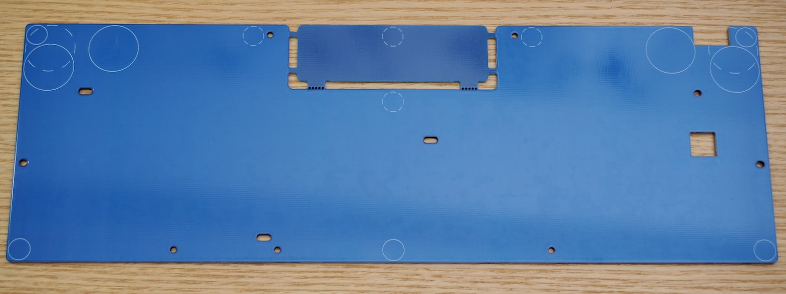
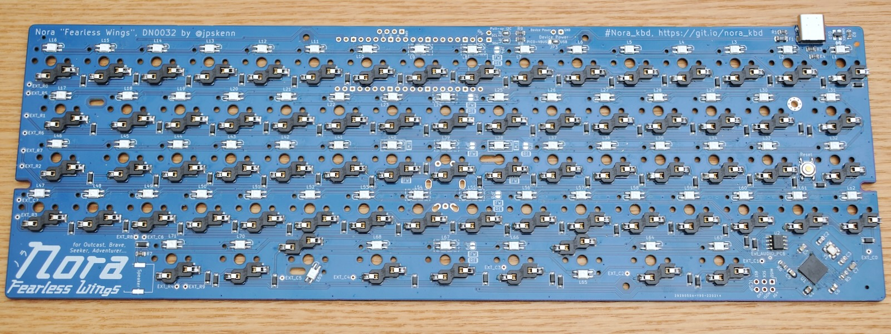
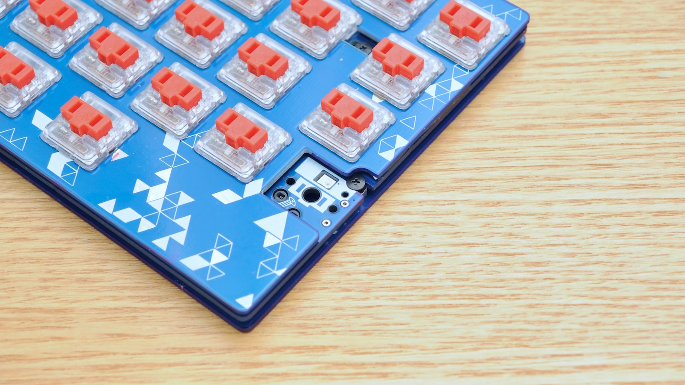
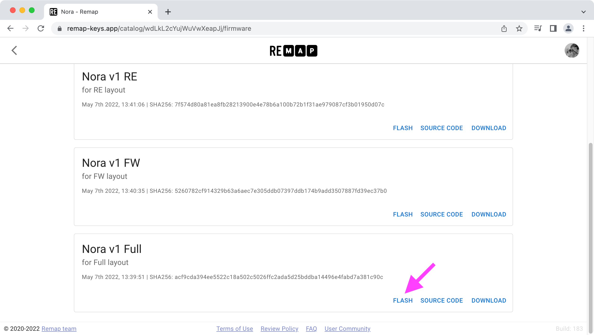
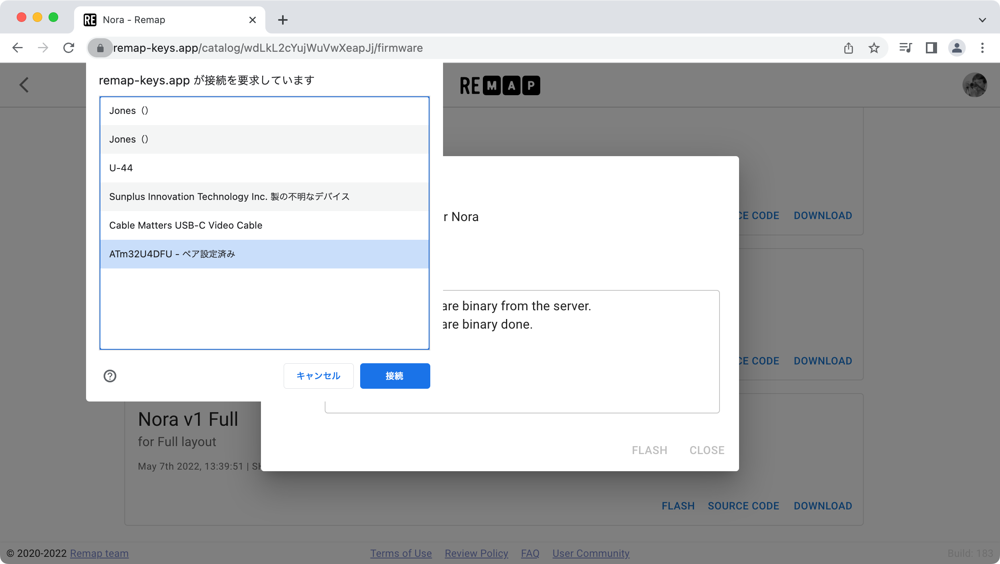

# Nora, Fearless Wings ビルドガイド

購入していただいた方、リポジトリから製造していただいた方、その他の皆様、Noraに興味を持っていただきありがとうございます。

このドキュメントは、”Nora, Fearless Wings”を組み立てるためのビルドガイドです。  
`Fullレイアウト`，`FWレイアウト`， `REレイアウト`の、三つのレイアウトの組み立て方法について説明します。  
参考： [Keyboard Layout Editor: Nora, Fearless Wings family](http://www.keyboard-layout-editor.com/#/gists/568990362f215776aa93e3b90064f241)

- `Fullレイアウト`

  すべてのキーを配置したレイアウト。  
  65%キーボード相当のキー数。

  [](../assets/BuildGuide_DN0032/DSC_7625.jpeg)

- `FWレイアウト`

  Fullレイアウトからホームポジション以外のキーを取り除き、中央部分に隙間のあるレイアウト。  
  60%キーボード相当のキー数。

  [](../assets/BuildGuide_DN0032/DSC_7641.jpeg)

- `REレイアウト`

  FWレイアウトの中央にロータリーエンコーダを配置したレイアウト。

  〓写真準備中〓
  <!-- [](../assets/BuildGuide_DN0032/xxxx.jpeg) -->

Noraのコンセプトや特徴、ビルド例などについては、[README](https://github.com/jpskenn/Nora/blob/main/README.md)をご覧ください。

ビルドガイド全体に目を通して作業手順を把握しておくとミスの防止につながりますので、ぜひ、一度お読みになってから組み立て作業を始めてください。

作業手順をしっかりと確認しながら組み立てたい方は、

<details>
<summary>《詳しい説明》</summary>

ここに追加の説明を表示します。
</details>

と書かれたところをクリックすると、追加の説明が表示されます。

---

## 目次

<!-- @import "[TOC]" {cmd="toc" depthFrom=2 depthTo=3 orderedList=false} -->

<!-- code_chunk_output -->

- [目次](#目次)
- [Nora, Fearless Wings の特徴, 機能](#nora-fearless-wings-の特徴-機能)
- [注意事項、制限など](#注意事項-制限など)
- [部品リスト](#部品リスト)
  - [キット内容](#キット内容)
  - [別途用意が必要な部品](#別途用意が必要な部品)
  - [オプション部品](#オプション部品)
- [組み立てに必要な工具](#組み立てに必要な工具)
- [組み立て前の確認](#組み立て前の確認)
  - [同梱物の確認](#同梱物の確認)
  - [接続の確認](#接続の確認)
  - [ソケット用パッドの確認](#ソケット用パッドの確認)
- [組み立て手順](#組み立て手順)
  - [（オプション）基板、スイッチプレート、ボトムプレートの側面を塗る](#オプション基板-スイッチプレート-ボトムプレートの側面を塗る)
  - [（オプション）LEDを取り付ける](#オプションledを取り付ける)
  - [Kailh Choc用ソケットを取り付ける](#kailh-choc用ソケットを取り付ける)
  - [（該当者のみ）ロータリーエンコーダを取り付ける](#該当者のみロータリーエンコーダを取り付ける)
  - [スイッチプレートにスペーサーシートを貼り付ける](#スイッチプレートにスペーサーシートを貼り付ける)
  - [スイッチとスイッチプレートを基板へ取り付ける](#スイッチとスイッチプレートを基板へ取り付ける)
  - [スイッチの動作確認をおこなう](#スイッチの動作確認をおこなう)
  - [基板をケース、またはボトムプレートへ取り付ける](#基板をケース-またはボトムプレートへ取り付ける)
  - [スイッチの最終動作確認をおこなう](#スイッチの最終動作確認をおこなう)
  - [仕上げ](#仕上げ)
- [参考](#参考)
  - [打鍵感向上：ケース内部の制振と静音化](#打鍵感向上ケース内部の制振と静音化)
  - [トラブル対応：正常に入力できないスイッチの原因調査](#トラブル対応正常に入力できないスイッチの原因調査)
  - [トラブル対応：LEDの取り付け不良調査](#トラブル対応ledの取り付け不良調査)
  - [資料：キーキャップ選び方ガイド](#資料キーキャップ選び方ガイド)
  - [資料：初期ファームウェアの機能と設定値](#資料初期ファームウェアの機能と設定値)
  - [資料：ファームウェアの書き込み方法](#資料ファームウェアの書き込み方法)
  - [資料：EEPROMを消去して、初期状態に戻す方法](#資料eepromを消去して-初期状態に戻す方法)
  - [資料：Nora, Fearless Wings 関連ファイル](#資料nora-fearless-wings-関連ファイル)
  - [資料：レイアウトを変更する方法](#資料レイアウトを変更する方法)
  - [資料：Raspberry Pi PICOによる動作（実験的機能）](#資料raspberry-pi-picoによる動作実験的機能)
  - [サービスマニュアル](#サービスマニュアル)

<!-- /code_chunk_output -->

---

## Nora, Fearless Wings の特徴, 機能

- 狭ピッチ
- Jonesゆずりの、2行目と3行目にずれのないキーレイアウト
- 左右に広げたアルファ部
- Chocロープロファイルスイッチと、MBK以下のサイズのキーキャップに合わせた専用設計
- RemapやVIAなどのキーマップ書き換えツールに対応
- 外部EEPROM（8KB）を搭載し、十分な数のレイヤーを使用できる
- 専用ボトムプレート以外にも、GH60型，Poker型のロープロファイルケースに取り付けできる
- ファームウェア書き込み済み  
- 細かな部品を実装済み
- オプションとして、以下のハードウェア機能を使用可能
  - レイヤーインジケータ／イルミネーションLED（全キー）
  - スイッチプレート交換による、レイアウト変更
  - Raspberry Pi PICOによる動作（実験的機能）

## 注意事項、制限など

- キーキャップ

  Choc V1用として販売されているキーキャップのうち、Choc用のキーピッチ（17 × 18mm）に対応したキーキャップを取り付けることができます。  

  Choc V1用として販売されているキーキャップでも、サイズが大きく取り付けできないものがあるため、詳しくは以下の資料をご覧ください。  
  →[資料：キーキャップ選び方ガイド](#資料キーキャップ選び方ガイド)

- スイッチの取り付け

  最下行の親指部分、左右のスペースキーとして使用するスイッチ（2個）は、上下逆向きに取り付けます。  
  キーキャップは特に問題なく取り付けることができます。  

  LEDも上下逆向きとなるため、レジェンド付き透過タイプのキーキャップでは文字部分が暗くなります。

- ソケットの取り付け

  1行目と4行目の左端のソケット2個は、ソケットの端子部分が基板から約0.5mmはみ出した状態で取り付けます。

  GH60型，Poker型のロープロファイルケースへの取り付けなども含め、実用上の問題がないことを確認していますが、怪我などしないようご留意ください。

    
  はみ出したソケット端子

- GH60型，Poker型のロープロファイルケースへの取り付け

  GH60型，Poker型のロープロファイルケースへ取り付けできるように設計していますが、ケースの構造などによっては、取り付けが難しかったり取り付けできない場合があるかもしれません。  
  取り付け確認済みケースを参考に、ご自身の判断で取り付けを行なってください。

  ここに記載していないケースへの取り付けの成功／失敗の報告を、随時募集しています。

  取り付け確認済みのケースは次の通りです。  
  - [KBDfans 60% ALUMINUM LOW PROFILE CASE](https://kbdfans.com/collections/60-layout-case/products/customized-gh60-aluminum-case)

  ”TOFU”などのハイプロファイルタイプのケースにも取り付けできますが、キーキャップの天面がケースのフレームよりも低くなって実用に向かないため、ハイプロファイルタイプのケースは取り付けの対象外としています。  
  参考：[TOFUケースへの装着例](https://twitter.com/jpskenn/status/1466729696713142277)

- スイッチの加工

  `Fullレイアウト`または`FWレイアウト`をGH60型，Poker型ケースへ取り付ける場合は、ケース中央のネジ穴に重なるスイッチの足を加工（切断）して取り付けます。

## 部品リスト

このキットを組み立てるためには、[キット内容](#キット内容)に加え、[別途用意が必要な部品](#別途用意が必要な部品)が必要です。  
好みに合わせて、必要な数をお買い求めください。

[オプション部品](#オプション部品)は、使いたい機能などに応じて用意してください。  

部品の購入先は、[Self-Made Keyboards in Japan：ショップリスト](https://scrapbox.io/self-made-kbds-ja/ショップリスト)などを参考にしてください。

### キット内容

〓写真入れ替え

| 部品名 | 個数 | 備考 |
| ----- | :-----: | ----- |
| ご案内リーフレット | 1 | |
| 基板 | 1 | [おもて側<br>](../assets/BuildGuide_DN0032/DSC_7493.jpeg)<br>[裏側<br>](../assets/BuildGuide_DN0032/DSC_7491.jpeg) |
| スイッチプレート<br>`Fullレイアウト`, `FWレイアウト`, `REレイアウト`のいずれか | 1 | `Fullレイアウト`<br>[おもて側<br>](../assets/BuildGuide_DN0032/DSC_7500.jpeg)<br>[裏側<br>](../assets/BuildGuide_DN0032/DSC_7504.jpeg)<br>`FWレイアウト`<br>[おもて側<br>](../assets/BuildGuide_DN0032/DSC_7497.jpeg)<br>[裏側<br>](../assets/BuildGuide_DN0032/DSC_7498.jpeg)<br>`REレイアウト`<br>〓写真準備中〓<!-- [おもて側<br>](../assets/BuildGuide_DN0032/xxxx.jpeg)<br>[裏側<br>](../assets/BuildGuide_DN0032/IMG_4118.jpeg) --> |
| ボトムプレート | 1 | [おもて側<br>](../assets/BuildGuide_DN0032/DSC_7505.jpeg)<br>[裏側<br>](../assets/BuildGuide_DN0032/DSC_7514.jpeg) |
| スペーサーシート<br> シール付き, 1mm厚, 10mm * 500mm（長い方）<br>[低弾性ゴムシート－ハネナイトＲ－ (UNLEA1-10)](https://jp.misumi-ec.com/vona2/detail/110300277050/?HissuCode=UNLEA1-10) | 1 | [](../assets/BuildGuide_DN0032/DSC_7568.jpeg) |
| スペーサーシート<br> シール付き, 1mm厚, 10mm * 約150mm（短い方） <br>[低弾性ゴムシート－ハネナイトＲ－ (UNLEA1-10)](https://jp.misumi-ec.com/vona2/detail/110300277050/?HissuCode=UNLEA1-10) | 1 | [](../assets/BuildGuide_DN0032/DSC_7568.jpeg) |
| ネジ, M2 3mm, 低頭<br>[低頭精密小ねじ(ラミクス)](https://wilco.jp/products/F/FX-EB.html) | 16 | [](../assets/BuildGuide_DN0032/IMG_4124.jpeg) |
| ネジ, M2 4mm, 低頭<br>[低頭精密小ねじ(ラミクス)](https://wilco.jp/products/F/FX-EB.html) | 4 | [](../assets/BuildGuide_DN0032/IMG_4125.jpeg) |
| ゴム足 小<br>[しっかりつくクッションゴム CS-102, 透明, 8 φ x 2 mm](https://www.3mcompany.jp/3M/ja_JP/p/d/v000453068/) | 6 | [](../assets/BuildGuide_DN0032/IMG_4126.jpeg) |

※出荷時期によってメーカーや品番などを変更することがあります

### 別途用意が必要な部品

| 部品名 | 個数 | 備考 |
| ----- | :-----: | ----- |
| ソケット<br>Kailh Chocロープロファイル用 | 62〜71 | `Fullレイアウト`：71個<br>`FWレイアウト`：64個<br>`REレイアウト`：62個 |
| スイッチ<br>Kailh Choc V1 | 62〜71 | `Fullレイアウト`：71個<br>`FWレイアウト`：64個<br>`REレイアウト`：62個<br>3ピン・5ピン、どちらも使用可能 |
| キーキャップ<br>Choc用<br>→[資料：キーキャップ選び方ガイド](#資料キーキャップ選び方ガイド) | 62〜71 | `Fullレイアウト`：71個<br>1u × 62個<br>1.5u × 9個<br>`FWレイアウト`：64個<br>1u × 56個<br>1.5u × 8個<br>`REレイアウト`：62個<br>1u × 54個<br>1.5u × 8個 |
| ロータリーエンコーダ<br>ALPS EC11, EC12または同等品 | 1 | `REレイアウト`を組み立てる場合のみ必要 |
| ロータリーエンコーダ用ノブ<br>（つまみ） | 1 | `REレイアウト`を組み立てる場合のみ必要<br>最大径35mm（使用するキーキャップのサイズによる） |
| USBケーブル （Type-C） | 1 | |

### オプション部品

| 部品名 | 個数 | 備考 |
| ----- | :-----: | ----- |
| LED<br>SK6812MINI-E | 62〜71 | LEDを取り付ける場合<br>`Fullレイアウト`：71個<br>`FWレイアウト`：64個<br>`REレイアウト`：62個 |
| GH60型，Poker型ロープロファイルケース | 1 | ケースへ取り付ける場合 |
| Raspberry Pi PICO | 1 | 実験的機能をDIYで楽しむ場合 |
| ゴム足（高さの異なるもの） | 必要数 | ボトムプレート裏側へ貼り付け、傾斜角度を変えたりする場合<br>例：[大きめのゴム足](https://www.yodobashi.com/product/100000001001980663/) |

## 組み立てに必要な工具

- 先の細いドライバー（M2ネジに対応するもの）
- ピンセット
- はんだ付け関連用品
- はさみ

フラックスやハンダ吸い取り線を用意しておくと、ちょっとした修正などがやりやすくなります。  
[遊舎工房の工具セット](https://yushakobo.jp/shop/a9900to/)を参考に用意してください。

なお、無くても組み立てはできますが、何か不具合があった場合の原因調査ではテスターがあると便利です。

## 組み立て前の確認

組み立てを開始する前に、同梱物と基板についての基本的な確認をおこないます。  

**組み立て前の確認で何か問題があった場合は作業を中止し、リーフレットに記載された連絡先へ問い合わせてください。**  
**組み立ての開始後は、初期不良として対応できかねる場合があります。**

### 同梱物の確認

キット内容に記載された部品が、不足なく入っていることを確認します。

### 接続の確認

基板をUSBケーブルでMacやPCに接続して、キーボードとして認識されることを確認します。

*充電用ではないUSBケーブルを使用します。*  
*他の機器を接続して使用した実績のあるケーブルを使うと、無用のトラブルを防げます。*

下記のOS別の確認方法を参考に、確認してください。

<details>
<summary>確認方法：《Mac, macOS Monterey 12.0.1》</summary>

1. 基板とMacをUSBケーブルで接続します。

    接続した際に`キーボード設定アシスタント`が表示された場合は、`終了`ボタンを押して閉じます。

      

    なお、キーボード設定アシスタントは、次の操作でいつでも呼び出すことができます。  
    `システム環境設定`から、`キーボード` → `キーボード`タブ → `キーボードの種類を変更…`ボタンを押す。

1. システム情報を表示します。

    メニューバーの``マークから、`このMacについて`を選び、表示された画面で`システムレポート…`をクリックします。  

1. USBデバイスを表示します。

    `システム情報`画面で、左側の`ハードウェア`から`USB`を選択します。

1. `Nora`が接続されていることを確認します。

    右側上部の`USB装置ツリー`で、`Nora`を探します。  
    どこかに`Nora`と表示されていれば、正しく接続されています。  

    `USB装置ツリー`の下の方が見切れている場合があるため、スクロールして探してください。

      
    システム情報の表示

</details>

<details>
<summary>確認方法：《Windows, 10 Pro 1909(18363.1082)》</summary>

1. 基板とPCをUSBケーブルで接続します。

1. `デバイス`を表示します。

    `スタートボタン`から`設定`を開いて`デバイス`を選択します。

1. `Nora`が接続されていることを確認します。

    `マウス、キーボード、ペン`の項目に`Nora`が表示されていれば、正しく認識されています。

      
    デバイスの表示

</details>

### ソケット用パッドの確認

[Remap](https://remap-keys.app/)のテスト機能を使用し、Kailh Chocソケット用のパッド（※）が、電気的に正しく反応することを確認します。  
※ソケットをはんだ付けする、基板上の四角い金色や銀色の部分

<details>
<summary>《詳しい説明》</summary>

キーマップ書き換えツール[Remap](https://remap-keys.app/)のテスト機能を使って確認をおこないます。

1. 基板の裏側が上になるように置きます。

1. 基板をPCやMacとUSBケーブルで接続します。

    USBコネクタ部分に無理な力がかからないように気をつけます。

1. Google Chromeブラウザで、[Remap](https://remap-keys.app/)のページを開きます。

    Chromeブラウザは、Web HID対応のバージョン89以降を使用します。

1. `START REMAP FOR YOUR KEYBOARD`をクリックして始めます。

    

1. `+ KEYBOARD`をクリックして、キーボードをRemapに接続する画面を表示します。

    

1. デバイスへの接続要求画面で`Nora`を選択し、`接続`をクリックしてキーボードをRemapに接続します。

    

1. 右側のアイコンから`Layout Option`をクリックし、使用するレイアウトを選択します。

    

1. 右側のアイコンから`…`をクリックし、`Test Matrix mode`を選択します。

    

1. ピンセットなどの電気を通すものを使い、基板裏側のソケット用パッドをショートさせます。

      
    ピンセットを使ってショートさせる様子

1. Remapの画面で、ショートさせた箇所に対応するキーの色が変わることを確認します。

    *基板が裏側になっているので、画面ではキーの位置が左右反対になります。*

    
    ショートさせる前

    
    ショートさせた後（キーの色が変わる）

    パッドをショートしても反応がない場合は、基板に実装された部品が外れたり、配線がダメージを受けている可能性があります。  
    この確認作業をすべてのパッドでおこなった後、どこが反応しなかったかわかるようにスクリーンショットなどを残してください。  
    撮影したスクリーンショットと合わせて、リーフレットに記載された連絡先へ問い合わせてください。

1. 同様の作業を繰り返し、全てのキーの色が変わることを確認します。

    なお、`REレイアウト`でロータリーエンコーダの回転に割り当てた箇所は、この手順では確認しません。

    
    ロータリーエンコーダの回転に割り当てた箇所 → この手順では確認しない

1. 確認が終わったら、USBケーブルを抜きます。

</details>

## 組み立て手順

以降の手順に沿って組み立てます。  
`（オプション）`と書かれた項目は、不要であれば作業をとばしてもかまいせん。  
`（該当者のみ）`と書かれた項目は、条件に該当する場合のみ作業をおこないます。

怪我などに気をつけて作業してください。  

### （オプション）基板、スイッチプレート、ボトムプレートの側面を塗る

*少し塗りにくくなりますが、組み立て後におこなうこともできます。*

ボトムプレートに取り付けて使用する際の見栄えを良くするため、基板、スイッチプレート、ボトムプレートの側面を塗ります。

はみ出さないように気をつけて、水性顔料や油性のマーカーなどを使って好きな色に塗ります。

  
基板側面を塗る様子

### （オプション）LEDを取り付ける

レイアウトに応じて、基板裏側のLED配線経路をジャンパします。  
スイッチを取り付ける位置に合わせて、基板裏側からLEDを取り付けます。  

| レイアウト | 配線経路ジャンパ位置 | LEDを取り付ける位置 |
| :-: | :-- | :-- |
| Full | なし | すべて |
| FW | `JP4`<br>`JP5`<br>`JP7`<br>`JP8`<br>`JP9`| 以下の点線で囲まれた箇所を除く<br>`L8` `L9`<br>`L24`<br>`L39`<br>`L54` `L55`<br>`L67` |
| RE | `JP4`<br>`JP5`<br>`JP6`<br>`JP8`<br>`JP9` | 以下の点線または実線で囲まれた箇所を除く<br>`L8` `L9`<br>`L24`<br>`L38` `L39` `L40`<br>`L54` `L55`<br>`L67` |

#### ヒント

- **行ごとにLEDを取り付ける方向が異なるため、注意して取り付けます。**

- レイアウトに応じたマークがついているところへ、ジャンパとLEDの取り付けを行います。

<details>
<summary>《詳しい説明》</summary>

#### LEDの配線経路をジャンパする

基板裏側の配線経路ジャンパ`JP4`から`JP9`を、レイアウトに応じてジャンパ（※）します。  
※隣同士のパッド（基板上の小さな四角の金色や銀色の部分）にはんだをつけてつなげること

〓写真追加：基板裏側、ジャンパの位置をまるで囲んで示す

レイアウトと配線経路に対応するジャンパ位置は次の通りです。  
各ジャンパ位置に描かれたマーキングを参考にします。

| レイアウト | 配線経路ジャンパ位置 | 基板のマーキング |
| :--: | :--: | :--: |
| Full | なし | なし |
| FW | `JP4`<br>`JP5`<br>`JP7`<br>`JP8`<br>`JP9`|  |
| RE | `JP4`<br>`JP5`<br>`JP6`<br>`JP8`<br>`JP9` |  |

1. 基板を裏側が上になるように置きます。

1. はんだごてを用意します。  
  こて先の温度は270〜℃程度にします。  

1. 2個並んだパッドにまたがるように、こて先をあてます。  
  そのまま、3秒ほど温めます。

1. こて先にはんだを押し付けて、少したっぷり目に溶かします。

1. こて先で基板をなでるように、横へスッとずらしてパッドから離します。  
  2個のパッドが、はんだでつながっていれば完了です。  

なかなか上手くジャンパできないのですが、何度かトライすればそのうちできます。  
こて先でパッドをグリグリいじるとパッドが剥がれて大変なことになるため、  
「はんだをたっぷりつけて、横へスッ」  
の動きを守って作業します。

  
JP9をFWにジャンパした例

#### LEDを取り付ける

基板裏側のLED`L1`から`L71`へ、スイッチを取り付ける位置に合わせてLEDを取り付けます。

レイアウトによって、LEDを取り付ける位置は次の通りです。

| レイアウト | LEDを取り付ける位置 |
| :--: | :--: |
| Full | すべて |
| FW | 以下の点線で囲まれた箇所を除く<br>`L8` `L9`<br>`L24`<br>`L39`<br>`L54` `L55`<br>`L67` |
| RE | 以下の点線または実線で囲まれた箇所を除く<br>`L8` `L9`<br>`L24`<br>`L38` `L39` `L40`<br>`L54` `L55`<br>`L67` |

〓写真追加：点線とか

1. 基板を裏側が上になるように置きます。

1. LEDを1個用意して、LEDの発光部分（透明な窓がある部分）が下側になるように持ちます。

      
    LEDの取り付け方向

1. LEDから出ている4本の端子のうち、角が斜めになっている1本が基板に描かれた印に合うようにして、基板の穴にはめこみます。  
    **注意：行ごとに、LEDを取り付ける方向が異なります。**  

      
    LEDをはめ込んだ様子

1. LEDの4本の端子が、基板に接した状態にします。

      
    4本の端子が基板に接した状態→OK

      
    端子が浮いた状態→NG

1. はんだごてを用意します。  
  LEDは高温ではんだ付けすると壊れやすいため、こて先温度を少し低めの220-270℃に設定します。

1. 次の手順を「1、2、3、4、5」と数える間におこないます。  

    - 1、2：  
      4本の端子のどれかひとつにこて先をあてて押さえ、端子とパッドを温めます。  

    - 3、4：  
      はんだを端子（またはパッド）に当てて溶かし、端子とパッドにはんだを行き渡らせて、はんだを離します。  
      こて先はグリグリ動かしません。はんだ溶けて、自然に濡れ広がっていくような具合です。  

    - 5：  
      こて先を離します。
      はんだが、端子とパッド全体に行き渡っていれば良い仕上がりです。  

1. LEDが傾いてしまった場合は、ピンセットでLEDをつまみ、はんだ付けした端子をこて先で温めながら傾きを修正します。  
  端子とパッドがずれたりしていなければ、少しくらい傾いていてもLEDの光り具合に大差はありません。

1. 最初にはんだ付けした端子とLED本体を挟んだ反対側の端子2本を、同様の手順ではんだ付けします。

1. 残った1本の端子をはんだ付けします。  
  これで、LED1個の取り付けが完了です。

      
    取り付けたLED

1. 作業を繰り返し、必要な数のLEDを取り付けます。

#### LEDの動作確認をおこなう

LEDの点灯状態を見て、正しく取り付けられているか確認します。

1. PCやMacにUSBケーブルで接続します。

1. すべてのLEDが、赤色に点灯することを確認します。

  点灯しないLEDがあったり、色がおかしかったりする場合は、[トラブル対応：LEDの取り付け不良調査](#トラブル対応LEDの取り付け不良調査)を参考にして調査します。

</details>

    
  LEDを取り付け、すべて点灯した状態

### Kailh Choc用ソケットを取り付ける

スイッチを取り付ける位置に合わせて、基板裏側へKailh Choc用ソケットを取り付けます。

| レイアウト | ソケットを取り付ける位置 |
| :--: | :-- |
| Full | すべて |
| FW | ソケット外枠だけが描かれ、白く塗られていない箇所へは取り付けない。 |
| RE | ソケット外枠だけが描かれ、白く塗られていない箇所へは取り付けない。<br>格子状に塗られた箇所にも取り付けない。 |

〓写真追加：塗られてるやつ、塗られてないやつ

#### ヒント

- ソケットには正しい取り付け方向があります。  
  基板に描かれた枠をよく見て、正しい方向に取り付けます。

- 1行目と4行目の左端のソケット2個は、ソケットの端子部分が基板から約0.5mm飛び出した状態で取り付けます。  

  

- ソケットを取り付けない箇所へ取り付けてしまっても、単に使わないだけで、機能的な問題はありません。

<details>
<summary>《詳しい説明》</summary>

#### ソケット用パッドの片方へ予備はんだする

1個のソケットに対応する2箇所のパッドのうち、どちらか*片方だけ*に予備はんだ（※）します。  
※部品を取り付ける前に、基板のパッドや部品の端子にはんだをつけておくこと。

基板の中央部分は、スイッチを取り付ける位置に合わせて予備はんだします。

1. 基板を裏側が上になるように置きます。

1. はんだごてを用意します。  
  こて先の温度は270〜320℃程度にします。

1. 次の手順を「1、2、3、4、5」と数える間におこないます。

    - 1、2：  
      予備はんだするパッドにこて先をあてて、温めます。

    - 3：  
      こて先にはんだをあてて溶かします。

    - 4：  
      溶けたはんだがパッド全体に広がったら、はんだを離します。

    - 5：  
      こて先をパッドから離します。

      
    ソケットの取り付け方向と、予備はんだした状態

#### ソケットの仮置き

ソケットを基板に描かれた枠に合わせ、プラスチックの突起が穴にはまるように仮置きします。  
ソケットを取り付ける方向に決まりがあるので、正しい方向になっているかよく確認します。

1. 基板を裏側が上になるように置きます。

1. ソケットを1個用意し、方向を確認します。

1. 予備はんだしておいた箇所へ、基板の穴に合わせてソケットを置きます。  
    この段階では、ソケットの片方の端子が予備はんだの上に乗り、基板から少し浮いて傾いた状態になります。

    基板の製造ロットによっては、基板の穴が小さい（狭い）ことがあります。
    その場合は、プラスチックの突起を穴に合わせて、ソケットを指で押し込むようにしてはめ込みます。

#### 予備はんだした端子をはんだ付けする

予備はんだしてある方の端子を、はんだ付けします。

1. はんだごてを用意します。  
  こて先の温度は270〜320℃程度にします。

1. 利き手にはんだごて、もう一方の手にピンセットを持ちます。

1. ピンセットでソケット中央のプラ部分を押さえて動かないようにします。

1. 端子の隙間にこて先を差し込みます。

      
    端子の隙間に、こて先を差し込んだ様子

1. 次の手順を「1、2、3、4、5、6」と数える間におこないます。

    - 1、2：  
      予備はんだが溶け始めます。  
      ピンセットで押さえていたソケットを軽く押し込むと、ソケットのプラスチックの突起が基板の穴にはまり、浮いていた端子が基板に接します。  

    - 3：  
      こて先をあてたまま、加熱を続けます。  

    - 4：  
      こて先を離します。  

    - 5：  
      ピンセットでソケットを押さえ続けます。  

    - 6：  
      はんだが冷えて固まるのを待ってから、ピンセットを離します。

1. ソケットが基板に描かれた枠に沿ってまっすぐに取り付けられ、傾いていないことを確認します。
  傾いている場合は端子部分を再度加熱し、こて先とピンセットで傾きを修正します。

#### 残りの端子のはんだ付け

残りのもう一方の端子をはんだ付けします。

1. はんだごてを用意します。  
  こて先の温度は270〜320℃程度にします。

1. 残りの端子の隙間にこて先を差し込みます。

1. 次の手順を「1、2、3、4、5、6」と数える間におこないます。

    - 1、2：  
      こて先を差し込んだまま、端子とパッドを加熱します。  

    - 3：  
      パッドと端子の隙間あたりへ、はんだを押し付けて溶かします。  

    - 4：  
      はんだを溶かしながら、端子とパッドの隙間へ流し込みます。  

    - 5：  
      溶けたはんだがパッド全体に広がる程度まで流し込んだら、はんだを離します。  

    - 6：  
      ソケットを動かしてしまわないよう、静かにこて先を離します。

1. はんだ付けした状態を確認します。  
    はんだがパッド全体に広がり、端子の間にポコっと盛り上がって固まっているのが良好な状態です。  

    はんだのパッドへの広がりが足りない場合は、再加熱して、はんだを少し足して塗り広げます。

〓ソケットを1個取り付けたのを、ななめ上から。ぽこっとがわかるように

1. ソケットが枠に沿ってまっすぐに取り付けられていることを確認します。  
    また、ソケットが基板から浮いていないことも確認します。  

    傾いたり浮いたりしている場合は、端子部分を再加熱し、こて先とピンセットで修正します。

    Kailh製のロープロファイルキーキャップを使用する場合は、
    隣同士のキーが当たるのを防ぐため、より一層、ソケットの傾きに注意して取り付けます。

      
    まっすぐに取り付けられたソケット→OK

      
    浮いた状態のソケット→NG

#### すべてのソケットの取り付け

1. 作業を繰り返して、すべてのソケットを取り付けます。

1. 取り付けが終わったら、**はんだ付けし忘れた箇所がないか、十分確認します**。

</details>

  
すべて取り付けたソケット

### （該当者のみ）ロータリーエンコーダを取り付ける

*`REレイアウト`を組み立てる場合のみ、この手順を行います。*

基板おもて側の中央へ、ロータリーエンコーダを取り付けます。

#### ヒント

- ロータリーエンコーダの端子や取り付け足が基板裏側から3mm以上飛び出す場合は、3mm以内にカットしてボトムプレートに当たらないようにします。  
  なお、日本国内のキーボード関連ショップで販売されているロータリーエンコーダは3mm以内に収まるものがほとんであり、あまり気にしなくても大丈夫です。  

- ノブ（つまみ）は、スイッチプレートを基板に取り付けた後に取り付けます。

<details>
<summary>《詳しい説明》</summary>

#### ロータリーエンコーダの取り付け

1. 基板をおもて側が上になるように置きます。

1. ロータリーエンコーダのピン（下3本、または上2本と下3本）と、左右の固定足を、基板の取り付け位置に合わせて差し込みます。  
  ピンを曲げないように注意します。

    <!-- 〓DN0032写真：RE仮取付 -->

1. ロータリーエンコーダのピンが正しく差し込まれ、傾いていないことを確認します。

1. ロータリーエンコーダが傾かないように注意しながら、基板の裏側が上になるように置き直します。

1. はんだごてを用意します。  
  こて先の温度は270〜320℃程度にします。

1. 次の手順を「1、2、3、4、5、6」と数える間におこないます。

    - 1、2：  
      いずれかのピンにこて先をあてて、温めます。  

      ```aside
      ロータリーエンコーダ左右の固定足は、はんだ付けしません。
      ```

    - 3：  
      こて先にはんだをあてて溶かします。

    - 4：  
      ピンと穴にはんだが流れ込んだら、はんだを離します。

    - 5：  
      こて先を当てたままにします。

    - 6：  
      こて先を離します。

1. はんだ付けした状態を確認します。  
    ピンに沿って、はんだが富士山型に盛り上がっていれば良い状態です。  
    ピンと穴の間に隙間が空いている場合は、再加熱してはんだを足します。

    ロータリーエンコーダが基板にぴったりとくっついて取り付けられていることを確認します。  
    隙間が空いていたり、傾いている場合は、はんだ付けをやり直します。

    <!-- 〓DN0032写真：REはんだ -->

1. ロータリーエンコーダが基板から浮かないように気をつけながら、残りのピンをはんだ付けします。

<!-- 〓DN0032写真：RE取り付け完了 -->

#### ロータリーエンコーダの動作確認

1. PCやMacにUSBケーブルで接続します。

1. ロータリーエンコーダのつまみを左右に回して、OSの音声出力ボリュームが変化することを確認します。  

1. ロータリーエンコーダのプッシュボタンスイッチを押して、OSの音声出力がミュート／ミュート解除されることを確認します。  

何か問題があった場合は、正しくはんだ付けされているかを確認します。

</details>

### スイッチプレートにスペーサーシートを貼り付ける

基板とスイッチプレートの隙間を埋めるため、スペーサーシートをはさみなどで切り離し、スイッチプレート裏側へ貼り付けます。  

#### ヒント

- シートを縦半分や縦1/3に切るのが少し難しいかもしれません。  
  最初のうちは練習のつもりで、短い長さの箇所から始めましょう。  
  切るのに慣れてコツをつかんでから、長いものを切るとよいでしょう。

- 白い線で描かれた貼り付け位置が埋まる程度に貼り付けてあれば、シートが多少余っていても問題ありません。  
  空いている箇所に追加で貼り付けてもよいでしょう。

<details>
<summary>《詳しい説明》</summary>

#### スペーサーシートの貼り付け

1. スイッチプレートを、裏側が上になるように置きます。

1. スイッチプレート裏側に白い線で描かれた貼り付け位置へ、スペーサーシートを貼り付けます。

    シートをはさみなどで切り離し、以下の優先順に貼り付けます。  

    1. 幅が広い箇所  
        シート幅そのままの、10mm幅を貼り付けます。

    1. 幅が中くらいの箇所  
        シートを縦半分に切り、5mm幅を貼り付けます。  
        `USB`と書かれた箇所を避けて貼り付けます。
        Raspberry Pi PICOを使用する場合は、`PICO reserved area`と書かれた箇所を避けて貼り付けます。

    1. 幅が狭い箇所  
        シートを縦1/3に切り、約3mm幅を貼り付けます。

    シートが余った場合は、空いている箇所へバランスよく貼り付けます。

      
    シートを貼り付ける長さに合わせて切り取る

      
    シートを縦半分に切る

      
    縦半分に切ったシートを貼り付ける

</details>


`Full`レイアウトのスイッチプレートへ、スペーサーシートを貼り付けたようす

### スイッチとスイッチプレートを基板へ取り付ける

スイッチプレートをはさむようにして、スイッチを基板に取り付けます。  

#### ヒント

- スイッチのスイッチプレートへの固定は、少しゆるめです。  
  一部はめ込むのがきついスイッチがあるため、余裕を持たせています。

- 最下行の親指部分、左右のスペースキーとして使用するスイッチ（2個）は、上下逆向きに取り付けます。
  LEDが眩しく感じる場合は、スイッチのLED窓内側へマスキングテープなどを貼ったり、黒マジックで塗ったりして減光します。

- 基板おもて側にネジのアイコンが描かれたスイッチは、この手順では取り付けません。  
  ボトムプレート、またはケースにねじ止めした後に取り付けます。

<details>
<summary>《詳しい説明》</summary>

#### スイッチプレートを仮固定する

スイッチプレートのおもて側から、1・3・5行目の左右の端へ6個のスイッチをはめ込み、スイッチの端子を基板のソケットへはめ込んで仮固定します。

1. スイッチを6個用意します。  
  端子が折れたものは使用できません。曲がっているものは、まっすぐにしておきます。

1. スイッチプレートをおもて側が上になるように置きます。

1. プレートのおもて側から、1・3・5行目の左右の端6箇所に、スイッチをパチンとはめ込みます。  
    スイッチをソケットの方向に合わせるため、スイッチの端子が手前側になるようにします。

    はめ込みを少しゆるく設計しているため、きっちりと固定されていなくても問題ありません。

      
    スイッチプレートに取り付けたスイッチ

1. 基板をおもて側が上になるようにして、プレートの隣に置きます。

1. スイッチ6個を取り付けたプレートを、スイッチ端子と基板のソケットの位置が合うようにして、基板に乗せて重ねます。  

1. プレートと基板がずれないように持ち上げます。

1. 基板の裏側からソケットを押さえながら、どれかひとつのスイッチをまっすぐに押し込んでソケットへ差し込みます。  

      
    基板の裏側からソケットを押さえながら、スイッチを差し込む

1. スイッチがしっかりと差し込まれ、基板にほぼくっついた状態になっていることを確認します。  
    5ピンのスイッチを取り付ける場合は固定用のプラスチックピン2本が根元まで刺さりきっていない場合があるため、よく確認しておきます。
〓写真追加：浮いてるNG/OK

1. 同様の手順で、残り5個のスイッチをソケットへ差し込みます。

      
    基板に仮固定されたスイッチプレート

#### 残りのスイッチを取り付ける

ケースネジに重なるスイッチを除いて、残りのスイッチをすべて取り付けます。

1. スイッチを用意します。  
    端子が折れたものは使用できません。曲がっているものは、まっすぐにしておきます。

1. プレートにスイッチをはめ込みつつ、そのまま基板のソケットへスイッチ端子を差し込んで、スイッチを取り付けます。
    スイッチを斜めに押し込むと端子が曲がりやすいため、プレート面に対してまっすぐ押し込むようにします。

    最下行の親指部分、左右のスペースキーとして使用するキーは、上下逆向きに取り付けます。

1. ケースネジに重なるスイッチ（基板にネジのアイコンが描かれた箇所）を除き、残りのスイッチをすべて取り付けます。

    
    基板に描かれたネジアイコン

</details>

  
基板に取り付けられたスイッチとスイッチプレート  
（ネジ穴に重なる箇所のスイッチは、まだ取り付けない）

### スイッチの動作確認をおこなう

組み立て前におこなった[ソケット用パッドの確認](#ソケット用パッドの確認)と同様の手順で、ソケットに取り付けたスイッチが正しく動作するか確認します。  
この手順では、取り付けたスイッチを押して確認します。

正常に入力できないスイッチがあった場合は、[トラブル対応：正常に入力できないスイッチの原因調査](#トラブル対応正常に入力できないスイッチの原因調査)の手順に沿って調査します。

### 基板をケース、またはボトムプレートへ取り付ける

スイッチとプレートが組み合わされた基板を、ボトムプレート、またはGH60型, Poker型ロープロファイルケースへ取り付けます。

打鍵感向上に興味のある方は、次の項目をお読みになると何かヒントがあるかもしれません。

- [打鍵感向上：ケース内部の制振と静音化](打鍵感向上：ケース内部の制振と静音化)

#### （該当者のみ）基板をボトムプレートへ取り付ける

*ボトムプレートを使用する場合のみ、この手順をおこないます。*

ネジとスペーサーを使い、ボトムプレートに基板を取り付けます。

<details>
<summary>《詳しい説明》</summary>

1. 以下の写真に示す○印をつけた8箇所に、ボトムプレート裏側からネジ（M2 3mm 低頭）を差し込み、ボトムプレートおもて側へスペーサー（M2 3mm）をねじ止めします。  

    ◎印をつけた右上と中央下の2箇所は、スイッチとの干渉を減らすため、スペーサーを右側へ寄せてねじ止めします。  

      
    スペーサー取り付け箇所

      
    ボトムプレートへねじ止めしたスペーサー（ひとつは右側へ寄せてねじ止めしている）

1. ボトムプレートをおもて側が上になるように置きます。

      
    ボトムプレートを置いた状態

1. 基板を、ボトムプレートに取り付けたスペーサーの位置に合わせて乗せます。  
  基板裏側の部品がスペーサーにぶつからないように注意します。

1. （該当者のみ）ロータリーエンコーダの端子や取り付け足が長すぎて、ボトムプレートと干渉していないことを確認します。

    *`REレイアウト`を組み立てる場合のみ、この確認を行います。*

    干渉している場合、基板裏側からの飛び出しが3mm以下になるように、曲げたり、ニッパーなどで切断したりします。

1. 基板おもて側から、ネジ（M2 3mm 低頭）を使い、基板とスペーサーをねじ止めします。  

      
    基板とボトムプレートをねじ止めした状態

1. まだ取り付けていないスイッチを、すべて取り付けます。

1. ボトムプレート底面に、滑り止めのゴム足を貼り付けます。

</details>

  
基板をボトムプレートを取り付けた状態

#### （該当者のみ）GH60型, Poker型ケースへ取り付ける

*GH60型, Poker型ケースを使用する場合のみ、この手順をおこないます。*

ケースに基板をねじ止めして取り付けます。

<details>
<summary>《詳しい説明》</summary>

1. ケース付属のネジ止め式の足を使用する場合は、最初に取り付けておきます。

1. ケースを安定したところへ置きます。

1. スイッチとスイッチプレートが組み合わされた基板を手に持ちます。

1. 基板を水平から30度くらいの角度に持ち、奥側から斜めにケース内へ入れていきます。  
  斜めに差し込んでいくと、USBコネクタがケースの穴にスッとはまります。

      
    基板を30度で差し込む様子

1. USBコネクタがはまった状態で基板の手前側を静かに下ろして水平にします。  
    力をかけることなく、基板全体がストンとケースに入ります。  
    力を入れてグリグリとこじったりググググッと押し込むようなことはせず、斜めに差し込んで、水平にするだけです。

1. ケース付属のネジで、左上と右上の2箇所を仮固定します。

1. キット同梱のネジ（M2 4mm 低頭）で、左端、右端、中央、中央下の4箇所を仮固定します。

1. ケースに対して、基板の位置が上下左右の真ん中になるように調整します。

1. ネジが軽く止まる程度まで締めて基板を固定します。

1. （該当者のみ）ケース中央のネジ穴に重なるスイッチを、足を加工して取り付けます。  

    *`Fullレイアウト`または`FWレイアウト`を組み立てる場合のみ、この作業を行います。*

    3ピンのスイッチは、加工不要で、そのまま取り付けできます。  
    5ピンのスイッチを使用する場合は、左右2本のプラスチックピンのうちネジ穴に干渉する方の足を、根本からニッパーなどで切断します。

      
    5ピンスイッチの片方の足をカットした状態（左：カット前，右：カット後）
    〓スイッチの方向が上下逆になっているので変更

    おそらく回避できるはずですが、もしスイッチの中央の足が干渉する場合は、中央の足も切断します。

      
    中央の足をカットしたスイッチ

1. 残りのスイッチを、すべて取り付けます。

1. ケース底面に、滑り止めのゴム足を貼り付けます。

</details>

  
基板をケースに取り付けた状態（スイッチ取り付け前）

### スイッチの最終動作確認をおこなう

組み立て前におこなった[ソケット用パッドの確認](#ソケット用パッドの確認)と同様の手順で、すべてのスイッチが正しく動作するか最終確認します。  

### 仕上げ

1. キーキャップ、ロータリーエンコーダのノブを取り付けます。

1. Remapでキーマップを変更したり、ファームウェアをカスタマイズして、自分好みに仕上げます。

1. 完成です。

    写真を撮影し、`#Nora_kbd` のタグをつけてツイートすると設計者が喜んだりします。  
    [Twitter: #Nora_kbd](https://twitter.com/search?q=(%23nora_kbd)&src=typed_query&f=live)

    - Fullレイアウト製作例

        
      キーキャップ： MBK Legend Glow

    - FWレイアウト製作例

        
      キーキャップ： MBK, Kailhロープロファイル無刻印（無塗装）
      ケース： KBDfans 60% ALUMINUM LOW PROFILE CASE, Gray  

---

## 参考

打鍵感向上や機能追加についてのDIY情報や、トラブル調査方法などの参考資料です。  
必要に応じてお読みください。

### 打鍵感向上：ケース内部の制振と静音化

ケースやボトムプレートに工夫を施すことで、打鍵感を向上させる方法について説明します。

<details>
<summary>《詳しい説明》</summary>

- ケースの振動防止

    ケース内部におもりを入れておくと、ケースの共振が抑えられ、打鍵感の向上や、打鍵音の変化が期待できます。  
    おもりには、10円玉、真鍮板、自動車タイヤ用のホイールバランスウェイト、鉛シートなどを使用します。  
    また、スポンジ状の両面テープなどを使っておもりを貼り付けると、より高い防振効果を得ることができます。

    基板裏側の部品におもりの金属部分がふれてショートしないよう、スポンジシートを間に挟んだり、カプトンテープなどで保護します。

- 基板の振動防止

    基板とケース間をウレタンスポンジやシリコンシートなどで埋めると、基板の振動を抑えることができます。  
    また、ケース内部の空間を埋めることで、基板の振動音やスイッチの動作音がケース内で響くのを減らすことができます。

    ボトムプレートを使用する場合も、基板とボトムプレートの間に対策を施すことで、同様の効果が期待できます。

    スポンジなどを詰めすぎると、ネジや基板裏側の部品に力がかかるため、ほどよい程度に調節します。

これらの工夫をおこなう様子はこちら  
→[ケースが響いてうるさいのをなんとかしていく](https://twitter.com/jpskenn/status/1467010813773119490)

</details>

### トラブル対応：正常に入力できないスイッチの原因調査

正常に入力できないスイッチの原因調査と対応方法について説明します。  

<details>
<summary>《詳しい説明》</summary>

テスターをお持ちの方は、疑わしい箇所をテスターで調べるのが手っ取り早い方法ですので、積極的に使用してください。

#### スイッチのソケットへの取り付け不良

もっとも多い原因は、スイッチのソケットへの取り付け不良です。  

スイッチを取り外し、端子が曲がったり折れたりしていないか確認します。  
端子の曲がりを修復するか、新しいスイッチに交換して、もう一度キー入力を確認します。

#### ソケットの基板への取り付け不良

次に多いのが、ソケットの基板への取り付け不良です。  

ソケットのはんだ忘れや、はんだが適切に行われていないことが原因のため、ソケットのはんだ状態を確認します。  
溶けたはんだがパッド全体に広がっていること、はんだがソケットの端子の間にポコっと盛り上がって固まっていることも確認します。  

念のため、再度はんだ付けし直して、もう一度キー入力を確認します。

#### 原因箇所の特定

スイッチとソケットの取り付け不良を調査しても改善しなかった場合、原因箇所の特定をおこないます。

組み立て前におこなった[ソケット用パッドの確認](#ソケット用パッドの確認)と同様の手順で、基板のパッド部分をピンセットでショートさせ、キー入力できるか確認します。  
パッドをショートしてキー入力できた場合は、パッド自体は正常ですので、スイッチとソケットを再度調査します。

#### キー入力が確認できない場合

この場合は、ソケット用パッドや基板の配線、その他の基板に取り付けられた部品が、組み立て中にダメージを受けたことが原因と考えられます。
同じ列や行のスイッチが連続して反応しない場合は、特にこの原因が疑われます。

これ以降の調査と修復の難易度が高くなりますが、ソケット用パッドが剥がれてソケットが取り付けられないというような物理的に破壊された状態を除けば、修復できる可能性は残されています。  
（パッドが剥がれたとしても、ネジ穴に重なるスイッチでなければ、スイッチを固定してソケットを端子に差し込んで、ソケットから基板へ配線すればなんとかなります。）

電子工作に詳しい方であれば、[Nora, DN0032関連ファイル](https://github.com/jpskenn/Nora/releases/tag/DN0032)の`PCB_FW`フォルダ内のKiCadプロジェクトを参考にテスター等を用いて調査を進め、ジャンパ線などで配線を修復してください。

自分ではどうにもできない場合など、何らかのアドバイスを必要とされる方は、キット同梱のリーフレットに記載された連絡先へ問い合わせてください。  
状況に応じて、できる限りのサポートをいたします。  

</details>

### トラブル対応：LEDの取り付け不良調査

LEDが点灯しない場合など、LEDの取り付け不良を調査する方法について説明します。

<details>
<summary>《詳しい説明》</summary>

調査の前提として、LEDの点灯には、

```text
点灯しないLEDより後ろは、すべて点灯しない。
```

というルールがあります。

例えば、
`L1` `L2`が点灯し、`L3`が点灯しないとき、
`L4`より後ろは、正しく取り付けられていたとしても、点灯しません。

このルールをふまえ、点灯しない最初のLEDから順番に調査を進めていきます。

#### LEDがひとつも点灯しない場合

LEDがひとつも点灯しない場合は、LEDに電源が供給されていないことが原因のひとつと考えられます。

ジャンパ`JP3: Device Power`が、正しい位置（通常は`USB`）にジャンパされていることを確認します。  

ジャンパ位置が合っている場合も、念のため、ジャンパをやりなおしておきます。

正しい位置にジャンパしていても点灯しない場合は、1個目のLEDの取り付け不良が疑われます。  

MCUとジャンパの組み合わせは次の通り。

| MCU | ジャンパ位置 | 備考 |
| :--: | :--: | :-- |
| ATmega32u4 | `USB` | 通常の組み合わせ |
| Raspberry Pi PICO | `PICO VBUS` | Raspberry Pi PICO使用時 |

〓FW,REのジャンパ忘れについて追記

#### LEDの光り方がおかしい場合

LEDがちらついたり、色がおかしい場合は、LEDのはんだ不良が疑われます。

光り方がおかしいLEDのはんだ付けをやり直します。

フラックスがある場合は、LEDの端子に塗布しておくと、はんだがダマになりにくくなります。  
はんだ吸い取り線がある場合は、一旦はんだを除去しておきます。  
どちらもない場合は、はんだを足しながら、はんだ付けをやり直します。

#### LEDが点灯しない場合

正しくジャンパしていてもLEDが点灯しない場合は、LEDの取り付けまたはLED自体に原因があると考えられます。  
LEDの点灯に関するルールにしたがい、**光らないLEDの、番号が若いものから順番に**以下の対処を行います。

1. 光らないLEDのはんだ不良を修復する

    「光らないLEDが正しくはんだ付けされていない」と仮定した対処です。  
    光らないLEDのはんだ付けをやり直します。

1. 光らないLEDの*ひとつ前*のLEDのはんだ不良を修復する

    「光らないLEDは正常に取り付けられているが、*ひとつ前*のLEDのはんだ不良が原因で配線がつながっていない」と仮定した対処です。  
    光らないLEDの*ひとつ前*のLEDのはんだ付けをやり直します。

1. 光らないLEDを新しいものに交換する

    「光らないLEDが壊れてしまっている」と仮定した対処です。  
    これまでの対処をおこなっても点灯しない場合は、光らないLED自体が壊れていると判断して、新しいものに交換します。

    以下のような方法で、LEDを取り外すことができます。

    - 少しずつ持ち上げる方法
      強く持ち上げるとパッドが剥がれてひどいことになるので、力をかけずに少しずつ持ち上げます。

        1. こて先の温度を270〜320℃程度にします。
        1. はんだ吸い取り線で、できる限りのハンダを除去しておきます。
        1. 片側2本の端子を同時に加熱しながら、ピンセットでLEDを少しだけ持ち上げます。
        1. 反対側の2本の端子も、同様にして、少しだけ持ち上げます。
        1. これを交互に繰り返し、じわりじわりと取り外していきます。

    - 熱々にして持ち上げる方法
      溶けたはんだで火傷しないように注意します。

        1. こて先の温度を270〜320℃程度にします。
        1. LEDの端子部分を温め、はんだをたーーーーーーっぷりと溶かし、端子部分につけておきます。  
        （あずき〜大豆くらいの大きさの溶けたはんだ）
        1. 反対側の端子にも、同じようにはんだをたっぷりとつけます。
        1. LEDのプラ部分をピンセットつまみます。
        1. LEDの両側のはんだを交互に2秒ずつ温めるのを繰り返し、両側のはんだが溶けた状態にします。
        1. その状態でLEDをつまみ上げて、基板から取り外します。

</details>

### 資料：キーキャップ選び方ガイド

Choc V1用キーキャップの各レイアウトへの対応と、使用感などの参考資料です。

<details>
<summary>《詳しい説明》</summary>

Noraは、MBK以下のサイズのキーキャップに合わせて設計されており、Choc用のキーピッチよりも横方向がほんの少し狭くなった 17 × 17.8594mm（[基板上の寸法図](../assets/BuildGuide_DN0032/PCB_key_pitch.png)） のキーピッチになっています。  
”Choc用キーピッチ対応”として販売されているキーキャップは、大きな問題なく取り付けることができます。（2022年2月現在）

Choc V1用キーキャップの各レイアウトへの対応
（◎：完全対応，○：対応，△：他のキーキャップが必要，×：取り付け不可）

| Keycaps | セット／単品 | Full | FW | RE | コメント |
| :---- | :---: | :---: | :---: | :---: | :---- |
Kailhロープロ刻印 | セット | ○ | ◎ | ◎ | *キーの寸法が少し大きいため、隣同士のキーが当たる場合があります。<br>ソケットを傾かないように取り付けたり、キーキャップの成形バリを取り除いたり、干渉する箇所を少し削る必要があるかもしれません。*<br><br>低価格ながらレジェンド付きで、バックライトLEDに対応する透過タイプ。<br>Fullレイアウトでは1.5uのキーが足りないため、最下行の中央には1.25uまたは1uを取り付けます。<br>スペースキー用にKailhロープロ無刻印などの単品キーを追加するのをおすすめします。 |
| MBK Legend Glow | セット | ◎ | ◎ | ◎ | レジェンド付きで、バックライトLEDに対応する透過タイプ。<br>少し高価ですが、1uと1.5uキーが豊富で、1.5uのコンベックスタイプも2個も用意されているのが嬉しいです。<br>スイッチへの抜き差しがきつく、取り外すときにスイッチが分解されることが多いのが難点。 |
| Gravity Keycaps | セット | △ | △ | △ | 唯一（？）の、キーの位置に合わせて個別の形状が与えられたChoc用キーキャップ。打鍵のしやすさはピカイチ。<br>40キー程度のキーボード用として作られているため、Noraで使用するには多くのキーが足りません。<br>MBKの黒色とのマッチングが良好なので、これと組み合わせるとよいでしょう。 |
| WRK | セット | × | × | × | MX用の19.05*19.05mmピッチを基準に作られているため、取り付けできません。 |
| Kailhロープロ無刻印 1u, 1.5u<br>(黒, 白, 無塗装） | 単品 | ◎ | ◎ | ◎ | *キーの寸法が少し大きいため、隣同士のキーが当たる場合があります。<br>ソケットを傾かないように取り付けたり、キーキャップの成形バリを取り除いたり、干渉する箇所を少し削る必要があるかもしれません。*<br><br>キー天面は平らな形状で、4辺が斜めにカットされているせいか意外と快適に打鍵できます。<br>Kailhロープロ刻印と組み合わせても、単体で使用しても良い感じ。<br>無塗装は少しクリーム色っぽい乳白半透明のような感じで、バックライトが綺麗に映ります。 |
| Kailhロープロ無刻印 1u<br>（クリア） | 単品 | × | × | × | クリアのみ形状が異なり、キーのサイズが少し大きくChoc用キーピッチに対応しないため、取り付けできません。 |
| MBK 1u, 1.5u| 単品 | ◎ | ◎ | ◎ | キー天面がスフェリカル（球状にえぐれた）な形状で、指がフィットしやすくなっています。<br>これまでは黒と白だけのラインナップでしたが、カラー版も販売されるようになり、アクセントカラーで個性が出せるようになりました。 |
| MCC-profile POM Choc keycap 1u | 単品 | △ | △ | △ | キー天面がシリンドリカル（中央がU字型に凹む）な形状で、とても打鍵しやすいです。<br>1uサイズしかラインナップされていないため、1.5uは他のキーキャップを使用します。<br>MBKの白がMCCに近い白色ですが、MBKはキーバックライトを透過しません。<br>バックライトを使う場合は、Kailhロープロ無刻印の無塗装と組み合わせるのがおすすめです。<br>POM素材のおかげか汚れがつかず、ずっと真っ白なままなのが嬉しいです。 |

</details>

### 資料：初期ファームウェアの機能と設定値

出荷時に書き込まれている初期ファームウェアの機能と設定値を説明します。

<details>
<summary>《詳しい説明》</summary>

- キーマップ書き換えツール

    RemapやVIAに対応。

- レイヤー
〓更新
    7個のレイヤーを使用できます。  
    レイヤー構成とレイヤーインジケータLEDの色は次の通りです。

    | No. | レイヤー名 | 主なキー割り当て | レイヤーインジケータLEDの色<br>左スペース, 右スペース |
    | :-: | :-- | :-- | :-: |
    | 0 | ベースレイヤー #1 | 英語配列<br>Macモディファイア | 未割り当て<br>（RGB Matrixのエフェクト色） |
    | 1 | ベースレイヤー #2 | 英語配列<br>Windowsモディファイア | 青, 青 |
    | 2 | ベースレイヤー #3 | ”SemiErgo”風<br>Macモディファイア | 黄, 黄 |
    | 3 | Lower | ファンクションキー, 記号, ボリューム | 緑, 緑 |
    | 4 | Raise | ファンクションキー, 数字, カーソル移動 | 水, 水 |
    | 5 | Func | （未設定） | 白, 白 |
    | 6 | Adjust | 各種設定, スクロールロックなど | 赤, 赤 |

    CapsLockがONのときは、左スペースのインジケータLEDが紫色になります。

- イルミネーションLED  

    全キーのLEDによる、RGB Matrix Lightingを使用したイルミネーションを表示します。  
    初期状態のエフェクトは単色の赤色で、組み立て時にLEDの点灯を確認できます。  
　　`Full`, `FW`, `RE`のレイアウトによってLEDを取り付ける数が異なるため、レイアウトに応じたファームウェアを使用します。
　　（初期状態では、レイアウトに応じたファームウェアを書き込み済み）

- レイヤーインジケータLED  

    左スペースと右スペースの2個をLEDをレイヤーインジケータとして使用し、レイヤーの状態を表示します。  
    表示色はレイヤーの項目に記載しています。

- ロータリーエンコーダ

    `REレイアウト`はロータリーエンコーダを使用できます。

- 組み込み機能

    キーコード `KC_FNx` （xには数字が入ります）を使用することで、ファームウェア内の組み込み機能を使用できます。

    | キーコード | 機能 |
    | :-- | :-- |
    | `KC_FN0` | :information_source: ファームウェアのバージョン情報を文字列として出力します。 |
    | `KC_FN1` | レイヤー0をデフォルトレイヤーにします。<br>:floppy_disk: EEPROMにデフォルトレイヤーを保存します。 |
    | `KC_FN2` | レイヤー1をデフォルトレイヤーにします。<br>:floppy_disk: EEPROMにデフォルトレイヤーを保存します。 |
    | `KC_FN3` | レイヤー2をデフォルトレイヤーにします。<br>:floppy_disk: EEPROMにデフォルトレイヤーを保存します。 |
    | `KC_FN4` | レイヤーインジケータLEDの表示/非常時を切り替えます。<br>非常時にすると、ずっとRGB Matrixのエフェクトを楽しむことができます。 :smiley: |
    | `KC_FN5` | レイヤーインジケータLEDの、ベースレイヤーの表示/非表示を切り替えます。<br>非表示にすると、ベースレイヤーでRGB Marixのエフェクトを楽しむことができます。 :smiley: |

    Remapでは、`SPECIAL`の`FUNC`がこれらのキーコードに該当します。  
    `KC_FN0`には`Func0`が対応します。

    

</details>

### 資料：ファームウェアの書き込み方法

RemapやQMK Toolboxを使用して、ビルド済み（＝作成済み）のファームウェアを書き込む方法について説明します。  

<details>
<summary>《詳しい説明》</summary>

**ファームウェアを書き込んだ後に初めてRemapに接続した際、キーボードレイアウト画面が表示されるまで30秒〜1分ほどかかる場合があります。**  
EEPROMの初期化処理がおこなわれていますので、キーボードの準備が整うまでしばらくお待ちください。  
2回目以降の接続では、すぐに接続されます。

#### Remapを使用して書き込む方法

Remapを使用して書き込む手順を説明します。
〓SSをv1で撮り直し
1. 基板の裏側が上になるように置きます。

1. 基板をPCやMacとUSBケーブルで接続します。

1. Google Chromeブラウザで、[Remap](https://remap-keys.app/)のページを開きます。

1. `KEYBOARD CATALOG`をクリックし、`Nora`を検索して開きます。  

1. `FIRMWARE`と書かれたところをクリックして、ファームウェアのリストを表示します。
〓リストSS変更
    

1. 書き込みたいファームウェアの`FLASH`を押します。
〓SS変更
    

1. Flash Firmwareのポップアップ画面のBootloaderの項目で、`dfu`を選択し、右下の`FLASH`を押します。

    

1. 接続要求画面が表示されたら、基板裏側の`Reset`と書かれたスイッチを押します。

    

1. 接続要求画面に`ATm32U4DFU`が表示されるので、これを選択して`接続`ボタンを押します。

    

1. ファームウェアの書き込みが始まり、10秒程度で書き込みが完了します。

    

    メッセージの最後に、

    ```text
    Writing the firmware finished successfully.
    ```

    と表示されていれば、書き込み成功です。

以上でRemapを使用したファームウェアの書き込み作業は完了です。

#### QMK Toolboxを使用して書き込む方法

[QMK Toolbox](https://github.com/qmk/qmk_toolbox/releases)を使用してビルド済み（＝作成済み）のファームウェアを書き込む方法について説明します。

QMKファームウェアのドキュメント[ファームウェアを書き込む](https://docs.qmk.fm/#/ja/newbs_flashing?id=ファームウェアを書き込む)も、あわせてご覧ください。

1. [資料：Nora, Fearless Wings 関連ファイル](#資料nora-fearless-wings-関連ファイル)に記載のダウンロード先から、キーボードのレイアウトに応じたビルド済みのファームウェアをダウンロードします。

1. [QMK Toolbox](https://github.com/qmk/qmk_toolbox/releases)をダウンロードし、起動します。

1. `Open`ボタンを押し、QMK Toolboxで、ダウンロードしておいたファームウェアを開きます。

1. `Nora`キーボードをDFU (Bootloader)モードにします。
    1. USBケーブルが接続されている場合は、ケーブルを抜きます。
    1. キーボードの**左上**のキーを押したまま、USBケーブルを差し込みます。

1. QMK Toolboxの画面に、以下のメッセージが表示されます。  
    （もし表示されない場合は、USBケーブルを接続した状態で、基板裏側のリセットボタンを押します）

    ```text
    *** Atmel DFU device connected: ATMEL ATm32U4DFU (03EB:2FF4:0000)
    ```

1. QMK Toolboxの`Flash`ボタンを押すとファームウェアの書き込みが始まります。  
    5秒程度で書き込みが終わり、QMK Toolboxの画面に以下のような書き込み完了メッセージが表示されます。（サイズ表記などの、細かい部分は実際とは異なります）

    ```text
    *** Attempting to flash, please don't remove device
    >>> dfu-programmer atmega32u4 erase --force
        Erasing flash...  Success
        Checking memory from 0x0 to 0x6FFF...  Empty.
    >>> dfu-programmer atmega32u4 flash --force /Users/jpskenn/qmk_firmware/nora_v01_via.hex
        0%                            100%  Programming 0x5E80 bytes...
        [>>>>>>>>>>>>>>>>>>>>>>>>>>>>>>>>]  Success
        0%                            100%  Reading 0x7000 bytes...
        [>>>>>>>>>>>>>>>>>>>>>>>>>>>>>>>>]  Success
        Validating...  Success
        0x5E80 bytes written into 0x7000 bytes memory (84.38%).
    >>> dfu-programmer atmega32u4 reset
    *** Atmel DFU device disconnected: ATMEL ATm32U4DFU (03EB:2FF4:0000)
    ```

    書き込み完了メッセージが表示されたら、QMK Toolboxを終了してもかまいません。  

    これとは違うメッセージ（書き込み失敗など）が表示された場合は、スクリーンショットを撮ったり、メッセージをコピーしておくと、何らかのサポートを受ける場合にスムースに話が進みます。

1. 書き込みが終わってから10秒ほど待つと、キーボードが起動し、キー入力できるようになります。  
  ファームウェアを書き込んだ後、初回起動時に外部EEPROMの消去をおこなっています。  
  この消去処理に10秒ほどかかっています。

1. リセットボタンを使ってDFUモードにする操作をおこなった場合は、[資料：EEPROMを消去して、初期状態に戻す方法](#資料eepromを消去して-初期状態に戻す方法)をおこないます。

以上でQMK Toolboxを使用したファームウェアの書き込み作業は完了です。

</details>

### 資料：EEPROMを消去して、初期状態に戻す方法

EEPROMに記録されているデータを消去し、初期状態に戻す方法について説明します。  

<details>
<summary>《詳しい説明》</summary>

キーマップやLEDの表示モードなどのEEPROMに記録されているデータを消去し、初期状態に戻すことができます。  

また、古いデータが残って動作がおかしくなるのを防止するため、リセットボタンを使用してファームウェアを書き込んだ際にもこの操作をおこないます。

1. USBケーブルを接続している場合は、ケーブルを抜きます。

1. キーボードの左上のキーを押したまま、USBケーブルを差し込みます。

1. ケーブルを差し込んで、1、2と数えてから、USBケーブルを抜きます。

1. USBケーブルを差し込みます。

1. 10秒ほど待つとキーボードが起動します。

以上でEEPROMが消去され、初期状態に戻ります。

</details>

### 資料：Nora, Fearless Wings 関連ファイル

このキーボードに関連するファイルです。

<details>
<summary>《詳しい説明》</summary>

- ビルド済みのファームウェア〓更新

  - `Fullレイアウト`用  
      [nora_v1_via.hex](https://gist.github.com/jpskenn/91e35665ae5ee15672c2e424c2413d76)

  - `FWレイアウト`用  
      [nora_v1_via_fw.hex](https://gist.github.com/jpskenn/91e35665ae5ee15672c2e424c2413d76)

  - `REレイアウト`用  
      [nora_v1_via_re.hex](https://gist.github.com/jpskenn/382f63057c083185cbfafc225f198880)

- ファームウェアのソース

    QMK本家にプルリクエストがマージされるまでは、以下を使用してください。

    私がQMKからフォークしたリポジトリ [https://github.com/jpskenn/qmk_firmware](https://github.com/jpskenn/qmk_firmware) に配置しています。  

    [develop_nora](https://github.com/jpskenn/qmk_firmware/tree/develop_Nora)ブランチの、`keyboards/nora/v1`に関連ファイルが格納されています。  
    〓QMK本家が作者別にキーボフォルダを移動するかもなので、ちょっと待機

- Remap / VIA用キーボード定義ファイル

    [nora_via.json](https://gist.github.com/jpskenn/1087e23153c0a28f7c73900d9b4d8c1f)

- その他、基板等の設計ファイルなど

    [DN0032タグ](https://github.com/jpskenn/Nora/releases/tag/DN0032)にまとめてあります。

</details>

〓〓〓ココカラ
### 資料：レイアウトを変更する方法

別売のスイッチプレートを使用してレイアウトを変更する方法について説明します。

<details>
<summary>《詳しい説明》</summary>

#### キーボードをこれから組み立てる場合

1. ビルドガイドに沿って、[組み立て前の確認](#組み立て前の確認)までおこないます。

1. 組み立てを開始する前に、変更するレイアウトに合ったファームウェアに書き換えます。
  →[資料：ファームウェアの書き込み方法](#資料ファームウェアの書き込み方法)を参考

1. [組み立て手順](#組み立て手順)に沿って組み立てます。

#### 組み立て済みの状態から、別のレイアウトに変更する場合

1. 変更するレイアウトに合ったファームウェアに書き換えます。
  →[資料：ファームウェアの書き込み方法](#資料ファームウェアの書き込み方法)を参考

1. ボトムプレートまたはケースを取り外します。

1. スイッチを取り外し、基板とスイッチプレートを分離します。

1. LEDの配線経路ジャンパを変更する（LEDを使用する場合）
  レイアウトに合わせて、ジャンパを変更します。
  'Full'に変更した場合は、はんだを取り除いて、隣同士のパッドがつながらないようにします。

1. LEDを取り付ける、または取り外す（LEDを使用する場合）
  `FW`から`Full`に変更して取り付け箇所が増える場合は、LEDを追加で取り付けます。

  その逆に、`Full`から`FW`に変更して取り付け箇所が減る場合は、未使用のLEDを取り外します。

1. Kailh Choc用ソケットを取り付けます。
  `FW`から`Full`に変更する場合など、スイッチが増える場合は、ソケットを追加で取り付けます。
  スイッチが減る場合は、未使用のソケットは取り付けたままでかまいません。（取り外してもかまいません）

1. ロータリーエンコーダを取り付ける／取り外す
  使用するレイアウトに合わせて、ロータリーエンコーダを取り付け、または取り外します。
　　　　〓ソケットついてると、RE取り付けできない？

1. [スイッチプレートにスペーサーシートを貼り付ける](#スイッチプレートにスペーサーシートを貼り付ける)以降の手順をおこなって組み立てます。

</details>
〓〓〓ココマデ

### 資料：Raspberry Pi PICOによる動作（実験的機能）

DIYの実験的機能について説明します。

<details>
<summary>《詳しい説明》</summary>

DIYの実験的機能として、Raspberry Pi PICO（以下、PICOと呼びます）を使用して、キーボードを動作させることができます。

#### PICOを使用して、できること

- キーマトリクスの駆動
- LEDの点灯（16個までの点灯を確認済み）

#### PICOを使用して、できるかもしれないこと

以下は、動作未確認の項目です。

- すべてのLEDの点灯
- EEPROMや、その他のI2C接続された機器との通信
- 未割り当てのGPIOピンの使用

#### 使用時の注意

- GH60型，Poker型ケースには、（たぶん）取り付けできません。  
  取り付けられたとしても、ケーブルの取り回しを工夫する必要があります。

- 基板のジャンパを変更して使用します。  
  [PICO使用時の設定](#PICO使用時の設定)を参照。

#### 接続図

PICOの接続図は以下の通り。


#### 取り付け

コンスルーを使用する場合、20ピン（高さ2mm以上）のものが使用できます。

基板とスイッチプレートの間隔が1mmしかないため、コンスルーが奥まで刺さり切らない場合があります。  

ボトムプレートに取り付ける場合は、プレート中央部を切り離します。  
L字型のコネクタをもつUSBケーブルを使用すると、すっきりとおさまります。

#### PICO使用時の設定

必要に応じて基板裏側のジャンパを設定してください。

- `JP3:Device Power`：LED, EEPROMへの電源供給元

    | ジャンパ設定 | LEDの電源供給元 | 備考 |
    | :-: | :-- | :-- |
    | PICO VBUS | PICOのVBUS ||
    | USB | 基板に接続したUSBのVCC | オンボードのMCU、ATmega32u4使用時のデフォルト設定|
    | オープン | 接続なし ||

- `JP1`,`JP2`：I2Cプルアップ抵抗（4.7KΩ）への接続

    | ジャンパ設定 | I2Cプルアップ抵抗への接続 | 備考 |
    | :-: | :-- | :-- |
    | ブリッジ | プルアップ抵抗へ接続 | オンボードのMCU、ATmega32u4使用時のデフォルト設定|
    | オープン | 接続なし ||

#### ファームウェア

- [PRK Firmware](https://github.com/picoruby/prk_firmware)

  以下の基本的な動作を確認済みです。

  - 全キーの入力
  - LED点灯（16個まで）

  動作確認に使用したファームウェアはこちら：[keymap.rb](../Firmware/prk_nora/)

</details>

### サービスマニュアル

基板の準備やファームウェアの書き込みなど、出荷前の作業メモです。

<details>
<summary>《詳しい説明》</summary>

#### パーツリスト

| 部品名 | 個数 | 備考 |
| :---- | :-----: | :---- |
| USBコネクタ<br>USB4085-GF-A | 1 ||
| ESD<br>PRTR5V0U2X | 1 | SMTAしなかった場合 |
| FUSE<br>0ZCJ0050AF2E | 1 | SMTAしなかった場合 |
| リセットスイッチ<br>〓型番〓 | 1 ||

#### 基板セットアップ

1. 部品取り付け

    1. 基板裏側からUSBコネクタを取り付ける

        テスターでピン接続、ショートしないことを確認する。
          
        USBコネクタ接続図

    1. （オプション）基板裏側`D10`へESDを取り付ける

        基板に描かれた取り付け方法を参考

    1. （オプション）基板裏側`F1`へFUSEを取り付ける

        方向なし

    1. リセットスイッチを取り付ける

        方向なし

1. ジャンパ

    1. I2Cプルアップ抵抗への接続をジャンパする。  
      `JP1`と`JP2`の2箇所

    1. デバイス電源をジャンパする  

      `JP3: Device Power` → `USB`

      `JP3: Device Power`付近の、`Device Power`と`GND`が導通しないことをテスターで確認。

      `ICSP`ピンの`+5V`と`GND`が導通しないことをテスターで確認。

1. ファームウェア書き込み

    1. QMK Toolboxを起動してファームウェアをロード

    1. 基板をPC/Macへ接続。

      QMK Toolboxに、デバイスの接続メッセージが表示されることを確認。

    1. 基板のリセットスイッチを押す

      QMK Toolboxに、デバイスの切断と接続のメッセージが表示されることを確認。

    1. `Flash`で書き込む

    1. Remapに接続 → EEPROMの初期化に1分ほどかかる

    1. Remapで全キーのパッドを確認する

</details>