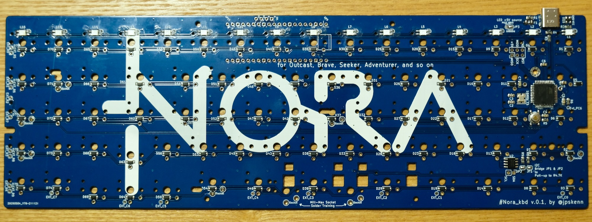
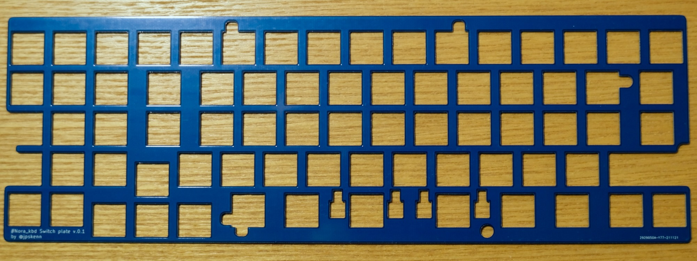
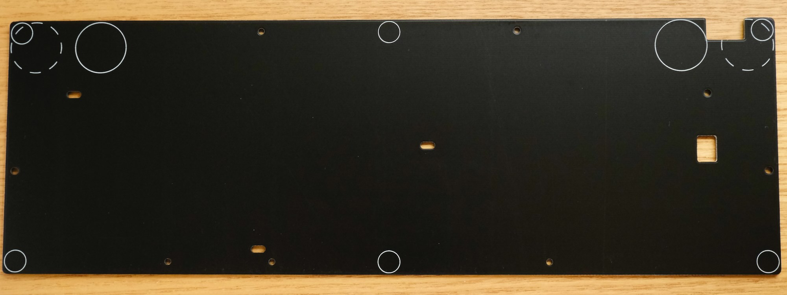
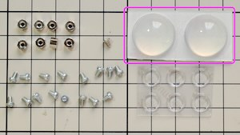
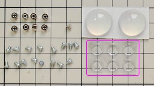
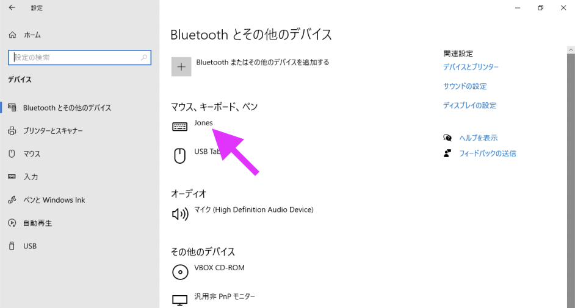

# Nora v.0.1 ビルドガイド

購入していただいた方、リポジトリから製造していただいた方、その他の皆様、Noraに興味を持っていただきありがとうございます。

このドキュメントは、Nora v.0.1を組み立てるためのビルドガイドです。  
Noraのコンセプトや特徴、ビルド例などについては、[Nora README](https://github.com/jpskenn/Nora/README.md)をご覧ください。

ビルドガイド全体に目を通して作業手順を把握しておくとミスの防止につながりますので、ぜひ、一度お読みになってから組み立て作業を始めてください。

組み立て初心者の方や、しっかりと確認しながら組み立てたい方は、

<details>
<summary>《詳しい説明》</summary>

ここに追加の説明を表示します。
</details>

と書かれたところをクリックすると、追加の説明が表示されます。

---

## 目次

<!-- @import "[TOC]" {cmd="toc" depthFrom=2 depthTo=3 orderedList=false} -->

<!-- code_chunk_output -->

- [目次](#目次)
- [Nora v.1の特徴, 機能](#nora-v1の特徴-機能)
- [注意事項、制限など](#注意事項-制限など)
- [部品リスト](#部品リスト)
  - [キット内容](#キット内容)
  - [別途用意が必要な部品](#別途用意が必要な部品)
  - [オプション部品](#オプション部品)
- [組み立てに必要な工具](#組み立てに必要な工具)
- [組み立て前の確認](#組み立て前の確認)
  - [同梱物の確認](#同梱物の確認)
  - [接続の確認](#接続の確認)
  - [基板回路の確認](#基板回路の確認)
- [組み立て手順](#組み立て手順)
  - [（該当者のみ）基板にMCUやUSBコネクタなどのパーツを取り付ける](#該当者のみ基板にmcuやusbコネクタなどのパーツを取り付ける)
  - [左シフトキーの構成を決める](#左シフトキーの構成を決める)
  - [Mill-Maxソケットを取り付ける](#mill-maxソケットを取り付ける)
  - [（オプション）LEDを取り付ける](#オプションledを取り付ける)
  - [スイッチプレートにシートを貼り付ける](#スイッチプレートにシートを貼り付ける)
  - [（オプション）スイッチプレートにスタビライザーを取り付ける](#オプションスイッチプレートにスタビライザーを取り付ける)
  - [スイッチとスイッチプレートを基板へ取り付ける](#スイッチとスイッチプレートを基板へ取り付ける)
  - [基板をケース、またはボトムプレートへ取り付ける](#基板をケース-またはボトムプレートへ取り付ける)
  - [スイッチをソケットに取り付ける](#スイッチをソケットに取り付ける)
  - [仕上げ](#仕上げ)
- [参考](#参考)
  - [打鍵感向上：ケース内部の制振と静音化](#打鍵感向上ケース内部の制振と静音化)
  - [トラブル対応：正常に入力できないスイッチの原因調査](#トラブル対応正常に入力できないスイッチの原因調査)
  - [トラブル対応：LEDの取り付け不良調査](#トラブル対応ledの取り付け不良調査)
  - [トラブル対応：Mill-Maxソケットの取り外し方](#トラブル対応mill-maxソケットの取り外し方)
  - [資料：USBコネクタ接続図](#資料usbコネクタ接続図)
  - [資料：ファームウェアの書き込み方法](#資料ファームウェアの書き込み方法)
  - [資料：初期ファームウェアの機能と設定値](#資料初期ファームウェアの機能と設定値)
  - [資料：Noraキーボードのファームウェア](#資料noraキーボードのファームウェア)
  - [資料：EEPROMを消去して、初期状態に戻す方法](#資料eepromを消去して-初期状態に戻す方法)
  - [資料：Raspberry Pi PICOによる動作（実験的機能）](#資料raspberry-pi-picoによる動作実験的機能)

<!-- /code_chunk_output -->

---

## Nora v.1の特徴, 機能

- 狭ピッチ
- Jonesゆずりのキーレイアウト
- Cherry 1800風のカーソルとテンキー
- Choc v1スイッチと、MBK、またはそれ以下のサイズのキーキャップに合わせた専用設計
- RemapやVIAなどのキーマップ書き換えツールに対応したファームウェアを書き込み済み  
- 外部EEPROM（8KB）を搭載し、十分な数のレイヤーを使用可能
- GH60型やPoker型に互換性のあるロープロファイルケースに対応  
  ボトムプレートと組み合わせて、ケースレスで高さを抑えて使用することも可能。
- オプションとして、以下のハードウェア機能を使用可能
  - レイヤーインジケータ／イルミネーションLED
  - Raspberry Pi PICOによる動作（実験的機能）
- 細かな部品を実装済み

---

## 注意事項、制限など

- MBK、またはそれ以下のサイズのキーキャップに合わせて設計されています。  
  Kailh製のロープロファイルキーキャップ（例：[Kailhロープロ刻印キーキャップ](https://shop.yushakobo.jp/collections/keycaps/products/pg1350cap-doubleshot)）は隣同士のキーが干渉する可能性があるため、ご自身の責任で使用してください。  
  （少し削れば使える、または、ギリギリ干渉しない程度のクリアランスなので、DIYすればなんとかなるレベル）

- 左シフトキーの2uスタビライザーは使用できません。

- 一部のスイッチはネジ穴の上に取り付けるため、Mill-Maxソケットを使用して取り付けます。

- GH60型, Poker型ケースを使用する場合、スイッチとケースのネジ穴との干渉を避けるため、一部のスイッチの足の加工が必要です。

- GH60型, Poker型ケースを使用する場合、中央下側のネジは使用しません。

- もしかしたら取り付けできないケースがあるかもしれません。  
  また、キー天面までの高さが低いため、ハイプロファイルタイプのケースは使用に適しません。（[TOFUケースへの装着例](https://twitter.com/jpskenn/status/1466729696713142277)）  

  取り付け確認済みのケースは次の通りです。  
  （これら以外のケースへの取り付けの成功／失敗の報告を募集しております。）
  - [KBDfans 60% ALUMINUM LOW PROFILE CASE](https://kbdfans.com/collections/60-layout-case/products/customized-gh60-aluminum-case)
  - [Jones用ボトムプレート](https://booth.pm/ja/items/3266269)（Noraキット付属のM2 3mm低頭ネジを使用します）

  木製のケースにも取り付けできますが、以下に示すケース、またはその他の同様のケースは内部構造が基板裏側の部品に干渉すると思われるため、DIYで加工することを前提に使用してください。
  - [60% 竹製ケース（パームレスト一体型）](https://shop.yushakobo.jp/products/a0700bp-01)
  - [NPKC 60% WOODEN WRIST REST KEYBOARD CASE](https://drop.com/buy/npkc-60-percent-wooden-wrist-rest-keyboard-case)
  - [60% 木製ケース](https://shop.yushakobo.jp/products/60-wood-case)

---

## 部品リスト

このキットを組み立てるためには、”キット内容”に加え、”別途用意が必要な部品”が必要です。  
好みに合わせて必要な数をお買い求めください。

”オプション部品”は使いたい機能などに合わせて用意してください。  

部品の購入先は、Self-Made Keyboards in Japanの[ショップリスト](https://scrapbox.io/self-made-kbds-ja/ショップリスト)などを参考にしてください。

### キット内容

| 部品名 | 個数 | 備考 |
| ----- | :-----: | ----- |
| ご案内リーフレット | 1 | |
| 基板 | 1 | [おもて側<br>](../assets/BuildGuide_v.0.1/_DSF1269.jpeg)<br>[裏側<br>](../assets/BuildGuide_v.0.1/_DSF1271.jpeg)<br>（※LEDは取り付けられていません） |
| スイッチプレート | 1 | [おもて側<br>](../assets/BuildGuide_v.0.1/_DSF1267.jpeg)<br>[裏側<br>](../assets/BuildGuide_v.0.1/_DSF1268.jpeg) |
| Choc用スタビライザー<br>2uサイズ | 2 | [](../assets/BuildGuide_v.0.1/IMG_3852.jpeg) |
| 低頭ネジ, M2 4mm | 5 | [](../assets/BuildGuide_v.0.4/_DSF0432_1.jpeg) |
| 低頭ネジ, M2 3mm | 5 | [](../assets/BuildGuide_v.0.4/_DSF0432_2.jpeg) |
| Mill-Maxソケット 金色<br>7305-0-15-15-47-27-10-0 | 12 | [](../assets/BuildGuide_v.0.4/_DSF0432_3.jpeg) <br>鍔が薄い |
| Mill-Maxソケット 銀色<br>0305-2-15-80-47-80-10-0 | 2 | [](../assets/BuildGuide_v.0.4/_DSF0432_3.jpeg)<br>鍔が厚い<br>はんだ付け練習用, 失敗時の予備用 |

〓写真入れ替え〓
※出荷時期によってメーカーや品番などが変わることがあります

### 別途用意が必要な部品

| 部品名 | 個数 | 備考 |
| ----- | :-----: | ----- |
| Choc v1 スイッチ | 最大 75 | v2には非対応 |
| キーキャップ<br>MBK、またはそれ以下のサイズのもの | 必要数 | 左シフト2uの構成：<br>1u 65個, 1.5u 6個, 2u 3個<br>左シフト1u+1uの構成：<br>1u 67個, 1.5u 6個, 2u 2個 |
| GH60型, Poker型ロープロファイルケース<br>または<br>Jones用ボトムプレートキット(\*) | 1 | Jones用を流用して使用 |
| USBケーブル （Type-C） | 1 | |

\* Jones用ボトムプレートキットの内容は次の通り
〓ネジを低頭ネジに変更する必要あり
| 部品名 | 個数 | 備考 |
| ----- | :-----: | ----- |
| ご案内リーフレット | 1 ||
| Jones用ボトムプレート v.1 | 1 | [おもて側<br>](../assets/BuildGuide_v.0.1/_DSF0644.jpeg)<br>[裏側<br>](../assets/BuildGuide_v.0.1/_DSF0654.jpeg) |
| スペーサー, M2 3mm | 8 | [](../assets/BuildGuide_v.0.1/_DSF0435_0.jpeg) |
| ネジ, M2 3mm | 16 | [](../assets/BuildGuide_v.0.1/_DSF0435_1.jpeg) |
| ネジ, M2 3mm, 低頭 | 1 | [](../assets/BuildGuide_v.0.1/_DSF0435_2.jpeg) |
| ゴム足 大 | 2 | [](../assets/BuildGuide_v.0.1/_DSF0435_3.jpeg) |
| ゴム足 小 | 6 | [](../assets/BuildGuide_v.0.1/_DSF0435_4.jpeg) |

※出荷時期によってメーカーや品番、色などが変わることがあります

### オプション部品

| 部品名 | 個数 | 備考 |
| ----- | :-----: | ----- |
| LED<br>SK6812MINI-E | 最大16 | 左上のキーから順番に、取り付けた数だけ点灯。 |
| Raspberry Pi PICO | 1 | 実験的機能をDIYで楽しむ場合 |

---

## 組み立てに必要な工具

M2ネジに対応する先の細いドライバー、ピンセット、はんだ付け関連用品など、一般的な電子工作向け工具を使用します。  
[遊舎工房の工具セット](https://yushakobo.jp/shop/a9900to/)を参考に用意してください。

キースイッチの取り外し用の工具があると作業がはかどります。  
[TALP KEYBOARDで売っているこのタイプ](https://talpkeyboard.net/items/601362fe2438601925ad0692)は、1本でキースイッチとキーキャップの両方に使えるので便利です。

また、マスキングテープが1巻あると、基板や部品の仮固定などに使えて便利です。

なお、無くても組み立てはできますが、何か不具合があった場合の原因調査ではテスターが必要になることがあります。

---

## 組み立て前の確認

組み立てを開始する前に、同梱物と基板についての基本的な確認をおこないます。  
何か問題があった場合は作業を中止し、キット同梱のリーフレットに記載された連絡先へ問い合わせてください。

*組み立ての開始後は初期不良として対応できかねる場合があります。*

### 同梱物の確認

以下の項目を確認します。

- 同梱物に不足がないこと

- 基板に配線が切れるような大きく深い傷や割れなどの破損がないこと

- 梱包の中に小さな部品が落ちていないこと（＝基板に実装された部品が外れていないこと）

### 接続の確認

MacやPCに接続して、キーボードとして認識されることを確認します。

```text
充電用ではないUSBケーブルを使用してください。
他の機器を接続して使用した実績のあるケーブルを使うと、無用のトラブルを防げます。
```

下記のOS別の確認方法を参考に、確認してください。

<details>
<summary>《Mac, macOS Monterey 12.0.1》</summary>

キーボードとMacを接続します。

接続した際に`キーボード設定アシスタント`が表示されることがありますが、この段階ではキーを押すことができないため、そのまま放っておくか、閉じるボタンで閉じておきます。  

  

なお、キーボード設定アシスタントは、次の操作でいつでも呼び出すことができます。

```aside
システム環境設定 → キーボード と進み、
キーボード タブ内の キーボードの種類を変更… ボタンを押す。
```

メニューバーから、`` → `このMacについて`を選び、表示された画面で`システムレポート…`をクリックします。  
システム情報が表示されたら、左側の`ハードウェア`から`USB`を選択します。

右側上部の`USB装置ツリー`のどこかに`Nora`というデバイスが表示されていれば、正しく認識されています。  
`USB装置ツリー`の下の方が見切れている場合があるため、スクロールして探してください。


システム情報の表示
</details>

<details>
<summary>《Windows, 10 Pro 1909(18363.1082)》</summary>

キーボードとPCを接続します。

`スタートボタン`から`設定`を開いて`デバイス`を選択し、  
`マウス、キーボード、ペン`の項目に`Nora`が表示されていれば、正しく認識されています。
（※スクリーンショットで”Jones”となっている部分を”Nora”に読み替えてください。

  
デバイスの表示
</details>

### 基板回路の確認

キースイッチまたはMill-Maxソケットを取り付ける箇所（スルーホール）をショートさせて、基板回路が電気的に正しく反応することを確認します。  

レイアウトを画面見ながら確認できるので、キーマップ書き換えツール[Remap](https://remap-keys.app/)のテスト機能を使う方法がおすすめです。  

<details>
<summary>《詳しい説明》</summary>

その他の方法として、OSのキーボードビューアや[Keyboard Checker](https://keyboardchecker.com)、[QMK Configurator](https://config.qmk.fm/)のキーボード入力テストを使用して確認することもできます。  
[VIA](https://caniusevia.com)を使用する際は、この定義ファイル（[nora_v01.json](〓リンク)）を読み込ませてください。

ここでは、キーマップ書き換えツール[Remap](https://remap-keys.app/)のテスト機能を使い、確認を行います。

基板の裏面が上側になるように置き、PCやMacとUSBケーブルで接続します。

Google Chromeブラウザ（Web HID対応のバージョン89以降）で、[Remap](https://remap-keys.app/)を開きます。

`START REMAP FOR YOUR KEYBOARD`をクリックしてキーボード接続画面に進みます。


`+ KEYBOARD`をクリックしてデバイスへの接続要求画面を開きます。

〓画像

デバイスへの接続要求画面で`Nora`を選択して`接続`をクリックすると、画面にキーボードのレイアウトが表示されます。

〓画像

レイアウト右側の`Layout Option`で、組み立てようとしているレイアウトに設定します。  
キーマップは組み立て完了後に変更するため、ここではレイアウトだけ設定して先へ進みます。


レイアウト右側の`…`をクリックし、`Test Matrix mode`を選択します。

〓画像

ピンセットなどの電気を通すものを使い、スルーホールをショートさせます。

〓画像
ピンセットを使ってショートさせる様子

Remapの画面で、ショートさせた箇所に対応するキーの色が変わることを確認します。  

〓画像

同様の作業を繰り返し、全てのキーの色が変わることを確認します。  

確認が終わったら、USBケーブルを抜きます。

</details>

---

## 組み立て手順

以下の手順に沿って組み立てます。  
`（オプション）`と書かれた項目は、不要であれば作業をとばしてもかまいせん。  

工具類や部品による怪我や、はんだ作業での火傷などに気をつけてください。  

### （該当者のみ）基板にMCUやUSBコネクタなどのパーツを取り付ける

*基板にパーツが取り付けられていない場合のみ、この手順を行います。*

以下の簡単な説明を読み、どうにかして必要なパーツを取り付けます。

<details>
<summary>《詳しい説明》</summary>

使用する部品は次のとおりです。

| 部品区分 | 型番 | 使用数 | 備考 |
| :-- | :-- | :-: | :-- |
| MCU | ATmega32u4-AU | 1 ||
| USBコネクタ | USB4085-GF-A | 1 ||
| ESD | PRTR5V0U2X | 1 ||
| FUSE | 0ZCJ0050AF2E | 1 ||
※出荷時期により同等品に変更になる場合があります。

#### MCUを取り付ける

基板裏側、`U3`へ取り付けます。  

いずれかの角、1箇所だけに予備はんだします。  
MCUを基板のマークに合わせて置き、予備はんだした箇所をはんだ付けします。  
ずれ、傾きがないように調整します。


MCU取り付け方向

対角上の角を1ピンだけはんだ付けします。

はんだ付けされていない辺のうち、どちらかの辺のピンを、すべてはんだ付けします。  
フラックスを塗り、ハンダの量をこて先に少しつけるくらいから始め、なんとかします。

同様の手順で、反対側の辺、残ったうちのどちらかの辺、最後に残った辺のピンをはんだ付けします。

フラックスを拭き取り、テスターで隣同士のピンがショートしていないか確認します。


基板裏側から見た、MCUのピン割り当て

#### USBコネクタを取り付ける

基板裏側`J1`の`INSTALL HERE`と書かれたところへコネクタを取り付け、基板おもて側からはんだ付けします。  
コネクタはマスキングテープなどで仮固定しておくと作業しやすくなります。

以下の接続図を参考に、テスターでピンを確認します。


基板おもて側から見た、USBコネクタのピン割り当て

#### ESDを取り付ける

基板裏側`D10`へ、GNDに太い足がくるように取り付けます。


ESD取り付け方向

#### FUSEを取り付ける

基板裏側`F1`へ取り付けます。  
どちら向きに取り付けてもかまいません。

#### リセットスイッチを取り付ける

基板裏側`Reset SW`へ取り付けます。  
どちら向きに取り付けてもかまいません。

#### I2Cプルアップ抵抗をジャンパする

基板裏側`JP1`と`JP2`をジャンパします。  
ジャンパすると、I2Cのプルアップ抵抗へ接続されます。

</details>

### 左シフトキーの構成を決める

左シフトキーの構成を、2u 1個、または1u 2個のどちらかに決めます。  
なお、スイッチ配置の都合により、左シフトキーにスタビライザーは取り付けできません。

レイアウトをまとめた[Keyboard Layout Editor: Nora v.0.1](http://www.keyboard-layout-editor.com/#/gists/33874da3b7be015c26f7f6f09a010688)も参考にしてください。

### Mill-Maxソケットを取り付ける

ケースネジの上に取り付けるスイッチが取り外せるように、Mill-Maxソケットを取り付けます。  

スイッチ端子のスルーホールに`Socket`と書かれた箇所へ、基板おもて側からMill-Maxソケットを差し込み、基板裏側からはんだ付けします。  
左シフトキーの構成により、取り付ける箇所がすこし変わります。

〓写真　取り付け箇所　左シフトでの変化のコメント入れる

基板の中央下部に、ソケットのはんだ付け練習場所があります。  
はんだ付けに不安がある場合は、キット同梱の練習用Mill-Maxソケット（銀色）を使って練習できます。

〓写真　練習用の場所

```aside
練習用Mill-maxソケット（銀色）はソケットの鍔（つば）が厚いため、実際に使用するスイッチの取り付けには適しません。
```

<details>
<summary>《詳しい説明》</summary>

基板裏側の`Socket`と書かれた箇所のスルーホールへ、基板おもて側からソケットを差し込みます。  
基板を裏返したときにポロッと外れてしまうようなら、マスキングテープでとめておきます。

基板の裏側が上になるように置きます。

はんだごてを用意します。  
こて先の温度を320℃程度にします。  

ここからは、1、2、3、4、5、6、7と数える間に次の手順をおこないます。  
時間をオーバーしてもソケットは壊れませんので、ゆっくりと落ち着いて、ソケットの中にハンダが入ってしまわないよう、慎重に作業してください。

1、2、3：
基板の裏側から、こて先を基板から飛び出しているソケットの側面とスルーホールの両方にあて、十分温めます。  
こて先をソケットの端の方まで当ててしまうと、ソケットの内側にはんだが流れ込みやすいため、当て方を工夫します。

〓写真　こて先をあてている状態

4、5、6：
ソケットとスルーホールの間あたりへ、はんだをチョンと押し付けて離します。  
溶けたはんだをソケットとスルーホールの隙間に流し込みます。  
はんだが隙間から少しだけ出て盛り上がる程度まで、何度か繰り返します。  
**ソケットの内側にはんだが入ってしまわないよう、少しずつ、慎重におこないます。**

7：
こて先を離します。

ソケットの全周にわたってはんだが流し込まれ、スルーホールとの隙間が埋まっていれば良い仕上がりです。

同様の手順で、必要な数のソケットを取り付けます。

ソケットの内側にはんだが入ってしまったりして取り外す必要がある場合は、[参考：トラブル対応：Mill-Maxソケットの取り外し方](〓リンク)を参照してください。

</details>

〓写真　できあがり

### （オプション）LEDを取り付ける

*LEDを使用しない場合、この手順は不要です。*

基板裏側から、16個のLEDを取り付けます。

LEDは基板おもて側から見て左上、つまりUSBコネクタのある方が1番目で、そこから順番につながっています。  

<details>
<summary>《詳しい説明》</summary>

基板を裏側が上になるように置きます。

はんだごてを用意します。  
こて先の温度は320℃程度にします。  

基板裏側のジャンパ`JP3:LED +5V source`を`Onboard`にジャンパ（隣同士のパッド（基板上の小さな四角の銀色部分）にはんだをつけてつなげること）します。  
3個並んだパッドのうち、中央と`Onboard`の2個にまたがるようにこて先を当てて温めます。  
こて先にはんだを押し付け、少したっぷり目に溶かし、こて先で基板をなでるように横へスッとずらしてパッドから離し、2個のパッドをはんだでつなぎます。  
なかなか上手くジャンパできないのですが、何度かトライすればそのうちできます。  
こて先でパッドをグリグリいじるとパッドが剥がれて大変なことになるため、「はんだをつけて横へスッ」の動きを守って作業します。

〓写真　パッドをOnboardにジャンパした例

LED（SK6812MINI-E）を1個、手元に用意します。

LEDの発光部分（透明な窓があるところ）が下側になるように持ちます。  
LEDから出ている4本の端子のうち、角が斜めになっている1本が、基板に描かれた印に合うようにして、基板の穴にはめこみます。  
4本の端子が基板にぴったりくっついていない場合は、軽く押し込みます。

はんだごてを用意します。  
LEDは高温ではんだ付けすると壊れやすいため、こて先温度を少し低めの220-270℃に設定します。  
温度の設定ができない場合は、以下の手順で数える時間を半分にして試します。（はんだの溶け具合が悪ければ時間を伸ばします）

ここからは、1、2、3、4、5と数える間に次の手順をおこないます。

1、2：  
4本の端子のどれかひとつにこて先をあてて押さえ、端子とパッドを温めます。  

3、4：  
はんだを端子（またはパッド）に当てて溶かし、端子とパッドにはんだを行き渡らせて、はんだを離します。  
こて先はグリグリ動かしません。はんだ溶けて、自然に濡れ広がっていくような具合です。

5：  
こて先を離します。

はんだが、端子とパッド全体に行き渡っていれば良い仕上がりです。  
LEDが傾いてしまった場合は、ピンセットでLEDをつまみ、はんだ付けした端子をこて先で温めながら傾きを修正します。  

続いて、最初にはんだ付けした端子とLED本体を挟んだ反対側の端子2本を、1本ずつ、同様の手順ではんだ付けします。

最後に、残った1本の端子をはんだ付けして、LED1個の取り付け完了です。

この作業を繰り返し、必要な数のLEDを取り付けます。

</details>

〓写真更新

取り付けたLED

#### LEDの動作確認

〓Func0とかをkeymapで定義しておいて、インジケータをON/OFFできないか？
〓led_update_userの中で、ifにrgblight_set_layer_stateを入れて走らないようにする感じで

〓最初のLEDパターンをテスト用のやつにしておいたら、Remapの作業いらない

LEDが正しく取り付けられているか、動作確認をおこないます。

USBケーブルを接続します。

この時点ですべてのLEDが赤色に点灯していれば、ひとまずOKです。  
点灯しいないLEDがある場合は、[トラブル対応：LEDの取り付け不良調査](#トラブル対応LEDの取り付け不良調査)を参考にして調査します。

続いてPCまたはMacでRemapを開き、`START REMAP FOR YOUR KEYBOARD`をクリックして、キーボードを接続してレイアウトが表示されるまで進みます。

右側のアイコンから`Lighting`をクリックします。

Lighting画面で`Hue` `Saturation` `Brightness`などの設定値を変えて、意図した通りにLEDの色が変われば正常です。  

確認が終わったら、USBケーブルを抜きます。

何か問題がある場合は、[トラブル対応：LEDの取り付け不良調査](#トラブル対応LEDの取り付け不良調査)を参考にして調査します。

### スイッチプレートにシートを貼り付ける

基板とスイッチプレートの隙間を埋めるシートを、スイッチプレート裏側へ貼り付けます。  
以下の写真に示す貼り付け位置を確認し、ちょうど良い長さにシートをはさみなどで切り離してください。

〓写真　シートを貼る位置

〓写真　貼り付けたところを拡大したもの

### （オプション）スイッチプレートにスタビライザーを取り付ける

*スタビライザーを使用しない場合、この手順は不要です。*

親指の2uキーに使用するスタビライザーを、スイッチプレートに取り付けます。

```aside
スタビライザーは、キーの左右の端を押したときでも、スイッチの軸をまっすぐに押し込むための部品です。
取り付けは必須ではありませんので、使用スタイルに合わせて取り付けるか決めてください

取り付ける場合：
キーのどこを押してもまっすぐに押し込むことができますが、スタビライザーのカチャカチャという動作音が気になることがあります。
→打鍵の安定性を優先する方に最適。
→指のポジションや打鍵スタイル的に、キーの左右の端を押しがちな方にもおすすめ。
→多少の動作音は気にならない方、または、ルブやModで動作音を低減すれば十分な方にもおすすめ。

取り付けない場合：
キーの端を押すと少し引っかかりがあって押し込みにくくなりますが、動作音が無くなり静かになります。
→静かさを優先する方に最適。
→おもにキーの中央部分を打鍵するスタイルで、スタビライザーがなくても特に影響のない方はこちら。
```

<details>
<summary>《詳しい説明》</summary>

#### スタビライザーを組み立てる

プラスチックパーツと金属の棒を組み合わせて、スタビライザーを2個組み立てます。

大きいプラパーツと小さいプラパーツを、それぞれ1個用意します。  
小さいパーツの`＋`部分がセンターから少しずれている方向を、大きいパーツのワイヤーがはまる方向に合わせます。


大きいパーツと小さいパーツを並べる

大きいパーツの下側から、小さいパーツをはめこみます。  
途中に引っ掛かりがあるので、指でパチンと押し込みます。


大きいパーツの下側から、小さいパーツをはめる。


小さいパーツがはめこまれた状態

同じようにして、もう1組のプラパーツをはめこんでおきます。

ワイヤーとはめこんだパーツを1個用意します。  
小さいパーツの穴にワイヤーを差し込み、大きいパーツにワイヤーをはめます。  
ワイヤーは、大きいパーツにパチンとはまわるわけではなく、ふわっと乗っているだけで固定されません。  
（ワイヤーは、スイッチプレートにスタビライザーを取り付けた際に固定されます）


プラパーツ1個にワイヤーをはめた状態

プラパーツをもう1個用意し、ワイヤーをはめます。  
ワイヤーが大きいパーツに固定されないので、すこしイライラする作業になります。


プラパーツ2個にワイヤーをはめた状態

同様に、もう1個組み立てます。

#### スイッチプレートにスタビライザーを取り付ける

スイッチプレートの裏側からスタビライザーをはめて取り付けます。

組み立てたスタビライザーを1個用意し、キーキャップにはまる`＋`の部分を上にして、金属の棒の中央部が奥になるような方向で置きます。

プレートを、スタビライザーがはまるスペースキー部分が手前で、おもて側が上になるように持ちます。  
左右どちらかの取り付け穴に合わせるようにして、スタビライザーの上にプレートを置きます。  
小さい四角と大きい四角にスタビライザーのプラ部分が入るように、位置を合わせます。

〓写真　のせる

位置を合わせた状態でスタビライザーをプレートの穴に押し込み、パチンとはめ込みます。  
プラパーツがプレートにしっかりとはまるよう、うしろから指で押し込んでおきます。

〓写真　はめた　おもて
〓写真　はめた　うら

もう1個のスタビライザーも、同じように取り付けます。

</details>

### スイッチとスイッチプレートを基板へ取り付ける

スイッチを、スイッチプレートをはさむようにして基板に取り付けます。  

**スイッチとスイッチプレートを取り付けた後は、それらを取り外さない限り、スタビライザーの取り付け・取り外しができなくなります。**  
スイッチのはんだを除去して、スイッチとスイッチプレートを取り外すことは可能ですが、そこそこ面倒な作業になります。

#### スイッチ取り付け前の確認

スイッチの端子を見て、折れたり、曲がったりしていないことを確認します。  
少しだけ曲がっているものは、まっすぐにしておきます。

```aside
折れてしまっているものは使用できません。
また、大きく曲がっているものは強度が落ちて折れやすいため、なるべく使用しないようにします
```

<details>
<summary>《詳しい説明》</summary>

〓写真更新
スイッチの端子（左から順に、曲がり、正常、曲がり）

折れてしまっているものは使用できません。  
また、大きく曲がっているものは、まっすぐに戻しても折れやすくなっているため、使用を避けた方がよいでしょう。

</details>

#### スイッチプレートを仮固定する

スイッチプレートの4隅にスイッチをはめ込み、基板へはんだ付けして仮固定します。  

<details>
<summary>《詳しい説明》</summary>

スイッチプレートをおもて側が上になるように置きます。

プレートの4隅に、スイッチの方向を基板のスイッチ端子のスルーホールの方向に合わせて、パチンとはめ込みます。  
プレートに対し、スイッチ端子が手前側になるのが正しい方向です。

〓写真更新
スイッチプレート4隅につけたスイッチ

スイッチがプレートの枠にぴったり密着してはまっていることを確認します。

〓写真　スイッチとプレートの密着OK NG

プレートの隣に、基板をおもて側が上になるように置きます。

スイッチ4個を取り付けたプレートを持ち上げ、スイッチ端子と基板のスルーホールの位置を合わせながら、基板に乗せて重ねます。  
スイッチ端子がスルーホールに入った状態にします。

プレートと基板を重ねたまま持ち上げ、基板の裏側を支えながら、スイッチを押し込みます。  
スイッチ固定用のプラスチックピン2本が根元まで刺さり、スイッチが基板にほぼくっついた状態にします。

〓写真　スイッチの押し込まれ具合

基板の裏側が上になるように置きなおします。

はんだごてを用意します。  
こて先の温度は320℃程度にします。  

ここからは、1、2、3、4、5、6と数える間に次の手順をおこないます。  
多少時間をオーバーしても壊れませんので、焦ることはありません。  
しかし、あまり時間をかけるとはんだ内のフラックスが蒸発して仕上がりが悪くなるため、オーバータイムで8くらいまでには終わるようにします。

1、2：
スルーホールから飛び出したスイッチ端子とスルーホールの両方に当たるように、こて先をあてて温めます。

3、4、5：  
はんだをスイッチ端子（またはスルーホール）に当てて溶かし、端子とスルーホールにはんだを行き渡らせて、はんだを離します。  
スイッチ端子の先の方だけでなく、スルーホール内部にもはんだが入っていくようにします。

6：  
こて先を離します。

スイッチ端子とスルーホールがはんだで覆われ、はんだが富士山型に盛り上がったようになっていれば良い仕上がりです。

〓写真　はんだ付けした端子1こか2こ

作業を繰り返し、4個のスイッチ（＝8本のスイッチ端子）を、すべてはんだ付けします。

</details>

〓写真更新
スイッチプレートを基板に仮固定

#### 残りのスイッチを取り付ける

ソケットを使用するスイッチを除いて、残りのスイッチをすべて取り付けます。

スイッチプレートの仮固定でおこなった作業と同様に、プレートにスイッチをはめ込み、基板裏側からはんだ付けする作業を繰り返します。  
左シフトキーは、自分で決めた構成（2u 1個、または、1u 2個）になるように取り付けるます。

〓写真更新
スイッチを全て取り付けた状態  

#### スイッチの動作確認

組み立て前におこなった[基板回路の確認](#基板回路の確認)と同様の手順で、スイッチのはんだ付けが正しく行われているか確認します。  
この手順ではスイッチを押して正しく反応することを確認します。

正常に入力できないスイッチがあった場合は、[トラブル対応：正常に入力できないスイッチの原因調査](#トラブル対応正常に入力できないスイッチの原因調査)の手順に沿って調査します。

### 基板をケース、またはボトムプレートへ取り付ける

スイッチとプレートが組み合わされた基板を、ケース、またはボトムプレートへ取り付けます。

#### （該当者のみ）GH60型, Poker型ケースへ取り付ける

*GH60型, Poker型ケースを使用する場合のみ、この手順をおこないます。*

ケースに基板をねじ止めして取り付けます。
〓60% プラスチックケースの加工については、必要に応じて追記する。たぶん非推奨ケースなはず

打鍵感向上に興味のある方は、次の項目をお読みになると何かヒントがあるかもしれません。

- [打鍵感向上：ケース内部の制振と静音化](打鍵感向上：ケース内部の制振と静音化)

<details>
<summary>《詳しい説明》</summary>

ケースを安定したところへ置き、スイッチとスイッチプレートが組み合わされた基板を手に持ちます。

基板を水平から30度くらいの角度に持ち、奥側（USBコネクタ）から斜めにケース内へ入れていきます。  
斜めに差し込んでいくと、USBコネクタがケースの穴にスッとはまります。

USBコネクタがはまった状態で基板の手前側を静かに下ろして水平にすると、力をかけることなく、基板全体がストンとケースに入ります。  
力を入れてグリグリとこじったりググググッと押し込むようなことはせず、角度を合わせて差し込んで、水平にするだけです。

〓写真更新
30度で差し込む

ケースネジ穴と基板のネジ穴の位置を合わせ、ネジで仮止めします。  
左上の1箇所のみ、ケース付属のネジを使用します。  
それ以外の、左端、右端、右上、中央、中央下の5箇所は、ネジ穴とスイッチが重なるため、キット同梱の低頭ネジを使用します。  
低頭ネジは5mmと4mmの長さのものを同梱していますが、ケース付属のネジと同じ長さか、少し短いものを使用します。

ケースに対して基板の位置が上下左右の真ん中になるように調整し、ネジが軽く止まる程度まで締めて基板を固定します。

ケース底面に、滑り止めのゴム足を貼り付けます。

</details>

〓写真　ケース取り付け完了

#### （該当者のみ）ボトムプレートへ取り付ける

*ボトムプレートキットを使用する場合のみ、この手順をおこないます。*

ネジとスペーサーを使い、ボトムプレートに基板を取り付けます。

<details>
<summary>《詳しい説明》</summary>

ボトムプレート裏面から、以下の写真に示す○印をつけた8箇所に、低頭ネジ（M2 3mm）を使い、スペーサー（M2 3mm）をねじ止めします。  
右上の◎印をつけた箇所は、スイッチとの干渉を避けるため、スペーサーを右側へ寄せてねじ止めします。  

〓写真更新　右下、点線のやつ消す。◎を追加

スペーサー取り付け箇所

基板を、ボトムプレートに取り付けたスペーサーの位置に合わせて乗せます。  
基板裏側の部品がスペーサーにぶつからないように気をつけてください。

基板おもて側から、ネジ（M2 3mm）を使い、基板とスペーサーをねじ止めします。  


基板とボトムプレートをねじ止めした状態

ボトムプレート底面に、滑り止めのゴム足を貼り付けます。  

- キーボードに傾斜をつける場合
    奥の左・右の2箇所：ゴム足 大
    手前の左・中・右の3箇所：ゴム足 小

- キーボードをフラットにする場合
    手前と奥の左・中・右の6箇所：ゴム足 小

見た目を良くしたい場合は、スイッチプレート, 基板, ボトムプレートの側面を、水性顔料インクのポスターカラーや油性マジックなどを使って塗ります。  
また、スイッチプレートと基板の周りにマスキングテープなどを貼り付けて、見た目の印象を変えることもできます。


側面の加工例（マスキングテープ貼り付けと黒色ペンでの塗り）

</details>


ボトムプレート取り付け完了

### スイッチをソケットに取り付ける

基板のねじ止めが終わったので、ネジに重なるスイッチをソケットに取り付けます。  
GH60型, Poker型ケースを使用する場合は、ケースのネジ穴に干渉するスイッチの足を加工して取り付けます。

#### （該当者のみ）ケースのネジ穴に干渉するスイッチの足を加工する

*GH60型, Poker型ケースを使用する場合のみ、この手順をおこないます。*

<details>
<summary>《詳しい説明》</summary>

中央と右上のケースのネジ穴に干渉する、スイッチ2個の足を加工します。  


スイッチの足を加工して取り付ける箇所

- 中央のネジ穴に重なるスイッチ
  5ピンのスイッチを使用する場合は、ネジ穴に干渉する片方の足を切断します。  
  おそらく回避できると思いますが、もしスイッチの中央の足が干渉する場合は、中央の足も切断します。

- 右上のネジ穴に重なるスイッチ
  スイッチ中央の足（出っ張り）を、ネジ穴に当たらない程度に一部切断して取り付けます。  
  ケースによってスイッチとの干渉具合が変わってくるため、現物合わせでどれくらい切断するかを判断します。

  
  中央の足をカットしたスイッチ

  また、押下時にスイッチの軸がネジに当たる場合は、軸の下端を切断したりして調整します。

  
  軸の下端を切断した状態

</details>

#### スイッチをスイッチプレートにはめ込む

スイッチの端子がソケットへまっすぐ刺さるようにして、スイッチプレートにはめ込みます。

〓写真　まっすぐ注意

#### ソケットへ取り付けたスイッチの動作確認

[基板回路の確認](#基板回路の確認)と同様の手順で、ソケットへ取り付けたスイッチが正しく反応することを確認します。

正常に入力できないスイッチがあった場合は、[トラブル対応：正常に入力できないスイッチの原因調査](#トラブル対応正常に入力できないスイッチの原因調査)の手順に沿って調査します。

### 仕上げ

キーキャップを取り付けます。

Remapで自分好みのキーマップに変更します。

完成です。

〓写真更新
製作例

写真を撮影し、`#Nora_kbd` のタグをつけてツイートすると設計者が喜んだりします。  
[Twitter: #Nora_kbd](https://twitter.com/search?q=(%23nora_kbd)&src=typed_query&f=live)

---

## 参考

打鍵感向上や機能追加についてのDIY情報や、トラブル調査方法などの参考資料です。  
必要に応じてお読みください。

### 打鍵感向上：ケース内部の制振と静音化

ケース内部底面におもり（10円玉, 真鍮板, 自動車のホイールバランスウェイト, 鉛シート, etc.）を入れておくと、ケースの共振が抑えられ、打鍵感の向上や、打鍵音の変化が期待できます。

ウレタンスポンジやシリコンシートなどで基板とケース間の空間を埋めてケース内部の残響音を減らしたり、基板の振動を抑制して振動音の発生を抑えて静音化するのも効果的です。

ボトムプレートを使用する場合も、基板とボトムプレートの間に対策を施すことで、同様の効果が期待できます。

〓写真更新する？　

### トラブル対応：正常に入力できないスイッチの原因調査

正常に入力できないスイッチの原因調査と対応方法について説明します。  

スイッチの取り付け方法に該当する項目を参照してください。

<details>
<summary>《詳しい説明》</summary>

テスターをお持ちの方は、疑わしい箇所をテスターで調べるのが手っ取り早い方法ですので、積極的に使用してください。

#### Mill-Maxソケットを使用して取り付けるスイッチ

ほとんどの原因は、スイッチのソケットへの取り付け不良です。  
スイッチを取り外し、端子が曲がったり折れたりしていないことを確認します。  
端子の曲がりを修復するか、新しいスイッチに交換して、もう一度キー入力を確認します。

ごくまれにソケットのはんだ不良が原因の場合があります。  
ソケットのはんだ忘れや、はんだが適切に行われていないことが原因のため、ソケットのはんだ状態を確認します。  
必要であれば再度はんだ付けし直して、もう一度キー入力を確認します。

上記で解決できなかった場合は、基板にはんだ付けされたMill-Maxソケットをピンセットなどを使ってショートさせ、キー入力を確認します。  
キー入力が確認できた場合は、ソケット自体は正しく取り付けられているので、スイッチを再度調査します。

#### はんだ付けして取り付けるスイッチ

ほとんどの場合、スイッチのはんだ不良が原因です。  
スイッチの端子にはんだがついているように見えて、実はスルーホールの中がスカスカという場合もあります。  
一旦、はんだ吸い取り線（ソルダーウィッグ）などではんだを除去し、はんだ付けをやり直してから、もう一度キー入力を確認します。

また、かなりレアなケースですがスイッチ自体が壊れている場合もあるため、別のスイッチに交換して試してみます。

#### それでも解決しない場合

組み立て前におこなった[基板回路の確認](#基板回路の確認)でおこなったように、基板のスルーホール部分をピンセットなどでショートさせ、正しく反応するか確認します。

この作業でキー入力が確認できない場合は、組み立て途中に基板の配線や部品がダメージを受けたことが原因と考えられます、これ以降の調査と修復の難易度が高くなります。

電子工作に詳しい方であれば、[NoraのKiCadプロジェクト](https://github.com/jpskenn/Nora/tree/master/PCB)を参考にテスター等を用いて調査を進め、ジャンパ線などで配線を修復してください。

自分ではどうにもできない方は、キット同梱のリーフレットに記載された連絡先へ問い合わせてください。  
状況に応じて、できる限りのサポートをいたします。  

</details>

### トラブル対応：LEDの取り付け不良調査

LEDが点灯しない場合など、LEDの取り付け不良を調査する方法について説明します。

<details>
<summary>《詳しい説明》</summary>

#### ジャンパの確認

ジャンパ`JP3: LED +5V source`が、正しくジャンパされていることを確認します。  
使用するMCUに合わせてジャンパする位置の組み合わせが異なりますが、通常は`Onboard`へジャンパします。

MCUとジャンパの組み合わせは次の通り。

| MCU | ジャンパ位置 | 備考 |
| :--: | :--: | :-- |
| ATmega32u4 | `Onboard` | 通常の組み合わせ |
| Raspberry Pi PICO | `PICO VBUS` | |

#### LEDの確認

ジャンパが正しく行われても点灯しない場合は、LEDに原因があると考えられますので、以下の順に対処します。  

```aside
なお、基板の配線へのダメージなど、他の要因も考えられますが、確率はかなり低いです。  
「組み立て中に工具で基板をガリっとやってしまった…」などの心当たりがあれば、また別ですが…
```

1. 光らないLEDのはんだ不良を修復する
    光らないLEDが正しくはんだ付けされていない、と仮定した対処です。
    光らないLEDの側面の端子部分にフラックスを塗り、こて先につけたはんだを押しあてて、はんだ付けをやり直します。

1. 光らないLEDの*ひとつ前*のLEDのはんだ不良を修復する
    光らないLEDのはんだは正常だが、ひとつ前のLEDのはんだ不良が原因で配線がつながっていない、と仮定した対処です。
    LEDは組み合わせによって、以下に示す順番で並んでいます。
    ひとつ前のLEDのはんだ付けをやり直します。
    | 組み合わせ | LEDの並び |
    | :--: | :-- |
    | 左側のみ | 左上（LED1） → 左下（LED2） |
    | 右側のみ | 右上（LED3） → 右下（LED4） |
    | 左右両方 | 左上（LED1） → 左下（LED2） → 右上（LED3） → 右下（LED4） |

1. 光らないLEDを新しいものに交換する
    220-270℃で1、2と数える程の加熱ではそう簡単にはLEDは壊れないと考えますが、何度かはんだをやり直しても点灯しない場合は、LEDが壊れていると判断して新しいものに交換します。

</details>

### トラブル対応：Mill-Maxソケットの取り外し方

Mill-Maxソケットを取り外すヒントです。  
「温めながら、押し出す」という方針でおこないます。

#### 用意するもの

- 竹串や爪楊枝など
  先の尖った、木製の棒状のもの。  
  金属製のものは、はんだがくっついて作業しにくい場合があります。
- はんだごて

#### 取り外し方法

この手順では竹串を使って説明します。

基板の裏側から、ソケットの穴へ竹串の尖った方の先端を、軽く差し込みます。  
グリグリと押し込む必要はなく、少しテンションがかかる程度でかまいません。

竹串の先端が差し込まれた状態のまま、基板のおもて側が上になるように置きます。  
この状態を作るのが難しいですが、竹串をいい具合の長さに折ったり、利き手とは逆の手で竹串と基板をつかんだりして、なんとかします。

はんだごてを用意します。  
こて先の温度を320℃程度にします。  

基板のおもて側から、ソケットの鍔（つば）部分にこて先を当てて温めます。

温まってはんだが溶ければ、竹串にかかっているテンションに押され、ソケットが基板から押し出されてきます。  
（このタイミングで　、ソケットがポロッと外れることもあります）

基板をおもて側が上になるように置きます。

ソケットが基板から半分ほど出た状態で、ソケット側面にはんだごてを当てて温め、ソケットの鍔に竹串を引っ掛けたり、ピンセットでつまんだりして取り外します。

### 資料：USBコネクタ接続図

USBコネクタの配線は次の通りです。


USBコネクタ接続図

### 資料：ファームウェアの書き込み方法

ファームウェアの書き込み方法について説明します。

<details>
<summary>《詳しい説明》</summary>

#### QMK Toolboxの使用

ビルド済み（≒作成済み）のキーボード用ファームウェアを書き込むには、[QMK Toolbox](https://github.com/qmk/qmk_toolbox/releases)を使用します。

QMKファームウェアに関するドキュメントの、[ファームウェアを書き込む](https://docs.qmk.fm/#/ja/newbs_flashing?id=ファームウェアを書き込む)を参考に、QMK Toolboxを使ってキーボードに書き込みます。

#### キーボードを DFU (Bootloader) モードにする方法

NoraキーボードでDFU (Bootloader)モードにするには、次のように操作します。

1. USBケーブルを抜く

1. キーボードの左上のキーを押したまま、USBケーブルを差し込む

この操作によってEEPROMも消去されるので、古いデータが残って動作がおかしくなるのを防止できます。  
ファームウェアの書き込みが終わった後に外部EEPROMの消去がおこなわれるため、**キーボードの起動まで5〜10秒ほどかかります**。（書き込み直後の初回起動のみ）

**何らかの理由で上記の操作でモードが変わらない場合は、次のように操作します。**

1. USBケーブルを差し込みます。（キーボードが普通に使える状態）

1. 基板裏側のリセットボタン`Reset SW`を押します。

この操作をおこなった場合は、ファームウェアの書き込み後に[資料：EEPROMを消去して、初期状態に戻す方法](#資料eepromを消去して-初期状態に戻す方法)を実施して、EEPROMを初期状態に戻す必要があります。

</details>

### 資料：初期ファームウェアの機能と設定値

出荷時に書き込まれている初期ファームウェアの機能と設定値を説明します。

<details>
<summary>《詳しい説明》</summary>

- キーマップ書き換えツール
  RemapやVIAに対応。

- キーレイアウト
  Wideレイアウト

- キーマップ
  日本語配列を元にしたキーマップ

- レイヤー
  6個のレイヤー。
  初期状態では、Wideレイアウトで英語配列のキーマップが設定され、6個のレイヤーを使用できます。  
  レイヤー構成とLEDインジケータの色は次の通りです。

  | No. | レイヤー名 | 機能 | LEDインジケータ色<br>手前, 奥 |
| :-: | :-- | :-- | :-: |
| 0 | ベースレイヤー #1 | 日本語配列 | 白, 白 |
| 1 | ベースレイヤー #2 | テンキー | 青, 青 |
| 2 | ベースレイヤー #3 | （未設定） | 黄, 黄 |
| 3 | Lower | 記号, ボリューム, ファンクションキー | －, 緑 |
| 4 | Raise | カーソル移動, 数字, ファンクションキー | －, 水 |
| 5 | Adjust | 各種設定, スクロールロックなど | －, 赤 |

- レイヤーインジケータLED
  2個（左または右のいずれか）、または4個（左右両方）に対応。

- ロータリーエンコーダ
  1個（左または右のいずれか）、または2個（左右両方）に対応。

- オーディオ（スピーカー）
  単音再生に対応。
  起動音などの効果音, 擬似クリック音, Music Modeを使用可能。

</details>

### 資料：Noraキーボードのファームウェア

ビルド済みファームウェアと、ソースファイルを用意しています。

#### ビルド済みのファームウェア

- [Nora v1 ファームウェア, VIA対応デフォルト](https://gist.github.com/jpskenn/3fcebf6a7c17f1a8433a8d954e05206f)

- [アンダーグロー対応 インジケータLEDなし用](https://gist.github.com/jpskenn/50e3ec1cdb09e1d24a6f2a5ed4cc2e15)

- [アンダーグロー対応 インジケータLED2個（左または右の、どちらか片側のみ）用](https://gist.github.com/jpskenn/5f6d95be0a71697aa9e7e743e40a73b2)

- [アンダーグロー対応 インジケータLED4個（左右両側）用](https://gist.github.com/jpskenn/cc2e155be9b250978d8f289e9917b5cd)

- [2音同時再生対応](https://gist.github.com/jpskenn/2a1d57117e745d635d038c64fdb32539)

#### ファームウェアのソース

2021年9月25日現在、QMK本家へのプルリクエストを申請中です。  
[[keyboard]Add v1 to nora keyboard #14405](https://github.com/qmk/qmk_firmware/pull/14405)

プルリクエストが取り込まれるまでは、僕のQMKからフォークしたリポジトリ  
[https://github.com/jpskenn/qmk_firmware](https://github.com/jpskenn/qmk_firmware)  
を使用してください。  

[develop_nora](https://github.com/jpskenn/qmk_firmware/tree/develop_Nora)ブランチの、`keyboards/nora/v1`に関連ファイルが格納されています。

### 資料：EEPROMを消去して、初期状態に戻す方法

キーマップやLEDの表示モードなどのEEPROMに記録されているデータを消去し、初期状態に戻すことができます。  

また、古いデータが残って動作がおかしくなるのを防止するため、ファームウェアを書き換える際にもこの操作をおこないます。

<details>
<summary>《詳しい説明》</summary>

USBケーブルを抜きます。

キーボードの左上のキーを押したまま、USBケーブルを差し込みます。

差し込んで1,2と数えてから、USBケーブルを抜きます。

USBケーブルを差し込みます。

5〜10秒ほどで外部EEPROMが消去され、キーボードが動作するようになります。  

これで設定が初期状態に戻ります。

</details>

### 資料：Raspberry Pi PICOによる動作（実験的機能）

DIYの実験的機能として、Raspberry Pi PICO（以下、PICOと呼びます）を使用して、キーボードを動作させることができます。

<details>
<summary>《詳しい説明》</summary>

#### PICOを使用してできること

- キーマトリクスの駆動
- LEDの点灯
- I2C接続されたEEPROMとの通信
- その他のI2C接続された機器との通信（オプション）
- 未割り当てのGPIOピンの使用（オプション）

#### PICO使用時の注意

- GH60型，Poker型ケースには、（たぶん）取り付けできません。
  取り付けられたとしても、ケーブルの取り回しを工夫する必要があります。

- ボトムプレートにも、そのままでは取り付けできません。
  PICOやケーブルに干渉する部分を切り取れば、取付可能です。

- 基板のジャンパを変更して使用します。
  [PICO使用時の設定](#PICO使用時の設定)を参照。

#### PICOの接続図

PICOの接続図は以下の通り。

〓写真　回路図

#### PICO使用時の設定

必要に応じて基板裏側のジャンパを設定してください。

- `JP3:LED +5 source`：LEDの電源供給元

| ジャンパ設定 | LEDの電源供給元 | 備考 |
| :-: | :-- | :-- |
| PICO VBUS | PICOのVBUS ||
| Onboard | 基板に接続したUSBのVCC | オンボードのMCU、ATmega32u4使用時のデフォルト設定|
| オープン | 接続なし ||

- `JP1`,`JP2`：I2Cプルアップ抵抗（4.7KΩ）への接続

| ジャンパ設定 | I2Cプルアップ抵抗への接続 | 備考 |
| :-: | :-- | :-- |
| ブリッジ | プルアップ抵抗へ接続 | オンボードのMCU、ATmega32u4使用時のデフォルト設定|
| オープン | 接続なし ||
