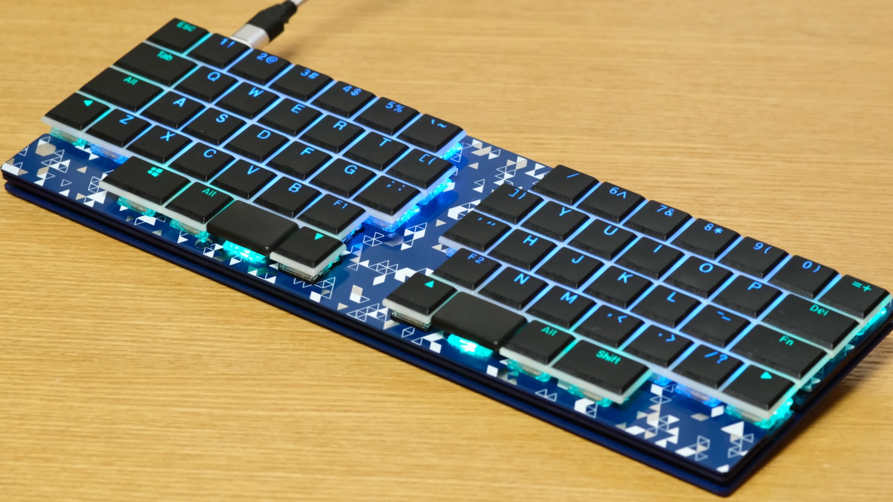
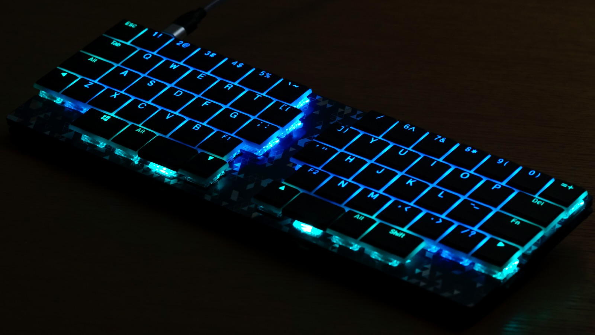
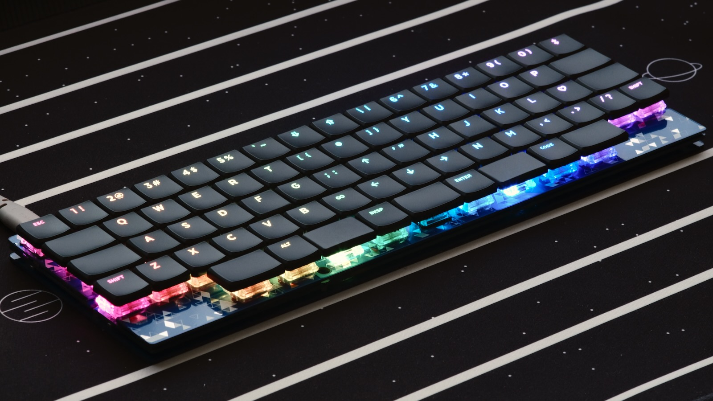
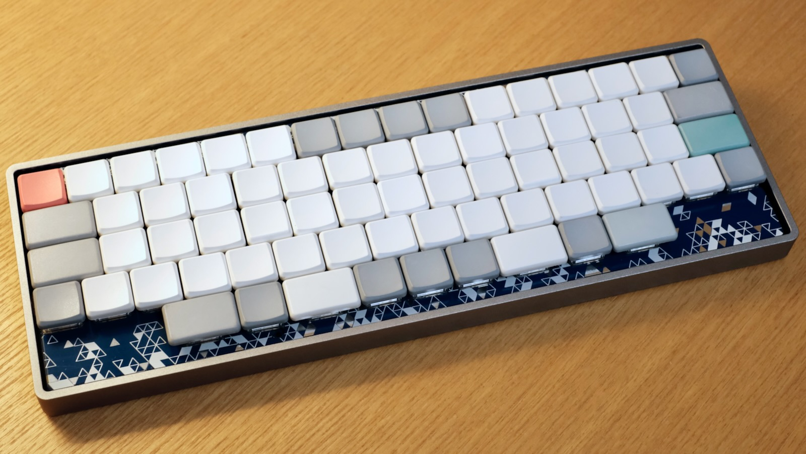
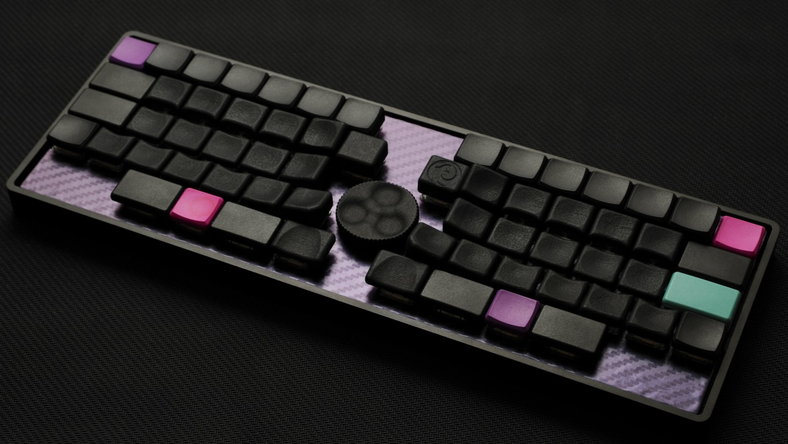
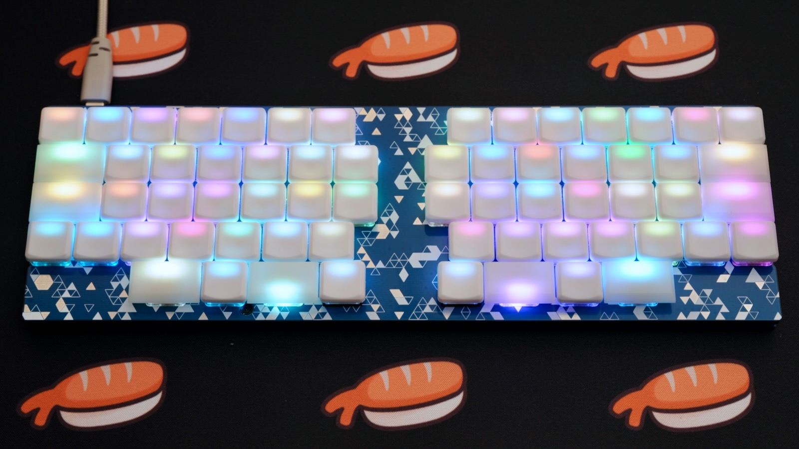

# 資料：Nora用キーキャップ選び方ガイド

Noraの各レイアウトに対応するChoc V1用キーキャップと、使用感などをまとめました。

Choc V1用キーキャップのうち、”Choc用キーピッチ対応”として販売されているキーキャップは、大きな問題なく取り付けることができます。（2022年4月現在）

*隣同士のキーが少し当たる場合は、ソケットを傾かないように取り付けたり、キーキャップの成形バリをカッターなどで取り除くと問題なく使用できます。*

## キーキャップ対応表

凡例  
◎：完全対応，○：対応，△：キーキャップを追加すればOK，×：取り付け不可

| 商品名 | Full | FW | RE | コメント |
| :---- | :---: | :---: | :---: | :---- |
Kailhロープロ刻印 セット | ○ | ◎ | ◎ | - 刻印あり - バックライトLED対応 透過タイプ - 低価格  Fullレイアウトでは1.5uのキーが足りないため、最下行の中央には1.25uまたは1uを取り付けるか、1.5uの単品キーを1個追加します。 スペースキー用にKailhロープロ無刻印などの単品キーを追加すると、見た目が良くなります。 |
| Kailhロープロ無刻印 (黒, 白, 無塗装） 単品 | ◎ | ◎ | ◎ | - 刻印なし  同じKailhロープロの刻印ありと組み合わせても、無刻印を単体で使用してもどちらも良い感じの見た目になります。 無塗装は少しクリーム色っぽい乳白半透明のような感じで、バックライトが綺麗に光ります。 |
| Kailhロープロ無刻印 （クリア）  単品 | × | × | × | クリアは形状が異なるため、取り付けできません。 |
| MBK Legend‡ Glow  セット | ◎ | ◎ | ◎ | - 刻印あり - バックライトLED対応 透過タイプ  少し高価ですが、1uと1.5uのブランクキーが豊富に付属しているのが嬉しいです。 スイッチへの抜き差しが少しきついかも。 |
| MBK 1u, 1.5u 単品 | ◎ | ◎ | ◎ | - 刻印なし  黒と白に加え、カラー版も販売されるようになりました。 白いキーは染色に適しており、オリジナルの色に染めることもできます。 |
| Gravity Keycaps セット | △ | △ | △ | - 刻印なし  Choc V1用キーキャップとしては唯一（？）の、キーの位置に合わせて個別のキー形状が与えられたキーキャップ。  40キー程度のキーボード用として作られているため、Noraで使用するには多くのキーが足りません。 MBKの黒色とのマッチングが良好なので、これと組み合わせるとよいでしょう。 |
| WRK セット | × | × | × | MX用の19.05*19.05mmピッチを基準に作られているため、取り付けできません。 |
| MCC-profile POM Choc keycap 1u 単品 | △ | △ | △ | - 刻印なし  POM素材がとてもスベスベで、汚れがつかず、ずっと真っ白なまま使えるのも嬉しいです。  1uサイズしかラインナップされていないため、1.5uは他のキーキャップを使用します。 MBKの白がMCCに近い白色ですが、MBKはキーバックライトを透過しません。 バックライトを使う場合は、Kailhロープロ無刻印の無塗装と組み合わせるのがおすすめです。 |

## キーキャップ取り付け例

各種キーキャップの取り付け例です。  
試作版の写真も含まれます。

- Kailhロープロ刻印

    

    

- MBK Legend‡ Glow

    

- MBK 単品

    

- Gravity Keycaps + MBK単品

    

- MCC-profile POM + Kailh無刻印（無塗装）

    

## 参考：Noraのキーピッチ

NoraはChoc用キーキャップのキーピッチよりも横方向がほんの少し狭くなった 17 × 17.8594mmのキーピッチになっています。（[基板上の寸法図](../assets/BuildGuide_DN0032/PCB_key_pitch.png)）
